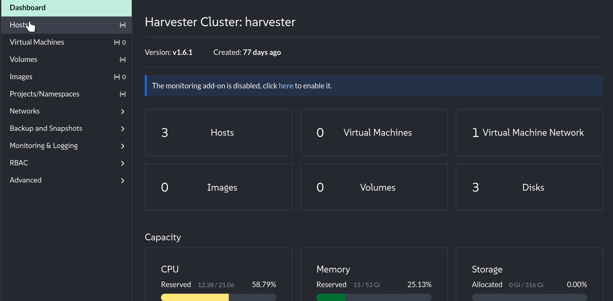
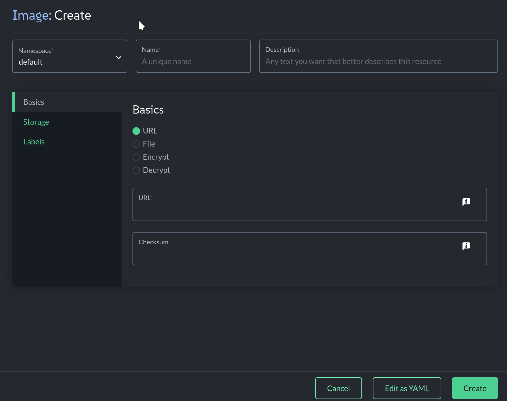

SUSE Virtualization Overview
=====
SUSE Virtualization (formerly Harvester) is a modern, open-source hyperconverged infrastructure (HCI) solution designed to bridge the gap between traditional virtualization and cloud-native computing. Built on top of Kubernetes, it installs directly onto bare metal servers, leveraging **KubeVirt** for virtualization management and **Longhorn** for distributed block storage.

This architecture allows operators to run and manage legacy virtual machines alongside containerized workloads within a unified platform. Deep integration with **SUSE Rancher Prime** provides a "single pane of glass" for centralized management across different clusters, not matter if they´re located at the core data center, cloud, or edge environments, eliminating the need for separate silos for VM and container operations. It offers an open source, innovative and cloud-natives alternative to proprietary HCI stacks, enabling a "lift-and-shift" modernization strategy.

Lab Intro
=====

Welcome to the SUSE Virtualization Rodeo! In this workshop, you will learn how to use SUSE Virtualization to manage virtual machines and to provide storage, backup, snapshots, and other functions for those virtual machines. Also you´ll learn about the integration of Rancher Prime with SUSE Virtualization and how to provision Kubernetes workloads using SUSE Virtualization as a Cloud Platform. Our lab consists of a few components that are important to understand:

First, we have deployed a SUSE Virtualization cluster for you to use, but there are a few steps you´ll have to perform to have the cluster fully functional.

We have also deployed a Rancher Prime management server to manage the SUSE Virtualization cluster. Although it is not strictly necessary to use Rancher Prime to manage SUSE Virtualization, it is a convenient way to manage multiple Kubernetes clusters and VMs from a single interface.

SUSE Virtualization has an UI (based on Rancher). Although, the UI is enough for single cluster management it falls short to manage multiple clusters or to extract all the capabilities of Rancher Primer and SUSE Virtualization working together. Rancher Prime acts as an orchestration layer that unifies your VMs and Kubernetes clusters under one identity and security umbrella.


Connecting to SUSE Virtualization
=====

In this lab, we will be interacting with SUSE Virtualization using SUSE Rancher Prime. Rancher Prime integrates with SUSE Virtualization to provide a "single pane of glass" for managing both traditional virtual machines and Kubernetes clusters within a unified interface. This integration significantly simplifies operations by centralizing authentication and Role-Based Access Control (RBAC) across the entire infrastructure stack. By treating SUSE Virtualization as a cloud provider, operators can easily provision and manage guest Kubernetes clusters (RKE2/K3s) directly on top of the virtualization layer with automatic support for storage and load balancing. Ultimately, it bridges the gap between more traditional IT and cloud-native environments, allowing teams to consolidate workloads and eliminate the need for separate management silos.

### Logging in to the Rancher Prime UI

Let's open the [button label="Rancher" variant="success"](tab-1) tab.

Log in to Rancher Prime, if necessary, with the following credentials:

- Username:

```txt
admin
```

- Password:

```txt
[[ Instruqt-Var key="RANCHER_PASSWORD" hostname="cloud-client" ]]
```

### Accessing the SUSE Virtualization Cluster

From the Rancher Prime UI, select the `Virtualization Management` menu item from the left-hand menu. Then select the `harvester` cluster from the menu.


Configuring our SUSE Virtualization Cluster
=====

In this section, we will configure our SUSE Virtualization cluster so that it is ready to run virtual machines. This includes creating a network, as well as loading an ISO image and/or Cloud image we can use to provision virtual machines.

## TASK: Create a Virtual Machine Network

A virtual machine network allows our virtual machines to communicate with each other, as well as with the outside world. In this lab, we will create a network that our virtual machines can use that is on the same network as our management network. This will allow our virtual machines to access the Internet, as well as allow us to connect to our virtual machine.

- Log in to the Rancher Prime UI and selecting the `suse-virt` cluster
- Select the `Network` menu item from the left-hand menu
- Select the `Virtual Machine Networks` item, and then click the `Create` button


- Give our virtual machine network a name of `vmnet`
- Change the type to `UntaggedNetwork`
- Select the `mgmt` Cluster Network (which determines which network we will connect our `vmnet` network to)
- Then click the `Create` button

> [!NOTE]
> If your hardware has more physical networks you can select another network. It is a good practice to have a data network and a management network splitting the traffic and responsabilities in the network.


Excellent! We have now created a network for our virtual machines to use!

> [!NOTE]
> The above is an example of only one type of network that SUSE Virtualization can provide. SUSE virtualization also supports tagging, load-balancer configurations, and other software defined networking services.

## TASK: Create an IP Pool

SUSE Virtualization it is not only a Virtualization platform it is based on Kubernetes and designed to also run Kubernertes clusters on it. Later today we will provision a K3s cluster that will need IPs for its loadbalancer and for the apps running on it. SUSE Virtualization provides a feature called IP Pool, and it provides a range of IPs for the clusters deployed on that same namespace (it can be morea than one).

- Log in to the Rancher Prime UI and selecting the `suse-virt` cluster
- Select the `Network` menu item from the left-hand menu
- Select the `IP Pools` item, and then click the `Create` button
- Go to the `Range` tab to specify the IP ranges for the IP Pool. You can add multiple IP Ranges. 
- The `Range`
- Go to the `Selector` tab to specify the `Scope` and `Priority`.
- Select the default/mgmt-network as `VM Network` value and select default as `Namespace`


- Then click the `Create` button

### Upload a VM Cloud Image
#
#One of the most common ways to provision a virtual machine is to use a cloud image. A cloud image is a pre-configured disk image that contains an operating system and any necessary software. In this lab, we will use a cloud image to provision our virtual machine.
#
#
#- Click on the `Images` menu item
#
#- Click the `Create` button
#
#
#
#- Give the image a name of `leap`
#
#- Paste the following text in to the `URL` field:
#
#```txt
#https://mirror.rackspace.com/openSUSE/distribution/openSUSE-current/appliances/openSUSE-Leap-15.6-Minimal-VM.x86_64-Cloud.qcow2
#```
#
#- Then click the `Create` button
#
#
#
#>[!NOTE]
#> The download will take a couple of minutes to complete
#
#> **Editors Note:**
#> Adapt the storage class accordingly with your needs.
#
#Excellent! We have now created a cloud image. Now we can use this image to deploy new virtual machines.
#
### TASK: Upload an ISO Image
#
#Another common way to provision a virtual machine is to use an ISO image. An ISO image is a disk image that contains an operating system installer. In this lab, we will use an ISO image to provision our virtual machine.
#
#- Click on the `Images` menu item
#- Click the `Create` button
#
#
#
#- Give the image a name of `leap-iso`
#- Set the `URL` to:
#
#```txt
#https://download.opensuse.org/distribution/leap/15.6/iso/openSUSE-Leap-15.6-DVD-x86_64-Current.iso
#
#```
#- Click the `Create` button.
#
#
#
#
#> **Editors Note:**
#> ISO images do not seem to be working. We will need a fix, or to remove this section

Well done! Click the `Check` button to move on to the next lesson!
