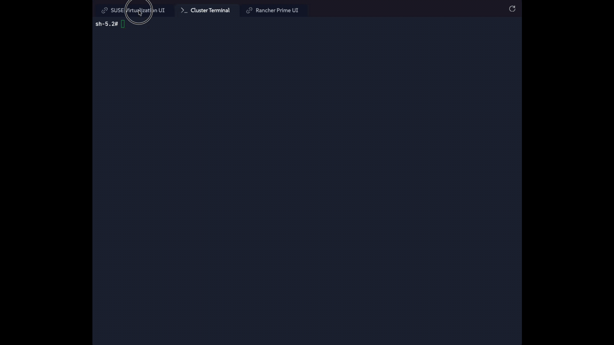

🏦 Chapter 1: <span lang="en" id="ch1.waiting1" hist="vertrex-bank">The Arrival</span>
==========================

<style type="text/css">
  * {
    font-family: suse;
    src: url('https://fonts.google.com/specimen/SUSE');
  }
  .suse { color: #30ba78; }
  .virt { color: #30ba78; }
  .bank { color: #d4af37; }
  .danger { color: #ff4d4d; font-weight: bold; }
  .hovereffect {
    border-radius: 25px 25px 25px 25px;
    background: linear-gradient(#30ba78 0 0) var(--hundredpercent, 0) / var(--hundredpercent, 0) no-repeat;
    transition: 0.5s, background-position 0s;
    padding: 5px;
  }
  .hovereffect:hover {
    --hundredpercent: 100%;
    color: white;
    border-radius: 10px 25px 10px 25px;
  }
  .story {
    border-left: 5px solid #d4af37;
    border-radius: 0 15px 15px 0;
    background: linear-gradient(135deg, rgba(48,186,120,.10), rgba(212,175,55,.10));
    padding: 15px 20px;
    margin: 15px 0;
  }
  .story em { color: #d4af37; }
  .missionbox {
    border: 2px dashed #30ba78;
    border-radius: 15px;
    padding: 12px 18px;
    margin: 15px 0;
  }
  .highlightcopy { color: white; font-weight: bold; padding: 0 10px; }
  img.logos { border-radius: 10px; }
  /* compact credential boxes (scoped: only code blocks inside <div class="cred">) */
  .cred > div { margin: 0; }
  .cred .my-3 {
    display: flex;
    flex-direction: row-reverse;   /* put the copy bar on the right */
    align-items: stretch;
    width: fit-content;
    min-width: 14em;
    margin: 4px 0;
    overflow: hidden;
  }
  .cred .my-3 > div:first-child {  /* the bar holding the copy button */
    height: auto;
    padding: 2px 8px;
    border-bottom: none;
    border-left: 1px solid white;
    border-radius: 0;
    display: flex;
    align-items: center;
    background-color: #30ba78;   /* new: green copy-bar background */
  }
  .cred .my-3 > div:first-child,
  .cred .my-3 > div:first-child * {
    color: #fff !important;
  }
  .cred .my-3 > div:first-child:hover,
  .cred .my-3 > div:first-child:hover * {
    font-weight: bold;
  }

  .cred .my-3 > pre {
    flex: 1 1 auto;
    margin: 0 !important;
    padding: 2px !important;
    border-radius: 0 !important;
    display: flex;
    align-items: center;
  }

  img.animatedgif {
    --borderthickness: 5pt;
    --colors: #0000 25%,#30ba78 0;
    padding: 10px;
    background:
      conic-gradient(from 90deg  at top    var(--borderthickness) left  var(--borderthickness),var(--colors)) 0    0,
      conic-gradient(from 180deg at top    var(--borderthickness) right var(--borderthickness),var(--colors)) 100% 0,
      conic-gradient(from 0deg   at bottom var(--borderthickness) left  var(--borderthickness),var(--colors)) 0    100%,
      conic-gradient(from -90deg at bottom var(--borderthickness) right var(--borderthickness),var(--colors)) 100% 100%;
    background-size: 50px 50px;
    background-repeat: no-repeat;
    transition: 1s;
  }

  img.animatedgif:hover {
    background-size: 51% 51%;
  }

  .embedded_img {
    width: 100%;
    height: auto;
    max-height: 1.5vh;
    max-width: 1.5vh;
    margin: 0;
    padding: 0;
    display: inline-block;
  }

</style>


<div id="101" class="story">
<span lang="en" id="ch1.intro1" hist="vertrex-bank">
The rain lashed against the floor-to-ceiling windows of <b class="bank">Vertex Trust Bank</b> headquarters, distorting the city skyline into a gray, watery blur. Inside the glass-walled executive boardroom, the atmosphere was equally turbulent. Sarah, the Chief Technology Officer, paced the length of the room, her eyes fixed on a massive overhead monitor projecting a sea of <b class="danger">red alerts</b> and performance warnings.

She turned to you, her voice tight with exhaustion. *"We are losing precious milliseconds on every single market transaction. Our legacy <span id="ch1.intro1.1" lang="nolang" no>hypervisor</span>s are buckling under the sheer volume of modern digital banking traffic. The infrastructure is brittle, the storage arrays are constantly falling out of synchronization, and our licensing costs are bleeding our engineering budget completely dry. We cannot survive another year chained to these monolithic, antiquated systems."*

You sit quietly at the end of the mahogany table, reviewing the architectural schematics she provided. As an elite **Infrastructure Architect**, you have been brought in for one specific purpose: to save <b class="bank">Vertex Trust Bank</b> from total operational gridlock. They need a bridge to the cloud-native world without rebuilding their entire application stack from scratch.

*"We have a plan, Sarah,"* you finally say, closing your laptop with a reassuring click. *"We are going to transition the entire datacenter to <b class="virt"><span id="ch1.intro1.2" lang="nolang" no>SUSE Virtualization</span></b>. We will bring your legacy systems into the modern era, and we will do it without missing a beat."*
</span>
</div>


<span id="assignment.2" lang=en no>
Your journey begins right now. Before you can begin dismantling the old world, you need to establish a foothold in the new one and dig into the environment.


## <b class="hovereffect">What is <span id="ch1.intro1.2" lang="nolang" no>SUSE Virtualization</span>?</b>

<b class="virt"><span id="ch1.intro1.2" lang="nolang" no>SUSE Virtualization</span></b> (also known as **<span id="assignment.2.1" lang="nolang" no>Harvester</span>**) is a modern, open-source hyperconverged infrastructure (HCI) platform built on <span id="assignment.2.2" lang="nolang" no>Kubernetes</span>. It runs directly on bare metal and gives the bank enterprise-grade **virtual machines** on a cloud-native foundation, <span id="ch1.intro2"  lang="en" hist="vertrex-bank">exactly the bridge <b class="bank">Vertex Trust Bank</b> needs</span>:

- **<span id="assignment.2.3" lang="nolang" no>KubeVirt</span> + <span id="assignment.2.4" lang="nolang" no>KVM</span>/<span id="assignment.2.5" lang="nolang" no>QEMU</span>**: enterprise virtualization as native <span id="assignment.2.2" lang="nolang" no>Kubernetes</span> workloads. Underneath sits the same battle-hardened **<span id="assignment.2.4" lang="nolang" no>KVM</span>/<span id="assignment.2.5" lang="nolang" no>QEMU</span>** pair that has powered <span id="assignment.2.6" lang="nolang" no>Linux</span> virtualization for decades, which is why the platform can run a huge variety of guest operating systems, <span id="ch1.intro3"  lang="en" hist="vertrex-bank">including the very old ones still serving in the bank's dustiest legacy corners, patiently waiting for their migration</span>
- **<span id="assignment.2.7" lang="nolang" no>SUSE Storage</span> (<span id="assignment.2.8" lang="nolang" no>Longhorn</span>)**: distributed, replicated block storage across every node, set up and ready out of the box. <span id="ch1.intro4"  lang="en" hist="vertrex-bank">And if the bank ever prefers different storage</span>, **any <span id="assignment.2.9" lang="nolang" no>CSI</span>-compatible storage driver plugs right in**, freedom of choice, never lock-in
- **<span id="assignment.2.10" lang="nolang" no>Software-defined networking</span>**: VLANs and isolated overlay networks without touching a cable
- **One open-source bill**: no per-socket <span id="ch1.intro1.1" lang="nolang" no>hypervisor</span> tax
- **<span id="assignment.2.11" lang="nolang" no>Support</span> that actually listens**: SUSE customers consistently rate **SUSE <span id="assignment.2.11" lang="nolang" no>Support</span>** among the best in the industry, and their feedback directly shapes where the products go next. Try asking a closed-source vendor for a seat at that table

Because the platform runs *on* <span id="assignment.2.2" lang="nolang" no>Kubernetes</span>, containerized workloads can run on the very same cluster. Keep the division of labor straight from day one: the <b class="virt"><span id="ch1.intro1.2" lang="nolang" no>SUSE Virtualization</span></b> UI manages **virtual machines**; managing containers (and managing whole fleets of clusters) is the job of <span id="assignment.2.12" lang="nolang" no>**Rancher Prime**</span>, which you will meet in a moment.

<span id="ch1.intro5"  lang="en" hist="vertrex-bank">Every proprietary component bleeding the bank's budget dry has a modern, open-source replacement:</span>

| The old world (per-socket licensing) | <span id="ch1.intro1.2" lang="nolang" no>SUSE Virtualization</span> |
|--------------------------------------|---------------------|
| ISAware proprietary <span id="ch1.intro1.1" lang="nolang" no>hypervisor</span> | <span id="assignment.2.3" lang="nolang" no>KubeVirt</span> + <span id="assignment.2.4" lang="nolang" no>KVM</span> |
| Proprietary storage array |  SUSE storage, or any <span id="assignment.2.9" lang="nolang" no>CSI</span> driver <span id="ch1.intro6"  lang="en" hist="vertrex-bank">the bank chooses</span> |
| Closed-source SDN | <span id="assignment.2.13" lang="nolang" no>Kube-OVN</span> + <span id="assignment.2.14" lang="nolang" no>Multus</span> |
| ISAware Command Throne | <span id="assignment.2.15" lang="nolang" no>SUSE Rancher Prime</span> |

No vendor lock-in. No virtualization tax. No proprietary kernel. **One platform, one bill**, <span id="ch1.intro7"  lang="en" hist="vertrex-bank">exactly what you promised Sarah in the boardroom</span>.

<div class="missionbox">

## 🎯 Your Quest Objectives

1. Log in and inspect the unified dashboard
2. Meet Rancher Prime, the command center!
3. Validate the distributed storage fabric
4. Test your administrative terminal access

</div>


<span id="ch1.intro8"  lang="en" hist="vertrex-bank">
> [!NOTE]
> Disclaimer: This lab is meant to be educational and not to provide instructions on how to configure a production environment for a 'bank', most decisions made are with the limitations and purpose of this environment.
</span>


🔐 Your Architect Credentials
=============================

For your records, your Architect Credentials are as follows:
</span>


Username:

<div class="cred">

```txt
admin
```

</div>

Password:

<div class="cred">

```txt
[[ Instruqt-Var key="RANCHER_PASSWORD" hostname="kvm-host" ]]
```

</div>


<span id="assignment.3" lang=en>

> [!NOTE]
> The UIs use self-signed certificates. Accept the browser security warning when it appears. If a page does not load right away, the lab environment may still be booting. Wait a minute and refresh the tab.

> [!NOTE]
> If you prefer to work in your own browser instead of the embedded tabs, the lab host is reachable directly at:
> <a href="https://kvm-host.[[ Instruqt-Var key="_SANDBOX_ID" hostname="kvm-host" ]].instruqt.io:8443">https://kvm-host.[[ Instruqt-Var key="_SANDBOX_ID" hostname="kvm-host" ]].instruqt.io:8443</a>


📊 Task 1: Log in and inspect the unified dashboard
===================================================

Navigate to the </span> [button label="SUSE Virtualization UI" variant="success"](tab-0) <span id="assignment.4" lang=en> tab and log in using your credentials.



Take a moment to look at the main </span>  <span id="assignment.5" lang="nolang" no>**Dashboard**</span><span id="assignment.6" lang=en>: this is your command center for the entire mission.


> [!NOTE]
> Don't make any changes yet. We are just getting familiar with the environment.


- The first section contains the overall numbers:
  - **<span id="assignment.6.1" lang="nolang" no>Hosts</span>** the cluster is made of
  - **<span id="assignment.6.2" lang="nolang" no>Virtual Machines</span>** (running and stopped)
  - **<span id="assignment.6.3" lang="nolang" no>Images</span>** available to deploy new VMs
  - **<span id="assignment.6.4" lang="nolang" no>Volumes</span>** in use
  - **<span id="assignment.6.5" lang="nolang" no>Disks</span>** available

Clicking on each of them takes you to a dedicated section with further information. Click on **<span id="assignment.6.1" lang="nolang" no>Hosts</span>**:

You see a detailed view of each host's reserved and used resources, as well as the host's IP addresses and other details.

Notice the  at the end of each row: clicking them opens a menu with different actions for that host.

Go back to the **<span id="assignment.6.6" lang="nolang" no>Dashboard</span>** and look at what else is there:

- The second section, **<span id="assignment.6.7" lang="nolang" no>Capacity</span>**, lists the resources currently reserved and available in the cluster.

- Below it sits a section with two tabs:

  - **<span id="assignment.6.8" lang="nolang" no>Cluster Metrics</span>**: real-time metrics about the cluster; these come in handy when troubleshooting performance issues.

  - **<span id="assignment.6.9" lang="nolang" no>Virtual Machine Metrics</span>**: real-time metrics for virtual machines; note that if no VM is running there is no data to show.

- At the bottom, the last section, **<span id="assignment.6.10" lang="nolang" no>Events</span>**, shows the latest events happening in the cluster.

Now look further around the UI. At the top right there is a drop-down menu with **All Namespaces** selected. It lets you focus on specific namespaces. Namespaces here are <span id="assignment.2.2" lang="nolang" no>Kubernetes</span> namespaces: a way to organize resources and assign dedicated permissions to everything inside them, a concept similar to a "group". At the bottom of this chapter you will find links with more information; many of the concepts you find in <span id="assignment.2.2" lang="nolang" no>Kubernetes</span> apply directly to <span id="ch1.intro1.2" lang="nolang" no>SUSE Virtualization</span>.

The **bell** holds notifications and alerts, and further right the **user icon** leads you to user settings and keys for automated access.

On the left side there is a column with different sections. We are not going through all of them now. You will look at many in the coming chapters. Note that these sections change depending on which plugins are enabled or disabled.

Finally, in the bottom-left corner, click on **<span id="assignment.2.11" lang="nolang" no>Support</span>**.
It takes you to a page with links to documentation and other support resources, plus two important sections:

- **<span id="assignment.6.11" lang="nolang" no>Generate a <span id="assignment.2.11" lang="nolang" no>Support</span> Bundle</span>**: produces a file that helps SUSE <span id="assignment.2.11" lang="nolang" no>Support</span> troubleshoot your environment without having to access it directly.
- **<span id="assignment.6.12" lang="nolang" no>Download KubeConfig</span>**: gives you the kubeconfig file you can use to manage this cluster with kubectl and other tools from a console.

If you still have time, familiarize yourself with the sections before moving on to the next task.


> [!NOTE]
> Everything you see in this dashboard (VMs, volumes, networks) is a <span id="assignment.2.2" lang="nolang" no>Kubernetes</span> resource under the hood. The UI is your primary tool for this mission; a terminal stands ready for the optional bonus drills, if you are curious about the machinery.


🐮 Task 2: Meet Rancher Prime, the command center
=================================================

The platform can also be connected to **Rancher Prime**, <span id="ch1.task2a"  lang="en" hist="vertrex-bank">and it is important to understand who does what in the bank's new world:</span>

- <b class="virt"><span id="ch1.intro1.2" lang="nolang" no>SUSE Virtualization</span></b> manages the **virtual machines** on this cluster.
- **Rancher Prime** manages **many clusters at once** (every <span id="ch1.intro1.2" lang="nolang" no>SUSE Virtualization</span> cluster in every branch datacenter), plus centralized **users, roles, and access control (<span id="assignment.6.13" lang="nolang" no>RBAC</span>)**, and the **container workloads** the bank will run alongside its VMs.

Let's see what is inside Rancher.

Open the [button label="Rancher Prime UI" variant="success"](tab-2), log in with the same credentials, and select **Virtualization Management** from the left menu.

<div style='align: middle; margin: 15px;'>
  
</div>

From here you can manage multiple <span id="ch1.intro1.2" lang="nolang" no>SUSE Virtualization</span> clusters. Import the existing one:

1. Click **Import Existing**
2. Set the **Cluster Name** to
<div class="cred">

```txt
mysusevirt1
```

</div>

3. Click **Create**
4. A new screen appears. On it a url shows up, copy that url for the next steps.
5. Below it you can see the registration instructions. Follow them, and remember to select **<span id="assignment.6.14" lang="nolang" no>Insecure Skip TLS Verify</span>** when editing the <b class="highlightcopy">cluster-registration-url</b> setting. This should be done in [button label="SUSE Virtualization UI" variant="success"](tab-0).

6. Switch back to [button label="Rancher Prime UI" variant="success"](tab-2) and click on "<span id="assignment.2.1" lang="nolang" no>Harvester</span> Clusters" on the top left of the UI.

Notice the state next to the cluster name: **<span id="assignment.6.15" lang="nolang" no>Pending</span>**. It is waiting for the cluster to finish the registration process.

Remain in the Rancher UI and watch the state change from **<span id="assignment.6.15" lang="nolang" no>Pending</span>** to **<span id="assignment.6.16" lang="nolang" no>Waiting</span>**, then finally to **<span id="assignment.6.17" lang="nolang" no>Active</span>**.

Now go back to **<span id="assignment.2.1" lang="nolang" no>Harvester</span> Clusters**: the cluster appears in the list.

Let's see what else you can do here. Click the  at the end of the cluster's row; a menu drops down with some options:

- **<span id="assignment.6.18" lang="nolang" no>Kubectl Shell</span>**: opens a shell connected to the cluster, where you can run kubectl commands against it.
- **<span id="assignment.6.12" lang="nolang" no>Download KubeConfig</span>**: same as what you already saw in the <span id="ch1.intro1.2" lang="nolang" no>SUSE Virtualization</span> UI.
- **<span id="assignment.6.19" lang="nolang" no>Download YAML</span>**: downloads the cluster definition in YAML format; you can use it as a template to import new clusters in an automated fashion (it also needs one extra step in the cluster UI).

Finally, click on the cluster name itself
- it takes you to the <span id="ch1.intro1.2" lang="nolang" no>SUSE Virtualization</span> UI embedded within the Rancher UI
- Notice on the left column a '<span id="assignment.6.13" lang="nolang" no>RBAC</span>' entry appears on the menu, we can control who can do what on our clusters.


With Rancher you can easily operate multiple clusters from one place.


> [!NOTE]
> There is a dedicated rodeo for SUSE Rancher Prime, feel free to join!


⌨️ Task 3: Test your administrative terminal access
===================================================

You will spend most of this mission in the UI, <span id="ch1.task3a"  lang="en" hist="vertrex-bank">but an architect always verifies their emergency access</span>. Click on the [button label="Cluster Terminal" variant="success"](tab-1) tab and run one command to check that your connection to the underlying <span id="assignment.2.2" lang="nolang" no>Kubernetes</span> engine is active:


```bash,wrap,run
kubectl --kubeconfig .rodeo/harvester-kubeconfig get VirtualMachine -A
```

You should see the list of <span id="assignment.6.2" lang="nolang" no>Virtual Machines</span> present in every namespace.


💾 Bonus Drill: validate the distributed storage fabric (optional)
====================================================================

<span id="ch1.bonus1a"  lang="en" hist="vertrex-bank">A healthy storage backend is key for banking operations</span>. <b class="virt"><span id="ch1.intro1.2" lang="nolang" no>SUSE Virtualization</span></b> uses **<span id="assignment.2.7" lang="nolang" no>SUSE Storage</span>** to replicate every volume across the cluster.

<div style='align: middle; margin: 15px;'>
  
</div>

The [button label="SUSE Virtualization UI" variant="success"](tab-0) already shows information about the storage health, but it is also possible to access the <span id="assignment.2.7" lang="nolang" no>SUSE Storage</span> (<span id="assignment.2.8" lang="nolang" no>Longhorn</span>) dashboard by enabling the **Extension developer features**:

1. Click on your **user icon** in the top-right corner
2. Select **Preferences**
3. Tick **Enable Extension developer features**

Go back to **Home**, and in the bottom-left corner click on **<span id="assignment.2.11" lang="nolang" no>Support</span>**.

You will now see two new sections:

- **<span id="assignment.6.20" lang="nolang" no>Access Embedded</span> Rancher UI**
- **<span id="assignment.6.20" lang="nolang" no>Access Embedded</span> <span id="assignment.2.7" lang="nolang" no>SUSE Storage</span> (<span id="assignment.2.8" lang="nolang" no>Longhorn</span>) UI**

Click on the **<span id="assignment.2.8" lang="nolang" no>Longhorn</span> UI** section.

It will take you to the <span id="assignment.2.7" lang="nolang" no>SUSE Storage</span> <span id="assignment.6.6" lang="nolang" no>Dashboard</span>, all should be green.
If a node were unschedulable or a volume degraded, <span id="assignment.2.7" lang="nolang" no>SUSE Storage</span> would already be rebuilding replicas elsewhere, but you always confirm your ground truth.


🏋️ Bonus Drills: for the command-line curious (optional)
==========================================================

New to <span id="assignment.2.2" lang="nolang" no>Kubernetes</span>? **Skip ahead freely**: everything that matters is in the UI. If you want to peek at the machinery, run these extra checks in the [button label="Cluster Terminal" variant="success"](tab-1):

- **See the <span id="assignment.2.2" lang="nolang" no>Kubernetes</span> control plane and CoreDNS endpoints:**

```bash,wrap,run
kubectl cluster-info --kubeconfig .rodeo/harvester-kubeconfig
```

- **Check cluster component health**: query the control plane's health endpoint; every check (etcd, informers, shutdown hooks) should report `ok`:

```bash,wrap,run
kubectl get --raw='/readyz?verbose' --kubeconfig .rodeo/harvester-kubeconfig
```

- **Confirm every node in the fabric is ready:**

```bash,wrap,run
kubectl get nodes --kubeconfig .rodeo/harvester-kubeconfig
```

  All nodes should show `Ready`.

- **Verify the core virtualization services are running:**

```bash,wrap,run
kubectl get pods -n harvester-system --kubeconfig .rodeo/harvester-kubeconfig | grep -v Completed
```

  All pods should be `Running`.

- **Confirm the exact platform version the bank is running:**

```bash,wrap,run
kubectl --kubeconfig .rodeo/harvester-kubeconfig get settings.harvesterhci.io server-version
```

💼 Why does this matter?
==============================================

- **One command center.** VMs, storage, and networking are visible from a single dashboard, no more juggling three separate management consoles with three separate licenses.
- **<span id="assignment.2.2" lang="nolang" no>Kubernetes</span>-native from day one.** Everything in the dashboard is a <span id="assignment.2.2" lang="nolang" no>Kubernetes</span> resource under the hood. The container team's existing skills transfer directly, while the VM team gets a friendly point-and-click UI.
- **Fleet management and <span id="assignment.6.13" lang="nolang" no>RBAC</span> included.** Rancher Prime is <span id="ch1.why1"  lang="en" hist="vertrex-bank">ready to command every cluster the bank will ever run, with one login and one set of access rules.</span>
- **Distributed storage out of the box.** <span id="assignment.2.7" lang="nolang" no>SUSE Storage</span> replicates data across nodes automatically.

Once you confirm the control plane is responding, the storage is healthy, and your administrative access is secured, you are ready to proceed deeper into the facility.

Click **Check** to descend into the datacenter. 🛗

📚 More information
===================
</span>


- [<span id="ch1.intro1.2" lang="nolang" no>SUSE Virtualization</span>: Overview](https://documentation.suse.com/cloudnative/virtualization/latest/en/introduction/overview.html)
- [Hardware and Network Requirements](https://documentation.suse.com/cloudnative/virtualization/latest/en/installation-setup/requirements.html)
- [<span id="assignment.2.2" lang="nolang" no>Kubernetes</span> concepts](https://kubernetes.io/docs/concepts/overview/)
