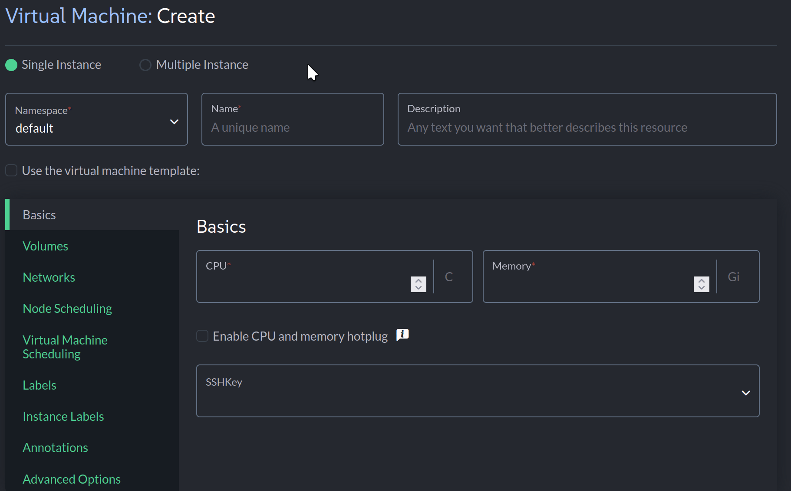

> **OPS BRIEF:** AeroGrid Network Operations Center | Priority: High | Assigned: Infrastructure Team
> First workload migration target: `virt1`, the ground operations interface VM. Provision it, verify connectivity, and prove the platform can move it live between nodes without downtime.

AeroGrid's ground operations system handles baggage tracking, gate assignments, and ramp coordination. Under VMware this was a vMotion-capable workload on ESXi. On SUSE Virtualization, the equivalent runs on KubeVirt and KVM with no proprietary hypervisor license required. The cluster is healthy. Time to put a VM on it.

VM Provisioning in SUSE Virtualization
===

SUSE Virtualization supports creating VMs from ISO files, QCOW2 disk images, and cloud images. For this challenge we use a pre-loaded **openSUSE Leap 16** cloud image called `leap16`. Cloud images are the standard production path — they boot fast and support full cloud-init customization.

> [!NOTE]
> Cloud-init is the industry standard for bootstrapping VMs at first boot. It handles users, SSH keys, networking, package installs, and custom scripts. SUSE Virtualization exposes cloud-init directly in its UI — no separate tooling required.

Verify the image is ready:

```bash,run
kubectl get virtualmachineimages -n default
```

You should see `leap16` with status `Active`. The base image is loaded.

TASK: Provision virt1
===

Open the [button label="Rancher UI" variant="success"](tab-1) tab and navigate to **Virtualization Management > [your cluster] > Virtual Machines**.

1. Click **Create**
2. Set the **Name** to `virt1`
3. Set **CPU** to `2` and **Memory** to `2 GiB`
4. Under **SSH Keys**, select `default/cloud-client` — this injects the terminal's public key so we can connect directly



5. Go to **Volumes**, click **Add Volume**, select **Image**, and choose `default/leap16`
6. Set the root disk size to `20 GiB`

TASK: Assign Network and Cloud-Init Configuration
===

7. Go to the **Networks** tab, click **Add Network**, and select `default/vmnet`
8. Expand **Advanced Options** and paste the following into the **Network Data** field:

```yaml
version: 2
ethernets:
  enp1s0:
    addresses:
      - 192.168.122.50/24
    gateway4: 192.168.122.1
    nameservers:
      addresses:
        - 8.8.8.8
```

This assigns `virt1` a fixed IP of `192.168.122.50`. Cloud-init applies this on first boot — no post-deployment manual setup required.

TASK: Configure Node Scheduling
===

9. Go to **Node Scheduling**

SUSE Virtualization offers three placement policies for VMs:

- **Any available node** — the Kubernetes scheduler places the VM and live migration is enabled
- **Specific node** — pin the VM to one node (no migration allowed)
- **Scheduling rules** — affinity rules based on node labels (GPU capability, NUMA topology, network zone, etc.)

10. Select **Run virtual machine on any available node** — this is required for live migration in the next task

11. Click **Create** and wait for the VM status to reach `Running`

> [!NOTE]
> Scheduling rules let you separate critical airport systems from background workloads — for example, pinning gate assignment VMs to low-latency nodes while keeping dev workloads on shared nodes.

TASK: Confirm virt1 is Operational
===

Once `virt1` is `Running`, switch to the [button label="Terminal" variant="success"](tab-0) tab and wait for SSH to come up:

```bash,run
until ssh virt1 "uname -a" 2>/dev/null; do
  echo "Waiting for ground ops VM..."
  sleep 10
done
```

When the kernel info prints, the VM is alive. Cloud-init configured the network and injected the SSH key automatically.

Connect and verify:

```bash,run
ssh virt1
```

```bash,run
cat /etc/os-release
```

```bash,run
exit
```

TASK: Live Migration — Zero Downtime Node Mobility
===

A maintenance window is coming on one of the cluster nodes. The ground ops VM must move to another node without going offline. Airport operations run 24/7 — any downtime halts gate assignments and baggage processing.

Check which node `virt1` is currently running on:

```bash,run
kubectl get vmi virt1 -n default -o jsonpath='{.status.nodeName}'
```

Trigger live migration from the [button label="Rancher UI" variant="success"](tab-1) tab:

1. Find `virt1` in the **Virtual Machines** list
2. Click the **⋮** menu > **Migrate**
3. Select a different node from the dropdown
4. Click **Apply** and watch the status change from `Migrating` back to `Running`


Confirm `virt1` landed on a new node:

```bash,run
kubectl get vmi virt1 -n default -o jsonpath='{.status.nodeName}'
```

Confirm the VM never went offline during the migration:

```bash,run
ssh virt1 "hostname && uptime"
```

`virt1` moved between nodes with zero downtime. This is the vMotion equivalent, running on open-source KubeVirt — no VMware license required.

Click **Check** to continue.
