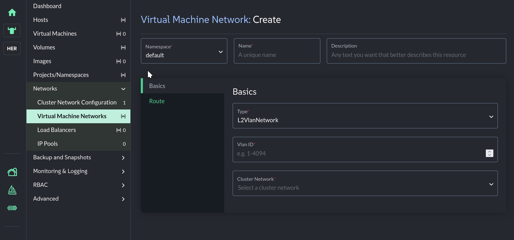

🛗 Chapter 2 — The Subterranean Divide
======================================

<style type="text/css">
  * {
    font-family: suse;
    src: url('https://fonts.google.com/specimen/SUSE');
  }
  .suse { color: #30ba78; }
  .virt { color: #30ba78; }
  .bank { color: #d4af37; }
  .danger { color: #ff4d4d; font-weight: bold; }
  .hovereffect {
    border-radius: 25px 25px 25px 25px;
    background: linear-gradient(#30ba78 0 0) var(--hundredpercent, 0) / var(--hundredpercent, 0) no-repeat;
    transition: 0.5s, background-position 0s;
    padding: 5px;
  }
  .hovereffect:hover {
    --hundredpercent: 100%;
    color: white;
    border-radius: 10px 25px 10px 25px;
  }
  .storybox {
    border-left: 5px solid #d4af37;
    border-radius: 0 15px 15px 0;
    background: linear-gradient(135deg, rgba(48,186,120,.10), rgba(212,175,55,.10));
    padding: 15px 20px;
    margin: 15px 0;
  }
  .storybox em { color: #d4af37; }
  .missionbox {
    border: 2px dashed #30ba78;
    border-radius: 15px;
    padding: 12px 18px;
    margin: 15px 0;
  }
  .highlightcopy { color: white; font-weight: bold; padding: 0 10px; }
  img.logos { border-radius: 10px; }
</style>

<div class="storybox">

Sarah leads you out of the quiet executive suites, into a secure elevator, and down into the bank's subterranean datacenter. The ambient temperature drops sharply as the heavy steel biometric doors lock behind you. The room hums with the deafening, relentless roar of industrial cooling systems.

She gestures to the left side of the room, where rows of sleek, densely packed server chassis blink with rapid blue lights. *"Those run our mobile banking APIs,"* she shouts over the fan noise. *"Pure microservices. Fully containerized and agile."*

She then points to the right side of the room, dominated by hulking, archaic server cabinets radiating an uncomfortable amount of heat. *"And those are the legacy monolithic virtual machines holding the core transaction ledgers. Two completely different worlds. Two different hardware silos. Two different engineering teams that barely even speak to each other."*

You walk between the two rows, feeling the distinct temperature differential. *"That divide ends today,"* you tell her.

</div>

## <b class="hovereffect">One fabric for two worlds</b>

You explain the elegant architecture of <b class="virt">SUSE Virtualization</b>: by leveraging advanced open-source technologies on a **Kubernetes foundation**, the platform does not just *tolerate* virtual machines — it treats them as **native citizens of the container ecosystem**. The heavy virtual machines will run side-by-side with the nimble containers, managed by the exact same orchestration engine:

| Legacy silo | Container silo | Unified on SUSE Virtualization |
|-------------|----------------|-------------------------------|
| Hypervisor hosts | Kubernetes nodes | **One set of nodes runs both** |
| VM management console | `kubectl` | **One API, one CLI, one UI** |
| SAN storage arrays | CSI volumes | **Longhorn serves VMs and pods alike** |
| Two on-call teams | | **One platform team** |

To prove the architecture is sound, you must prepare the environment to host the bank's workloads.

<div class="missionbox">

## 🎯 Your Quest Objectives

1. Inspect the physical node topology
2. Map the nodes via the command line
3. Expose the virtualization operators
4. Prepare a dedicated workspace for the bank
5. Build the bank's production VM network
6. Reserve address space for customer-facing services

</div>

🖥️ Task 1: Inspect the physical node topology
=============================================

Go to the [button label="SUSE Virtualization UI" variant="success"](tab-0), navigate to the left-hand menu, and click on **Hosts**.

1. Click on the name of the **first host** in the list
2. Navigate to the **Storage** tab for that host

Observe how raw block devices are provisioned for virtual machine disks. Each disk you see here becomes part of the Longhorn distributed storage pool that will hold the bank's ledgers.

🗺️ Task 2: Map the nodes via the command line
=============================================

Switch your view to the [button label="Cluster Terminal" variant="success"](tab-1). Because <b class="virt">SUSE Virtualization</b> operates natively on Kubernetes, these very same hosts can be queried using standard cluster commands:

```bash,run
kubectl get nodes -o wide
```

Compare the output with the **Hosts** page you just visited — same machines, same IPs, same OS image. The UI and the API are two views of one single source of truth.

⚙️ Task 3: Expose the virtualization operators
==============================================

You need to reveal the hidden engine that translates traditional virtual machine instructions into container-native processes. Query the system namespace to expose the virtualization operators:

```bash,run
kubectl get pods -n harvester-system | grep virt
```

You should see components like `virt-api`, `virt-controller`, and `virt-handler` — this is **KubeVirt**, the engine that runs every VM as a pod. `virt-handler` runs on every node, acting as the bridge between Kubernetes and KVM.

🏗️ Task 4: Prepare a dedicated workspace for the bank
=====================================================

In Kubernetes, workloads are isolated in **namespaces**. You need to create a dedicated space for the financial workloads you are about to deploy:

```bash,run
kubectl create namespace vertex-trust-prod
```

Verify it exists:

```bash,run
kubectl get namespace vertex-trust-prod --show-labels
```

🌐 Task 5: Build the bank's production VM network
=================================================

Before a single ledger VM can boot, it needs a network to live on — one that lets the bank's virtual machines talk to each other and to the outside world.

In the [button label="SUSE Virtualization UI" variant="success"](tab-0):

1. Select **Networks** from the left-hand menu, then **Virtual Machine Networks**
2. Click **Create**


3. Fill in:
   - **Name:** <b class="highlightcopy">vmnet</b>
   - **Type:** `UntaggedNetwork`
   - **Cluster Network:** `mgmt`
4. Click **Create**



Verify from the [button label="Cluster Terminal" variant="success"](tab-1):

```bash,run
kubectl get network-attachment-definitions -n default
```

`vmnet` should be listed. Every bank workload you deploy in the coming chapters attaches to this network.

> [!NOTE]
> On production hardware with more physical NICs, best practice is to split responsibilities across dedicated networks — management, storage replication, live migration, and VM workload traffic each on their own uplink. In this lab, everything rides the `mgmt` cluster network. SUSE Virtualization also supports VLAN tagging, load-balancer configurations, and other software-defined networking services — you will build a tagged VLAN yourself in a later chapter.

🏦 Task 6: Reserve address space for customer-facing services
=============================================================

<b class="virt">SUSE Virtualization</b> is not only a virtualization platform — it is designed to also run Kubernetes clusters on top. Those clusters need LoadBalancer IPs to expose their services. An **IP Pool** pre-allocates a range of addresses for exactly that.

The bank will need this soon: the mobile banking portal, the ops dashboard, and every customer-facing service will pull its address from this reserve.

In the [button label="SUSE Virtualization UI" variant="success"](tab-0):

1. Go to **Networks > IP Pools** > **Create**
2. Set the name to <b class="highlightcopy">vertex-ippool</b>
3. On the **Range** tab, add the range `192.168.122.200` to `192.168.122.220`
4. On the **Selector** tab:
   - **VM Network:** `default/vmnet`
   - **Namespace:** `default`
5. Click **Create**

Verify:

```bash,run
kubectl get ippools.network.harvesterhci.io -n default
```

`vertex-ippool` should be listed. The bank's address reserve is funded.

🏋️ Bonus Drills — know your metal
==================================

- **Audit the resources one node can offer the bank.** Pick the first node name from `kubectl get nodes` and inspect its capacity:

```bash,run
kubectl describe node $(kubectl get nodes -o jsonpath='{.items[0].metadata.name}') | grep -A 6 "Allocatable"
```

- **Inspect the storage fabric powering those disks you saw in Task 1:**

```bash,run
kubectl get pods -n longhorn-system | head -15
```

- **Confirm the cluster is a blank canvas** — no bank VMs exist yet anywhere:

```bash,run
kubectl get vm -A
```

- **Label the new workspace** so future automation can target production financial workloads:

```bash,run
kubectl label namespace vertex-trust-prod stage=prod owner=vertex-trust
```

💼 Why does this matter for Vertex Trust Bank?
==============================================

- **The silos disappear.** VMs and containers share nodes, storage, networking, and one operations team — the datacenter's "temperature divide" is gone.
- **No retraining cliff.** The container team's Kubernetes skills now manage the VM estate too; the VM team gets a familiar point-and-click UI backed by the same API.
- **Namespaces bring governance.** Financial workloads live in `vertex-trust-prod` with their own quotas, policies, and access controls — auditors will love it.
- **Networking is self-service.** A production VM network and a LoadBalancer address reserve took minutes to define — no switch tickets, no waiting on the network team.

<div class="storybox">

Sarah stares at the terminal output over your shoulder, watching the virtualization pods running smoothly across the nodes and the new namespace spin up. A faint smile breaks across her face. *"The foundation is solid. Let's get to work."*

</div>

Click **Check** to continue. ⚡

📚 More information
===================

- [SUSE Virtualization — Overview](https://documentation.suse.com/cloudnative/virtualization/latest/en/introduction/overview.html)
- [Hardware and Network Requirements](https://documentation.suse.com/cloudnative/virtualization/latest/en/installation-setup/requirements.html)
