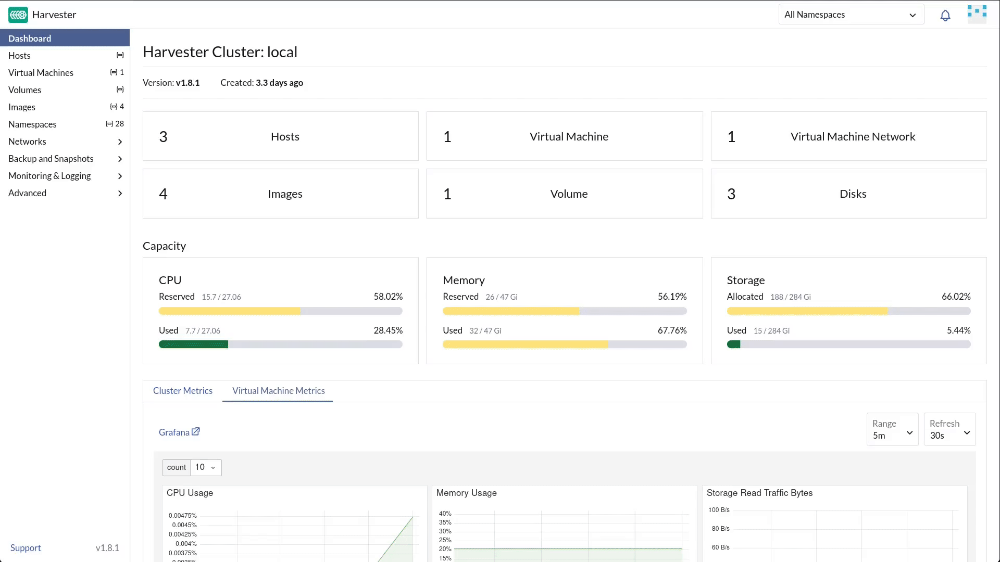
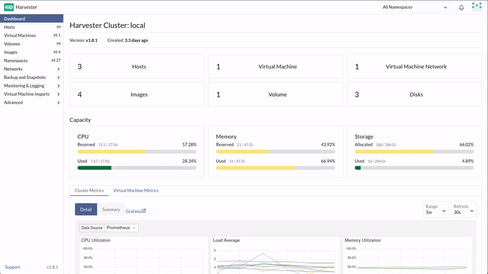
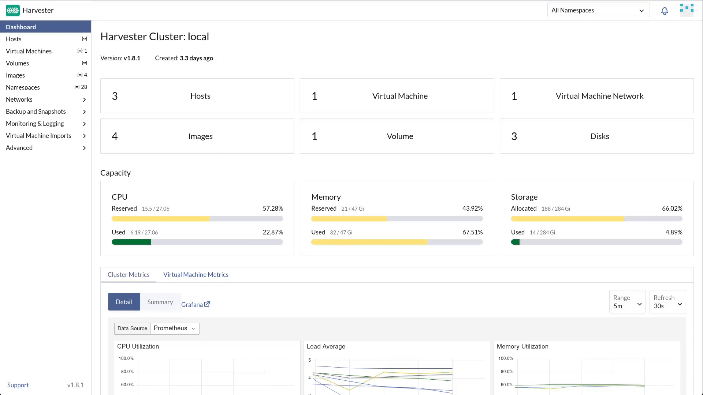
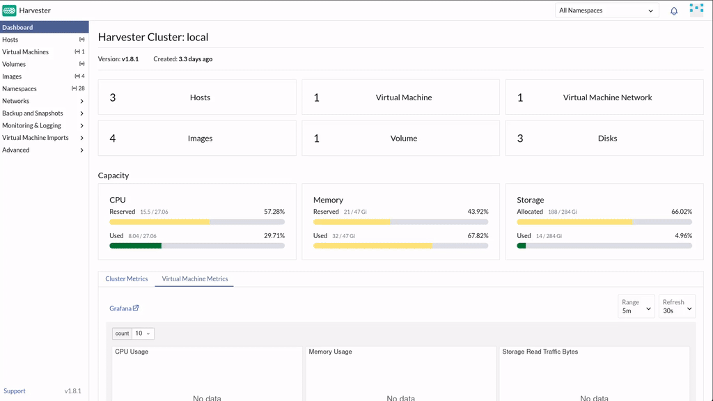

🛗 Chapter 2: The Subterranean Divide
======================================

<style type="text/css">
  * {
    font-family: suse;
    src: url('https://fonts.google.com/specimen/SUSE');
  }
  .suse { color: #30ba78; }
  .virt { color: #30ba78; }
  .bank { color: #d4af37; }
  .danger { color: #ff4d4d; font-weight: bold; }
  .hovereffect {
    border-radius: 25px 25px 25px 25px;
    background: linear-gradient(#30ba78 0 0) var(--hundredpercent, 0) / var(--hundredpercent, 0) no-repeat;
    transition: 0.5s, background-position 0s;
    padding: 5px;
  }
  .hovereffect:hover {
    --hundredpercent: 100%;
    color: white;
    border-radius: 10px 25px 10px 25px;
  }
  .story {
    border-left: 5px solid #d4af37;
    border-radius: 0 15px 15px 0;
    background: linear-gradient(135deg, rgba(48,186,120,.10), rgba(212,175,55,.10));
    padding: 15px 20px;
    margin: 15px 0;
  }
  .story em { color: #d4af37; }
  .missionbox {
    border: 2px dashed #30ba78;
    border-radius: 15px;
    padding: 12px 18px;
    margin: 15px 0;
  }
  .highlightcopy { color: white; font-weight: bold; padding: 0 10px; }
  img.logos { border-radius: 10px; }
  /* compact credential boxes (scoped: only code blocks inside <div class="cred">) */
  .cred > div { margin: 0; }
  .cred .my-3 {
    display: flex;
    flex-direction: row-reverse;   /* put the copy bar on the right */
    align-items: stretch;
    width: fit-content;
    min-width: 14em;
    margin: 4px 0;
    overflow: hidden;
  }
  .cred .my-3 > div:first-child {  /* the bar holding the copy button */
    height: auto;
    padding: 2px 8px;
    border-bottom: none;
    border-left: 1px solid rgba(255,255,255,.25);
    border-radius: 0;
    display: flex;
    align-items: center;
    background-color: #30ba78;
  }
  .cred .my-3 > div:first-child,
  .cred .my-3 > div:first-child * {
    color: #fff !important;
  }
  .cred .my-3 > div:first-child:hover,
  .cred .my-3 > div:first-child:hover * {
    font-weight: bold;
  }
  .cred .my-3 > pre {
    flex: 1 1 auto;
    margin: 0 !important;
    padding: 2px !important;
    border-radius: 0 !important;
    display: flex;
    align-items: center;
  }
  .cred-sparkle {
    animation: cred-sparkle 0.8s ease-out;
  }
  @keyframes cred-sparkle {
    0%   { text-shadow: 0 0 2px #fff, 0 0 10px #30ba78, 0 0 20px #ffd700; }
    100% { text-shadow: none; }
  }

  img.animatedgif {
    --borderthickness: 5pt;
    --colors: #0000 25%,#30ba78 0;
    padding: 10px;
    background:
      conic-gradient(from 90deg  at top    var(--borderthickness) left  var(--borderthickness),var(--colors)) 0    0,
      conic-gradient(from 180deg at top    var(--borderthickness) right var(--borderthickness),var(--colors)) 100% 0,
      conic-gradient(from 0deg   at bottom var(--borderthickness) left  var(--borderthickness),var(--colors)) 0    100%,
      conic-gradient(from -90deg at bottom var(--borderthickness) right var(--borderthickness),var(--colors)) 100% 100%;
    background-size: 50px 50px;
    background-repeat: no-repeat;
    transition: 1s;
  }

  img.animatedgif:hover {
    background-size: 51% 51%;
  }

  .embedded_img {
    margin: 0;
    padding: 0;
    display: inline-block;
  }

</style>
<script>
document.querySelectorAll('.cred .my-3 > div:first-child button').forEach(function(btn){
  if (btn.dataset.sparkleBound) return;
  btn.dataset.sparkleBound = '1';
  btn.addEventListener('click', function(){
    var pre = btn.closest('.my-3').querySelector('pre');
    if (!pre) return;
    pre.classList.remove('cred-sparkle');
    void pre.offsetWidth;
    pre.classList.add('cred-sparkle');
    setTimeout(function(){ pre.classList.remove('cred-sparkle'); }, 800);
  });
});
</script>


<div id="201" class="story">

Sarah leads you out of the quiet executive suites, into a secure elevator, and down into the bank's subterranean datacenter. The ambient temperature drops sharply as the heavy steel biometric doors lock behind you. The room hums with the deafening, relentless roar of industrial cooling systems.

She gestures to the left side of the room, where rows of sleek, densely packed server chassis blink with rapid blue lights. *"Those run our mobile banking APIs,"* she shouts over the fan noise. *"Pure microservices. Fully containerized and agile."*

She then points to the right side of the room, dominated by hulking, archaic server cabinets radiating an uncomfortable amount of heat. *"And those are the legacy monolithic virtual machines holding the core transaction ledgers. Two completely different worlds. Two different hardware silos. Two different engineering teams that barely even speak to each other."*

You walk between the two rows, feeling the distinct temperature differential. *"That divide ends today,"* you tell her.

</div>

## <b class="hovereffect">One fabric for two worlds</b>

You explain the elegant architecture of <b class="virt">SUSE Virtualization</b>: by using advanced open-source technologies on a **Kubernetes foundation**, the platform does not just *tolerate* virtual machines: it treats them as **native citizens of the container ecosystem**. The heavy virtual machines will run side-by-side with the nimble containers, managed by the exact same orchestration engine:

| Virtualization world | Container World | Unified on SUSE Virtualization |
|---------------------|----------------|-------------------------------|
| Hypervisor hosts | Kubernetes nodes | **One set of nodes runs both** |
| Hypervisor management console | Container tooling | **One platform underneath**. SUSE Virtualization runs the VMs, Rancher Prime commands the clusters and the containers |
| SAN storage arrays | CSI volumes | **Longhorn serves VMs and pods alike** |

That last row is where you start. Every VM disk, every container's persistent volume, all of it rides on the same distributed storage fabric, and not every workload deserves the same price tag.

<div class="missionbox">

## 🎯 Your Quest Objectives

1. Inspect the physical node topology
2. Prepare a dedicated workspace for the bank
3. Understand how Longhorn replicates your data
4. Build a cost-tier storage class for the development team

</div>

🔐 Login Credentials
====================

The **SUSE Virtualization** UI and **Rancher Prime** UI use the same credentials.

Username:

<div class="cred">

```txt
admin
```

</div>

Password:

<div class="cred">

```txt
[[ Instruqt-Var key="RANCHER_PASSWORD" hostname="kvm-host" ]]
```

</div>


☁️ What is Longhorn?
====================

<b class="highlightcopy">Longhorn</b> is the distributed storage system built into SUSE Virtualization that you can use. It pools the raw disks sitting on every node and turns them into one shared storage fabric.

By default every volume it creates is replicated across multiple nodes, so a disk failure or a node reboot never makes you lose the data. No SAN, no separate storage team, one system for VMs and containers alike.

It is ready for you to use but if you want to use other CSI you are free to use it, no vendor lock-in.


🖥️ Task 1: Inspect the physical node topology
=============================================


<div style='align: middle; margin: 15px;'>
  
</div>


Go to the [button label="SUSE Virtualization UI" variant="success"](tab-0), navigate to the left-hand menu, and click on **Hosts**.

1. Click on the name of **one of the hosts** in the list
2. Navigate around the UI and check the different options to understand better how things work. Observe how raw block devices are provisioned for virtual machine disks. Each disk you see here becomes part of the Longhorn distributed storage pool that will hold the bank's ledgers.


<div id="203" class="story">
Banks grow, and so does this fabric. Running low on space is not a forklift upgrade anymore. Rack a new node, add its raw disks to the pool, and Longhorn rebalances replicas across the expanded fabric automatically with no downtime, no data migration weekend. Storage capacity scales the same way compute does: incrementally, on demand.
</div>


🏗️ Task 2: Prepare a dedicated workspace
========================================


<div style='align: middle; margin: 15px;'>
  
</div>

The platform isolates workloads in **namespaces**, separate, governable workspaces on the same cluster.

In the [button label="SUSE Virtualization UI" variant="success"](tab-0), select **Namespaces** from the left-hand menu. You will notice <b class="highlightcopy">prod</b> already sitting in the list. The platform team provisioned it before you arrived, and it is where the bank's production workloads will live.

Now create its counterpart for development:

1. Click **Create**
2. Set the **Name** to:

<div class="cred">

```txt
dev
```

</div>

3. Set the **Description** to:

<div class="cred">

```txt
VMs from dev
```

</div>


4. Click **Create**

The developers workspace now stand ready, in the future we can assign to it quotas, policies, and access controls.

💾 Task 3: Understand how Longhorn replicates your data
========================================================


<div style='align: middle; margin: 15px;'>
  
</div>

Let's look at *how* the storage backend stays healthy. Every disk <b class="virt">SUSE Virtualization</b> hands to a VM or a pod is a **Longhorn volume**, and every Longhorn volume is created from a **StorageClass**: a policy that decides, among other things, how many copies of your data exist at any given time.

In the [button label="SUSE Virtualization UI" variant="success"](tab-0), go to **Advanced > Storage Classes** and click on <b class="highlightcopy">harvester-longhorn</b>.

Note the **Number Of Replicas** field: it is set to **3**. Every volume created from this class gets three full copies, spread across three different nodes.

<div id="204" class="story">
That is exactly right for the transaction ledgers — lose a node, even lose a disk mid-write, and the data survives untouched.
</div>

Let's look under the hood and see how Longhorn stores the data:

1. Go to the [button label="Cluster Terminal" variant="success"](tab-1) and SSH into one of the SUSE Virtualization hosts:
```bash,run
rodeo ssh harvester1
```
2. Check the Longhorn folder on the harvester1 node: you will see some folders and files:
```bash,run
ls /var/lib/harvester/defaultdisk
```
3. Inside the replicas folder, find one folder per volume replica this node holds:
```bash,run
ls /var/lib/harvester/defaultdisk/replicas/
```
4. Leave the host by typing exit:
```bash,run
exit
```

> [!NOTE]
> Three replicas means three times the disk footprint. That is the correct trade for production money. It is wasteful for a developer's disposable test VM that gets deleted by Friday. Replica count is a **policy**, not a law of physics, and policies can be tuned per workload.

🧅 Task 4: Build a cost-tier storage class for the development team
=====================================================================


<div style='align: middle; margin: 15px;'>
  
</div>


The development team does not need production-grade replication for their sandboxes, they need cheap, fast iteration. You will give them their own storage tier, priced for what it actually is: disposable.

In the [button label="SUSE Virtualization UI" variant="success"](tab-0), under **Advanced > Storage Classes**:

1. Click **Create**
2. Set the **Name** to:

<div class="cred">

```txt
harvester-longhorn-1rep
```

</div>


3. Set **Number Of Replicas** to:

<div class="cred">

```txt
1
```

</div>


4. Set **Node Selector** to: **dev** so that it is only scheduled on dev nodes.


5. Click **Create**

Two StorageClasses sit side by side in the list: `harvester-longhorn` (3 replicas, production) and <b class="highlightcopy">harvester-longhorn-1rep</b> (1 replica for dev sandboxes, at a third of the disk cost). The dev team will reach for this tier every time they spin up a disposable VM in the chapters ahead.

> [!NOTE]
> One replica means **zero redundancy**, lose that single node and the volume is gone. That is an acceptable risk for a sandbox nobody depends on overnight, and a very deliberate trade-off you are making on the record, not an accident. Storage classes can also encode disk tags to steer workloads to specific hardware, production on fast NVMe, development on cheaper spindles.

🏋️ Bonus Drills: for the command-line curious (optional)
==========================================================

<div style='align: middle; margin: 15px;'>
  
</div>


New to Kubernetes? **Skip ahead freely.** If you are curious, everything you just did in the UI is also visible through the Kubernetes API, open the [button label="Cluster Terminal" variant="success"](tab-1):


- **See your UI storage classes as API objects**: the workspace and both storage tiers:

```bash,run
kubectl --kubeconfig .rodeo/harvester-kubeconfig get namespace dev -o wide; kubectl --kubeconfig .rodeo/harvester-kubeconfig get storageclasses;
```

- **Label the new workspace** so future automation can target it easily:

```bash,run
kubectl --kubeconfig .rodeo/harvester-kubeconfig label namespace dev stage=dev
```

💼 Why does this matter?
==============================================

- **The silos disappear.** VMs and containers share nodes, storage, and one operations team. The datacenter's "temperature divide" is gone.
- **No retraining cliff.** The container team's Kubernetes skills now manage the VM estate too; the VM team gets a familiar point-and-click UI backed by Kubernetes API.
- **Namespaces bring governance.** Financial workloads live in `prod` with their own quotas, policies, and access controls. Auditors will love it.
- **Storage has a price list now.** Replication is a dial, not a default. Production data gets three copies because it must; disposable sandboxes get one because they should not cost more than they need to.

<div id="202" class="story">

Sarah watches over your shoulder as the new workspace and the two storage tiers appear on the dashboard, one after another. A faint smile breaks across her face. *"The foundation is solid. Let's get to work."*

</div>

Click **Check** to continue. ⚡


📚 More information
===================

- [SUSE Virtualization: Overview](https://documentation.suse.com/cloudnative/virtualization/latest/en/introduction/overview.html)
- [Storage: Overview](https://documentation.suse.com/cloudnative/virtualization/latest/en/storage/overview.html)
