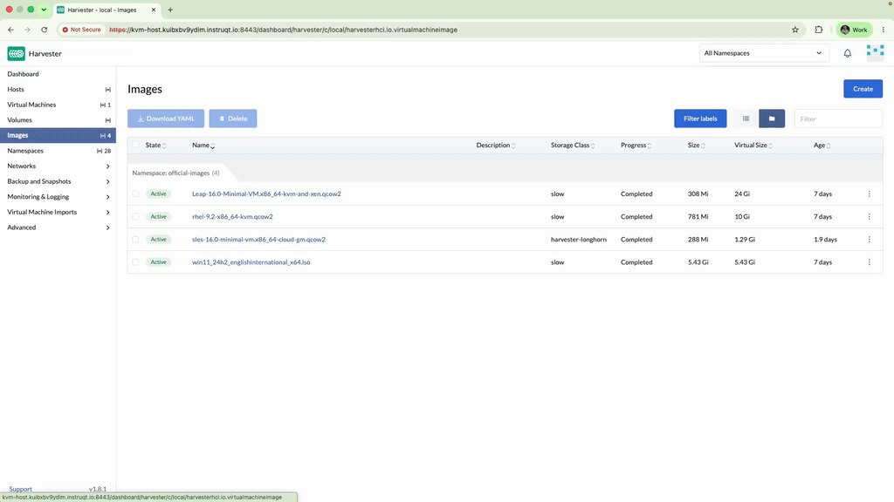
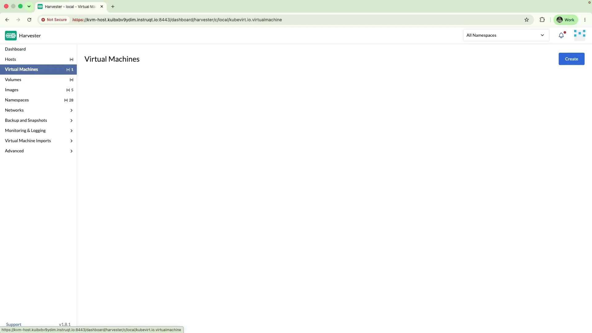
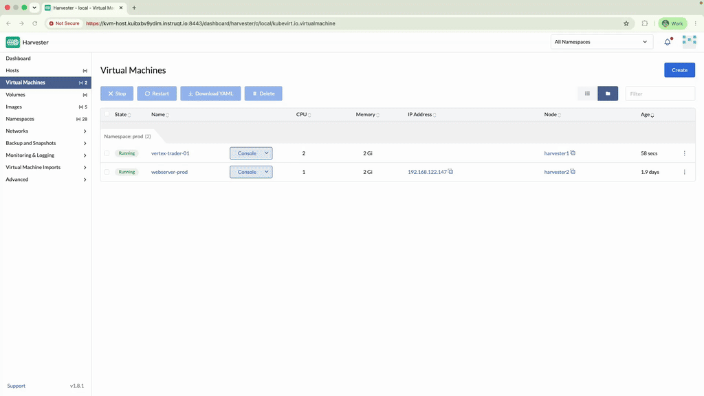

⚡ Chapter 3: The Flash Crash
=============================

<style type="text/css">
  * {
    font-family: suse;
    src: url('https://fonts.google.com/specimen/SUSE');
  }
  .suse { color: #30ba78; }
  .virt { color: #30ba78; }
  .bank { color: #d4af37; }
  .danger { color: #ff4d4d; font-weight: bold; }
  .hovereffect {
    border-radius: 25px 25px 25px 25px;
    background: linear-gradient(#30ba78 0 0) var(--hundredpercent, 0) / var(--hundredpercent, 0) no-repeat;
    transition: 0.5s, background-position 0s;
    padding: 5px;
  }
  .hovereffect:hover {
    --hundredpercent: 100%;
    color: white;
    border-radius: 10px 25px 10px 25px;
  }
  .story {
    border-left: 5px solid #d4af37;
    border-radius: 0 15px 15px 0;
    background: linear-gradient(135deg, rgba(48,186,120,.10), rgba(212,175,55,.10));
    padding: 15px 20px;
    margin: 15px 0;
  }
  .story em { color: #d4af37; }
  .missionbox {
    border: 2px dashed #30ba78;
    border-radius: 15px;
    padding: 12px 18px;
    margin: 15px 0;
  }
  .highlightcopy { color: white; font-weight: bold; padding: 0 10px; }
  img.logos { border-radius: 10px; }
  img.animatedgif {
    --borderthickness: 5pt;
    --colors: #0000 25%,#30ba78 0;
    padding: 10px;
    background:
      conic-gradient(from 90deg  at top    var(--borderthickness) left  var(--borderthickness),var(--colors)) 0    0,
      conic-gradient(from 180deg at top    var(--borderthickness) right var(--borderthickness),var(--colors)) 100% 0,
      conic-gradient(from 0deg   at bottom var(--borderthickness) left  var(--borderthickness),var(--colors)) 0    100%,
      conic-gradient(from -90deg at bottom var(--borderthickness) right var(--borderthickness),var(--colors)) 100% 100%;
    background-size: 50px 50px;
    background-repeat: no-repeat;
    transition: 1s;
  }
  img.animatedgif:hover {
    background-size: 51% 51%;
  }
  /* compact credential boxes (scoped: only code blocks inside <div class="cred">) */
  .cred > div { margin: 0; }
  .cred .my-3 {
    display: flex;
    flex-direction: row-reverse;   /* put the copy bar on the right */
    align-items: stretch;
    width: fit-content;
    min-width: 14em;
    margin: 4px 0;
    overflow: hidden;
  }
  .cred .my-3 > div:first-child {  /* the bar holding the copy button */
    height: auto;
    padding: 2px 8px;
    border-bottom: none;
    border-left: 1px solid rgba(255,255,255,.25);
    border-radius: 0;
    display: flex;
    align-items: center;
    justify-content: center;
    background-color: #30ba78;
  }
  .cred .my-3 > div:first-child,
  .cred .my-3 > div:first-child * {
    color: #fff !important;
  }
  .cred .my-3 > div:first-child:hover,
  .cred .my-3 > div:first-child:hover * {
    font-weight: bold;
  }
  .cred .my-3 > pre {
    flex: 1 1 auto;
    margin: 0 !important;
    padding: 2px !important;
    border-radius: 0 !important;
    display: flex;
    align-items: center;
  }

  img.animatedgif {
    --borderthickness: 5pt;
    --colors: #0000 25%,#30ba78 0;
    padding: 10px;
    background:
      conic-gradient(from 90deg  at top    var(--borderthickness) left  var(--borderthickness),var(--colors)) 0    0,
      conic-gradient(from 180deg at top    var(--borderthickness) right var(--borderthickness),var(--colors)) 100% 0,
      conic-gradient(from 0deg   at bottom var(--borderthickness) left  var(--borderthickness),var(--colors)) 0    100%,
      conic-gradient(from -90deg at bottom var(--borderthickness) right var(--borderthickness),var(--colors)) 100% 100%;
    background-size: 50px 50px;
    background-repeat: no-repeat;
    transition: 1s;
  }

  img.animatedgif:hover {
    background-size: 51% 51%;
  }

  .embedded_img {
    width: 100%;
    height: auto;
    max-height: 1.5vh;
    max-width: 1.5vh;
    margin: 0;
    padding: 0;
    display: inline-block;
  }

</style>


<div id="301" class="story">

You are sitting in a makeshift office just outside the datacenter, halfway through reviewing the network topologies, when the overhead emergency lights suddenly pulse a harsh yellow. Your radio crackles to life. It is the **Head of Quantitative Trading**, and he sounds panicked.

*"We have a <span class="danger">massive anomaly</span> in the Asian markets!"* he shouts over the chaotic background noise of a frenzied trading floor. *"Our current algorithmic models are failing to parse the incoming data stream fast enough. We need a new, dedicated high-performance calculation engine deployed immediately, complete with a secondary high-speed data volume, or we are going to bleed millions in the next ten minutes!"*

In the past, fulfilling this emergency request at <b class="bank">Vertex Trust Bank</b> meant opening a priority ticket, waiting for the infrastructure team to carve out storage allocations, and manually installing an operating system. It was a process that took **days**.

You do not have days. **You have minutes.**


You bypass the legacy ticketing system entirely and prepare to deploy a fully configured Linux virtual machine (with injected security credentials and attached storage) in mere seconds.
</div>


<div class="missionbox">

## 🎯 Your Quest Objectives

1. Verify the operating system image
2. Provision the calculation engine
3. Access the Web Console

</div>

🔐 Login Credentials
====================

The **SUSE Virtualization** UI and **Rancher Prime** UI use the same credentials.

Username:

<div class="cred">

```txt
admin
```

</div>

Password:

<div class="cred">

```txt
[[ Instruqt-Var key="RANCHER_PASSWORD" hostname="kvm-host" ]]
```

</div>


📀 Task 1: Verify the operating system image
============================================

Go to the [button label="SUSE Virtualization UI" variant="success"](tab-0), navigate to **Images** on the left side panel, and confirm that the base **SLES-16.0-Minimal-VM.x86_64-Cloud-GM.qcow2** operating system image is present and marked as **Active**.

> [!NOTE]
> Images in <b class="virt">SUSE Virtualization</b> are cluster-wide golden masters. Every VM you boot from this image gets its own copy-on-write disk. The image itself is never modified.

**If the image were missing**, you could add it yourself in seconds, no waiting for a storage admin.

Images can be created from a URL, uploaded from your workstation, or exported from an existing volume via **Images > Create**:

<div style='align: middle; margin: 15px;'>
  
</div>

For example, let's add a new image:

1. Go to **Images** on the left panel and click **Create**, then fill in the following details:
   - **Namespace**: <b class="highlightcopy">official-images</b>
   - **Name**: filled in automatically
   - Basics:
     - **URL**:


<div class="cred">

```txt
http://192.168.122.1:8889/SLES15-SP7-Minimal-VM.x86_64-Cloud-GM.qcow2
```

</div>


2. Click **Create**

The image you just created appears in the list with the state **Downloading**. You can follow it in the progress column.

Move on to the next task; once the download completes, an alert shows up in the **notification bell** at the top right of the screen.


> [!NOTE]
> The download runs server-side, from a local mirror on this lab's own network, so it lands in seconds. The image becomes **Active** once Longhorn has it replicated.


🚀 Task 2: Provision the calculation engine
===========================================


For this task we are going to create our first VM.


> [!NOTE]
> Please don't click **Create** until instructed.

<div style='align: middle; margin: 15px;'>
  
</div>


Navigate to **Virtual Machines** and click the **Create** button.

Configure the engine exactly as the quants need it:

- **Name**:
<div class="cred">

```txt
vertex-trader-01
```

</div>

- **Namespace**:
<div class="cred">

```txt
prod
```

</div>


  If the namespace does not exist, create it.

- **CPU**:
<div class="cred">

```txt
2
```

</div>


- **Memory**:
<div class="cred">

```txt
2
```

</div>


Notice the very low resources: our future crew of quants is highly skilled, and their application is extremely optimized for low latency and low resource usage.

- **SSHKey**: <b class="highlightcopy">prod/default</b>


Under the **Volumes** tab, fill in the following details:

- **Image**: <b class="highlightcopy">official-images/SLES-16.0-Minimal-VM.x86_64-Cloud-GM.qcow2</b>
- **Size**:
<div class="cred">

```txt
5
```

</div>

Then add a new volume by clicking **Add Volume**, and fill in the following details:

- **Name**:
<div class="cred">

```txt
market-data-vol
```

</div>

- **Size**:
<div class="cred">

```txt
1
```

</div>

Now wire the engine into the bank's network. Under the **Networks** tab:

- **Network**: <b class="highlightcopy">prod/service</b>


<div id="302" class="story">


This fulfills the trader's request for a secondary high-speed data drive. Behind the scenes, both disks become replicated Longhorn volumes, the market data survives even if a physical disk dies mid-trade.

</div>


Since this is a mixed-environment cluster, let's make sure the VM runs only on production nodes.

Click on **Node Scheduling**: SUSE Virtualization offers three choices:

- **Any available node**: the Kubernetes scheduler chooses where to place the VM, and **live migration stays enabled**
- **Specific node**: pin the VM to one node (no migration possible)
- **Scheduling rules**: affinity rules based on node labels (GPU capability, NUMA topology, network zone…)

Configure the production rule:

1. Select **Run virtual machine on node(s) matching scheduling rules**
2. Click **Add Node Selector**, then **Add Rule**:

- **Key**:
<div class="cred">

```txt
stage
```

</div>

- **Value**:
<div class="cred">

```txt
prod
```

</div>


Now assign it a label: go to the **Labels** tab and click **Add Label**:

- **Key**:
<div class="cred">

```txt
stage
```

</div>

- **Value**:
<div class="cred">

```txt
prod
```

</div>

This will help us manage the VM with future automation.


Navigate to **Advanced Options**, then select **Cloud Configuration**, to make sure the trading system comes up with all the required settings and packages installed.

In **User Data Template**, click **Create New** to define the standard template the whole production namespace will reuse. Name it:

- **Name**:
<div class="cred">

```txt
prod
```

</div>

Since the template lives in the <b class="highlightcopy">prod</b> namespace and is itself named <b class="highlightcopy">prod</b>, it becomes <b class="highlightcopy">prod/prod</b>: the production standard, ready for every VM this namespace deploys from now on. For the **User Data**, enter:

```yaml
#cloud-config
packages:
  - qemu-guest-agent
runcmd:
  - - systemctl
    - enable
    - --now
    - qemu-guest-agent.service
ssh_authorized_keys:
  - ssh-ed25519
    AAAAC3NzaC1lZDI1NTE5AAAAIFdt8wX4G0WGg/l4uDq/LntBO7WiNyqh0+pNUzF/NfMa
```

Save the template by clicking in **Create**, then make sure <b class="highlightcopy">prod/prod</b> is selected as the **User Data Template** back on the VM creation form.

<div id="303" class="story">
The trading desk's firewall team has one more demand:
</div>

The engine must come up on a **predictable address**, not whatever DHCP hands out. In the **Network Data** field, enter:

```yaml
version: 2
ethernets:
  enp1s0:
    addresses:
      - 192.168.122.50/24
    gateway4: 192.168.122.1
    nameservers:
      addresses:
        - 192.168.122.1
```

Cloud-init applies both on first boot: <b class="highlightcopy">vertex-trader-01</b> will come online at `192.168.122.50` with zero post-deployment manual setup.

> [!NOTE]
> This is **cloud-init**, the same industry-standard mechanism used by every major public cloud.
> In a real-case scenario there would be more complete automation and dedicated templates for this server's purpose.


Now we have finished the configuration please click **Create** to initialize the deployment of the Virtual Machine.

<div id="304" class="story">
Scheduling rules let you separate critical systems from other workloads, for example, pinning the trading engines to low-latency nodes while batch jobs share the rest. Keeping "any available node" here matters: it is what makes the zero-downtime evacuation in the next chapter possible.

</div>

> [!NOTE]
> **When microseconds are money:** the high-frequency trading desk will demand more than placement rules and dedicated hardware. <b class="virt">SUSE Virtualization</b> can **pin dedicated CPU cores** to a VM, pass hardware straight through, virtualize hardware using **SR-IOV** (for both NICs and GPUs), and slice datacenter GPUs into hardware-isolated **MIG partitions** so several VMs share one GPU with no noisy neighbors. Dedicating physical resources to a VM buys **predictable, consistent latency**. This exercise is just for educational purposes and not a recommendation for how to setup a high-frequency trading application.

> [!IMPORTANT]
> Since this lab runs on a **nested configuration**, I/O performance is a bit slower than usual, and the provisioning process will take a few minutes. While your VM spins up, we have some entertainment lined up for you! Head over to Bonus Drills to learn how to interact with the SUSE Virtualization API using the CLI. Everything in SUSE Virtualization is a Kubernetes object, which means you can manage it via the Kubernetes API through the underlying RKE2 cluster.
> Once you're done, jump back into Task 3.

🖥️ Task 3: Access the Web Console
=================================

Monitor the [button label="SUSE Virtualization UI" variant="success"](tab-0) until the virtual machine transitions to the **Running** state.

<div style='align: middle; margin: 15px;'>
  
</div>


1. Click the **Console** button on the virtual machine row to open the VNC web console
2. Observe we can access the system without a connection by using this method, don't wait for the installation to finish just move on to the next.
3. Close the console window


🏋️ Bonus Drills: see through the abstraction (optional, for the command-line curious)
========================================================================================

New to Kubernetes? **Skip ahead freely.** Otherwise, back in the [button label="Cluster Terminal" variant="success"](tab-1), look at what the platform actually created for you:

- **The golden images are API objects too:**

```bash,run
kubectl --kubeconfig .rodeo/harvester-kubeconfig get virtualmachineimages -A
```

- **The VM is a Kubernetes resource:**

```bash,run
kubectl --kubeconfig .rodeo/harvester-kubeconfig get virtualmachines -n prod
```

- **The running instance, with its node and IP** (the same IP you used for SSH):

```bash,run
kubectl --kubeconfig .rodeo/harvester-kubeconfig get vmi -n prod -o wide
```

- **The disks are ordinary PersistentVolumeClaims backed by Longhorn:**

```bash,run
kubectl --kubeconfig .rodeo/harvester-kubeconfig get pvc -n prod
```

You should recognize `market-data-vol` in the list: a banking data drive, expressed as cloud-native storage.

💼 Why does this matter for Vertex Trust Bank?
==============================================

- **Days become minutes.** A ticket-driven, multi-team provisioning process collapsed into a two-minute self-service workflow, during a live market crisis.
- **Consistency by construction.** Golden images plus cloud-init mean every engine the quants request boots identical, configured, and ready.
- **No stranded storage.** Volumes are carved from the shared Longhorn pool on demand, no more waiting for SAN LUN allocations.

<div id="305" class="story">

You radio back to the trading floor. *"Your engine is online and the data volume is attached."* The crisis is averted — but the day is far from over.

</div>

Click **Check** to continue. 🌊

📚 More information
===================

- [Creating Virtual Machines](https://documentation.suse.com/cloudnative/virtualization/latest/en/virtual-machines/create-vm.html)
- [SUSE Virtualization: Overview](https://documentation.suse.com/cloudnative/virtualization/latest/en/introduction/overview.html)
