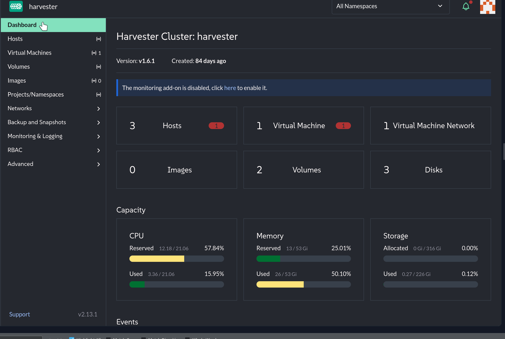

> **OPS BRIEF:** AeroGrid Network Operations Center | Priority: High | Assigned: Infrastructure Team
> Flight operations data retention is an ICAO regulatory requirement — 7 years minimum. Before any maintenance on `virt1`, take a checkpoint. Simulate data corruption, restore to a clean state, and confirm the off-site backup target config is in place.

AeroGrid's flight operations records are required under ICAO regulations to be retained for a minimum of 7 years. Any configuration change to `virt1` — the ground operations interface VM — needs a rollback point before it happens. Longhorn distributed storage spans all three cluster nodes. You will configure storage policies, take a snapshot before a risky change, and verify that restoration actually works.

AeroGrid's Storage Architecture
===

SUSE Virtualization uses **Longhorn** as its distributed block storage engine. Longhorn aggregates local disks from all cluster nodes into a replicated pool — no external SAN, no NFS, no proprietary storage array required.

| VMware (Broadcom) | SUSE Virtualization |
|-------------------|---------------------|
| vSAN | Longhorn |
| vSAN storage policies | Longhorn StorageClasses |
| VM snapshots | Longhorn volume snapshots |
| vSphere Data Protection | S3/NFS backup targets |

Longhorn writes multiple replicas of each volume across different nodes. If one node fails, the volume keeps serving from the surviving replicas — no data loss, no downtime.

Check the storage nodes:

```bash,run
kubectl get storageclass
```

```bash,run
kubectl get nodes.longhorn.io -n longhorn-system
```

You should see 3 Longhorn storage nodes — one per cluster node.

TASK: Inspect and Create Storage Policies
===

SUSE Virtualization ships with `harvester-longhorn` as the default storage class — 3 replicas, one per node. This is the standard data protection policy for production workloads.

In the [button label="Harvester UI" variant="success"](tab-2) tab:

1. Go to **Advanced > Storage Classes**
2. Click on `harvester-longhorn` and note `numberOfReplicas: "3"` — every VM disk gets 3 copies across the 3 nodes

Create a secondary storage policy for dev and test workloads (2 replicas, lower overhead):

```bash,run
cat << EOF | kubectl apply -f -
apiVersion: storage.k8s.io/v1
kind: StorageClass
metadata:
  name: harvester-longhorn-2rep
  annotations:
    storageclass.kubernetes.io/is-default-class: "false"
provisioner: driver.longhorn.io
allowVolumeExpansion: true
reclaimPolicy: Delete
volumeBindingMode: Immediate
parameters:
  numberOfReplicas: "2"
  staleReplicaTimeout: "30"
  fromBackup: ""
  fsType: ext4
EOF
```

```bash,run
kubectl get storageclass
```

Two storage policies are now available: `harvester-longhorn` (3 replicas, production flight data and gate systems) and `harvester-longhorn-2rep` (2 replicas, dev and test workloads).

TASK: Take a Checkpoint Before a Risky Change
===

The team is about to make a configuration change on `virt1`. Before anything happens, take a snapshot — a point-in-time checkpoint of the VM's disk state. If the change causes issues, the snapshot is the rollback point.

> [!NOTE]
> SUSE Virtualization snapshots are crash-consistent by default. For application-consistent snapshots (filesystem freeze), use the QEMU guest agent — it is pre-installed in the leap16 image.

In the [button label="Harvester UI" variant="success"](tab-2) tab:

1. Go to **Virtual Machines**
2. Find `virt1` and click the **⋮** menu
3. Select **Take Snapshot**
4. Name it `virt1-snap1`
5. Click **Create**


Verify the checkpoint is ready:

```bash,run
kubectl get vmsnapshots -n default
```

Status should show `ReadyToUse: true`. The rollback point is set.

TASK: Simulate Data Corruption and Restore
===

The configuration change went wrong. A critical file on `virt1` has been corrupted. Roll back to the clean checkpoint.

First, simulate the corruption:

```bash,run
ssh -i ~/.ssh/id_rsa opensuse@192.168.122.50 \
  "echo 'CRITICAL: GATE ASSIGNMENT DATABASE CORRUPTED — GROUND OPS AT RISK' | sudo tee /etc/incident-report.txt"
```

Restore from the checkpoint via the [button label="Harvester UI" variant="success"](tab-2) tab:

1. Go to **Virtual Machines > virt1** > **⋮** > **Restore Snapshot**
2. Select `virt1-snap1`
3. Choose **Create new VM** — this restores into a new VM, leaving `virt1` intact for comparison
4. Name the restored VM `virt1-restored`
5. Click **Restore**



```bash,run
kubectl get vm -n default
```

You should see both `virt1` (post-incident) and `virt1-restored` (clean checkpoint). The restored VM contains no trace of the corruption — it predates the failed change.

TASK: Verify Off-Site Backup Configuration
===

Snapshots are local. If the entire cluster is lost, local snapshots are lost with it. For flight data archival and genuine DR, SUSE Virtualization supports backup to S3-compatible storage or NFS — the equivalent of off-site tape for an airport operator.

Inspect the backup target configuration:

```bash,run
kubectl get settings.harvesterhci.io backup-target -o yaml
```

In a production AeroGrid deployment, this would point to MinIO, AWS S3, or an NFS share at a separate facility. The backup engine is Longhorn-native and can restore full VMs or individual volumes from the off-site target. ICAO retention compliance requires this to be configured and tested before go-live.

What's New in 1.8: In-Place Storage Live Migration
===

SUSE Virtualization 1.8 introduced the ability to move a running VM's disk between storage backends — for example from Longhorn to an external CSI volume — without stopping the VM. This is called **in-place storage live migration** and is the storage equivalent of compute live migration. It is not covered in this challenge but is available in **Advanced > Volumes** on any running VM once the feature is enabled.

Verify Replica Distribution Across Nodes
===

Check how Longhorn is spreading volume replicas across nodes:

```bash,run
kubectl get volumes.longhorn.io -n longhorn-system
```

```bash,run
kubectl get replicas.longhorn.io -n longhorn-system -o custom-columns=\
NAME:.metadata.name,\
NODE:.spec.nodeID,\
VOLUME:.spec.volumeName,\
STATE:.status.currentState
```

Each volume should have replicas across different nodes. One node can fail entirely and AeroGrid keeps running. This is vSAN resilience without the vSAN license.

Click **Check** to continue.
