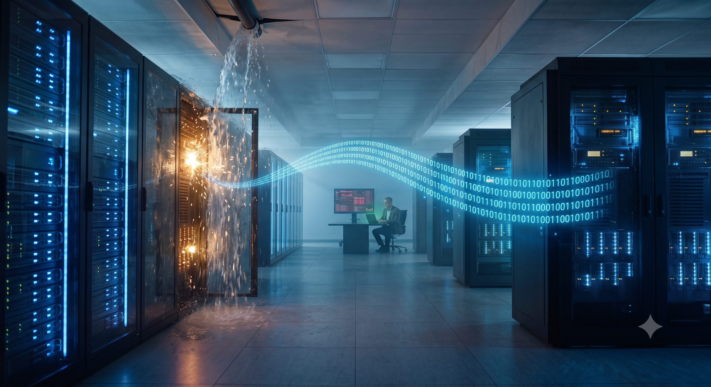
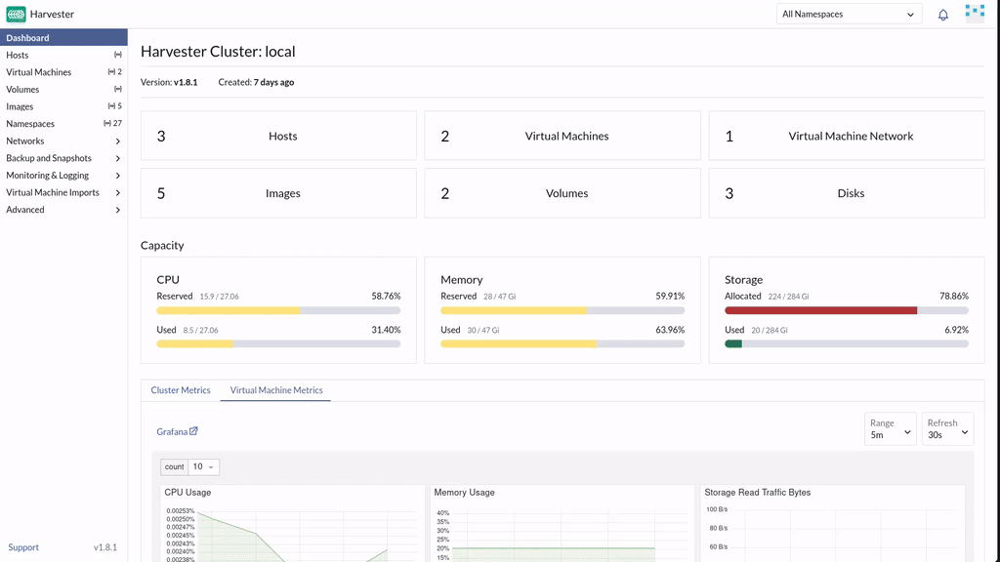
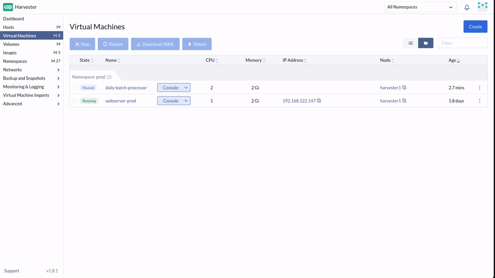
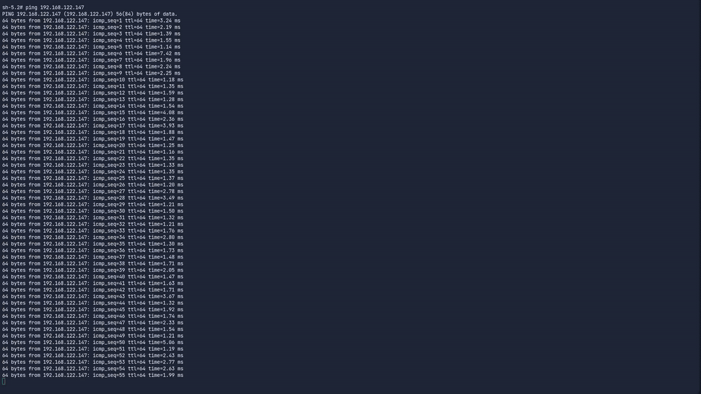
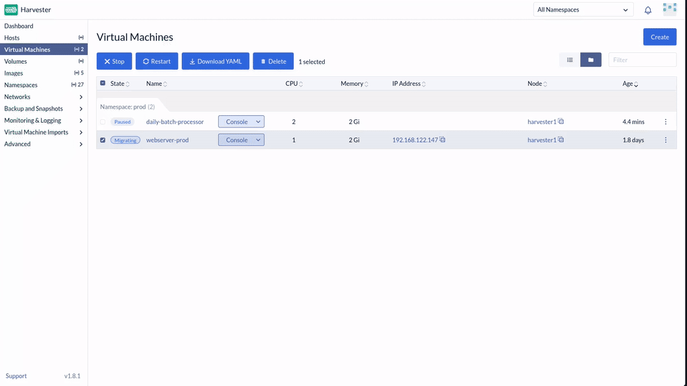
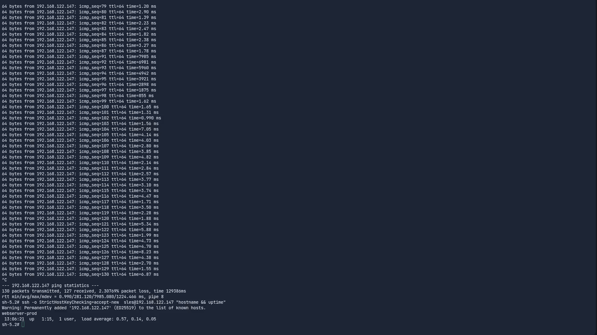
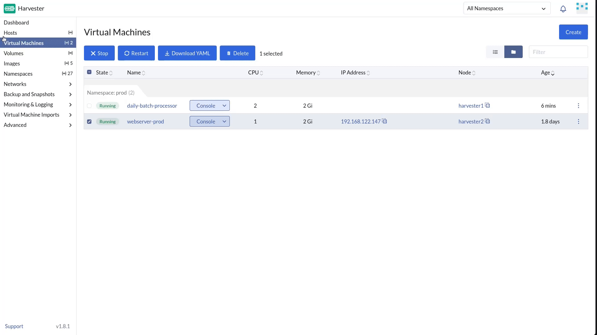
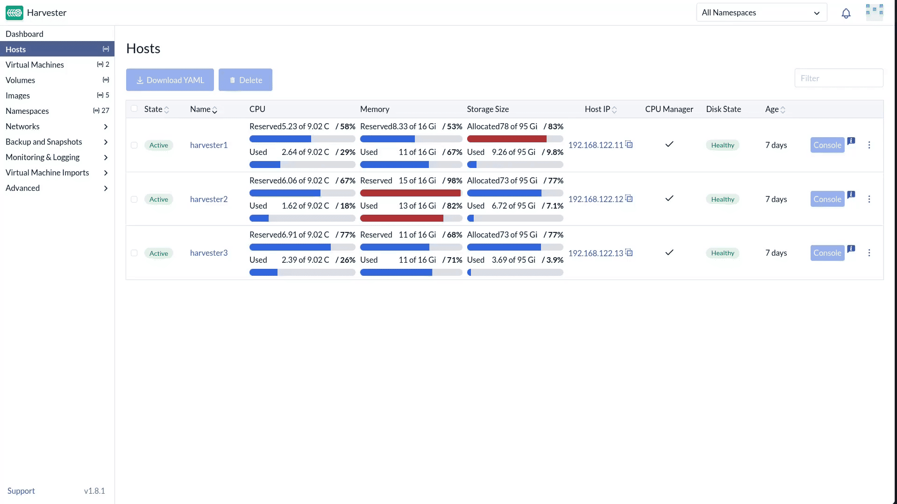

🌊 Chapter 4: The Rising Tide
==============================

<style type="text/css">
  * {
    font-family: suse;
    src: url('https://fonts.google.com/specimen/SUSE');
  }
  .suse { color: #30ba78; }
  .virt { color: #30ba78; }
  .bank { color: #d4af37; }
  .danger { color: #ff4d4d; font-weight: bold; }
  .hovereffect {
    border-radius: 25px 25px 25px 25px;
    background: linear-gradient(#30ba78 0 0) var(--hundredpercent, 0) / var(--hundredpercent, 0) no-repeat;
    transition: 0.5s, background-position 0s;
    padding: 5px;
  }
  .hovereffect:hover {
    --hundredpercent: 100%;
    color: white;
    border-radius: 10px 25px 10px 25px;
  }
  .story {
    border-left: 5px solid #d4af37;
    border-radius: 0 15px 15px 0;
    background: linear-gradient(135deg, rgba(48,186,120,.10), rgba(212,175,55,.10));
    padding: 15px 20px;
    margin: 15px 0;
  }
  .story em { color: #d4af37; }
  .missionbox {
    border: 2px dashed #30ba78;
    border-radius: 15px;
    padding: 12px 18px;
    margin: 15px 0;
  }
  .highlightcopy { color: white; font-weight: bold; padding: 0 10px; }
  img.logos { border-radius: 10px; }
  /* compact credential boxes (scoped: only code blocks inside <div class="cred">) */
  .cred > div { margin: 0; }
  .cred .my-3 {
    display: flex;
    flex-direction: row-reverse;   /* put the copy bar on the right */
    align-items: stretch;
    width: fit-content;
    min-width: 14em;
    margin: 4px 0;
    overflow: hidden;
  }
  .cred .my-3 > div:first-child {  /* the bar holding the copy button */
    height: auto;
    padding: 4px 8px;
    border-bottom: none;
    border-left: 1px solid rgba(255,255,255,.25);
    border-radius: 0;
    display: flex;
    align-items: center;
    justify-content: center;
    background-color: #30ba78;
  }
  .cred .my-3 > div:first-child,
  .cred .my-3 > div:first-child * {
    color: #fff !important;
  }
  .cred .my-3 > div:first-child:hover,
  .cred .my-3 > div:first-child:hover * {
    font-weight: bold;
  }
  .cred .my-3 > pre {
    flex: 1 1 auto;
    margin: 0 !important;
    padding: 2px !important;
    border-radius: 0 !important;
    display: flex;
    align-items: center;
  }
  img.animatedgif {
    --borderthickness: 5pt;
    --colors: #0000 25%,#30ba78 0;
    padding: 10px;
    background:
      conic-gradient(from 90deg  at top    var(--borderthickness) left  var(--borderthickness),var(--colors)) 0    0,
      conic-gradient(from 180deg at top    var(--borderthickness) right var(--borderthickness),var(--colors)) 100% 0,
      conic-gradient(from 0deg   at bottom var(--borderthickness) left  var(--borderthickness),var(--colors)) 0    100%,
      conic-gradient(from -90deg at bottom var(--borderthickness) right var(--borderthickness),var(--colors)) 100% 100%;
    background-size: 50px 50px;
    background-repeat: no-repeat;
    transition: 1s;
  }

  img.animatedgif:hover {
    background-size: 51% 51%;
  }

  .embedded_img {
    width: 100%;
    height: auto;
    max-height: 1.5vh;
    max-width: 1.5vh;
    margin: 0;
    padding: 0;
    display: inline-block;
  }

</style>



<div id="401" class="story">

The adrenaline from the trading floor incident has barely faded from your system when a deep, metallic groan echoes through the datacenter walls. You and Sarah turn simultaneously toward **Rack 4**. A primary coolant valve has ruptured overhead, and a steady stream of chilled, chemically treated water is cascading directly onto the physical server chassis hosting the bank's primary **Payment Gateway**.

*"If that server shorts out, the gateway drops,"* Sarah says, genuine panic creeping into her voice as she watches the water pool. *"If the gateway drops, every single credit card transaction for <b class="bank">Vertex Trust Bank</b> fails. We will be facing <span class="danger">federal regulatory investigations</span> by morning."*

*"We aren't going to let it drop,"* you reply, your fingers flying across your keyboard.

</div>

You cannot shut the machine down to move it; the transaction stream is too critical, processing thousands of requests a second. You must execute a **live migration**, moving a running VM, memory and all, to a different physical node with **zero downtime**.

But first, to ensure maximum bandwidth is available for the emergency migration, you decide to suspend a nearby non-critical batch processing server.

<div class="missionbox">

## 🎯 Your Quest Objectives

1. Suspend non-critical workloads to free resources
2. Establish a service heartbeat
3. Execute the Live Migration
4. Monitor the seamless transfer
5. Resume normal operations
6. Hand the damaged rack to the repair crew

</div>

🔐 Login Credentials
====================

The **SUSE Virtualization** UI and **Rancher Prime** UI use the same credentials.

Username:

<div class="cred">

```txt
admin
```

</div>

Password:

<div class="cred">

```txt
[[ Instruqt-Var key="RANCHER_PASSWORD" hostname="kvm-host" ]]
```

</div>


⏸️ Task 1: Suspend non-critical workloads to free resources
===========================================================

<div style='align: middle; margin: 15px;'>
  
</div>


In the [button label="SUSE Virtualization UI" variant="success"](tab-0), go to **Virtual Machines**:

1. Locate the virtual machine named <b class="highlightcopy">daily-batch-processor</b>
2. Click the  on the right side of its row
3. Select **Pause** then click **Apply** after prompted to confirm.
4. Wait for its state to change to **Paused**

This halts its CPU cycles, dedicating maximum hardware resources to your emergency operation.

> [!NOTE]
> This is not really necessary, we have setup already a dedicated network for live migration traffic, is here for educational purposes


📡 Task 2: Establish a service heartbeat
========================================

<div style='align: middle; margin: 15px;'>
  
</div>

Switch to the [button label="Cluster Terminal" variant="success"](tab-1). You need a continuous heartbeat monitor to prove the network connection remains unbroken during the evacuation.

Start the heartbeat monitor against <b class="highlightcopy">webserver-prod</b>:

```bash,run
ping [[ Instruqt-Var key="PAYMENT_GATEWAY_IP" hostname="kvm-host" ]]
```

> [!IMPORTANT]
> Leave the ping running continuously in the terminal. **Do not stop it.** This scrolling stream of replies is your proof of zero downtime. Switch your focus back to the SUSE Virtualization UI.

🚚 Task 3: Execute the Live Migration
=====================================

<div style='align: middle; margin: 15px;'>
  
</div>

In the [button label="SUSE Virtualization UI" variant="success"](tab-0), go to **Virtual Machines** and locate the <b class="highlightcopy">webserver-prod</b> instance:

1. Read the **Node** column and **write down** which node the gateway is running on: you will want proof it moved
2. Click the  on the far right side of its row
3. Select **Migrate** from the context menu
4. Choose a different, safe target node from the dropdown list
5. Click **Apply**

Behind the scenes, KubeVirt copies the VM's live memory pages to the target node over the network, tracking and re-copying any pages the busy gateway dirties mid-flight, until it can freeze, flip, and resume execution on the new node in a fraction of a second.

👀 Task 4: Monitor the seamless transfer
========================================

<div style='align: middle; margin: 15px;'>
  
</div>

Immediately switch back to the [button label="Cluster Terminal" variant="success"](tab-1) tab and watch the ping sequence.

<div id="402" class="story">

You hold your breath as the hypervisor coordinates the massive memory transfer over the network. The pings continue scrolling down the screen, **completely uninterrupted**. The virtual machine seamlessly materializes on the new physical node just as sparks begin to fly from the water-damaged chassis in Rack 4.

</div>

Press `Ctrl+C` to terminate the ping.

<div id="403" class="story">
You exhale sharply. The transaction flow survived.
</div>


Strictly speaking, there *is* a hand-over moment: once the memory copy converges, the VM freezes for one final instant while execution flips to the new node, a micro-interruption. On a properly sized infrastructure it passes completely unnoticed; even in this lab, which runs virtualization *inside* virtualization *inside* virtualization, the most you might have spotted is slightly higher latency times in the pings.

Back in the [button label="SUSE Virtualization UI" variant="success"](tab-0), the **Node** column for <b class="highlightcopy">webserver-prod</b> now shows a **different node** than the one you wrote down. The gateway physically moved while its customers never noticed.

<div id="404" class="story">
Now produce the evidence Sarah will forward to the regulators — the guest's uptime counter never reset, meaning the operating system never stopped running:
</div>

```bash,run
ssh -o StrictHostKeyChecking=accept-new  sles@[[ Instruqt-Var key="PAYMENT_GATEWAY_IP" hostname="kvm-host" ]] "hostname && uptime"
```

▶️ Task 5: Resume normal operations
===================================

<div style='align: middle; margin: 15px;'>
  
</div>

Return to the [button label="SUSE Virtualization UI" variant="success"](tab-0). Locate the <b class="highlightcopy">daily-batch-processor</b> you paused earlier:

1. Click the  on its row
2. Select **Unpause** to allow the non-critical jobs to resume

🛠️ Task 6: Hand the damaged rack to the repair crew
====================================================

<div style='align: middle; margin: 15px;'>
  
</div>


<div id="405" class="story">
The gateway is safe — but the water-damaged node is still dripping, and smaller workloads may still be running on it. You are not going to migrate them one by one while a puddle spreads across the floor. Let the platform manage it.
</div>


In the [button label="SUSE Virtualization UI" variant="success"](tab-0), go to **Hosts**:

1. Find the node that <b class="highlightcopy">webserver-prod</b> was running on **before** the migration, the one you wrote down.

<i id="406" class="story">That is the water-damaged machine</i>

2. Click the  on its row and select **Enable Maintenance Mode**, then confirm

Now watch the **Virtual Machines** page: every VM still living on the damaged node live-migrates off it **automatically**. The platform picks healthy target nodes, moves the workloads one by one, and leaves the node empty. No spreadsheets, no manual target-picking, no forgotten VM.

> [!NOTE]
> This may take some time in this lab environment.

Once the node shows **Maintenance** and its VM count reaches zero, the (virtual) repair crew swaps the (virtual) coolant valve. Bring the node back into service:

3. Click the  on its row again and select **Uncordon**

The node rejoins the fabric, ready to accept workloads again.

> [!NOTE]
> The same intelligence works in the other direction, too: every time a new VM is created, the scheduler places it on the least-loaded suitable node, keeping the cluster naturally balanced, no manual Tetris required. Between automatic placement on the way in and automatic evacuation on the way out, the humans only decide *what* should run; the platform decides *where*.

🏋️ Bonus Drills: the migration paper trail (optional, for the command-line curious)
======================================================================================

<div style='align: middle; margin: 15px;'>
  
</div>

New to Kubernetes? **Skip ahead freely.** Otherwise: every migration is itself a Kubernetes object, which means it is auditable. In the [button label="Cluster Terminal" variant="success"](tab-1):

- **Review the migration record** (who moved, when, from where to where):

```bash,run
kubectl --kubeconfig .rodeo/harvester-kubeconfig get virtualmachineinstancemigrations -A
```

- **Inspect the details of the completed migration:**

```bash,run
kubectl --kubeconfig .rodeo/harvester-kubeconfig describe virtualmachineinstancemigrations -A | grep -A 10 "Status"
```

- **Think ahead:** what happens if a *node* fails without warning, before anyone can migrate? Check each VM's run strategy: SUSE Virtualization can reschedule VMs from a failed host automatically:

```bash,run
kubectl --kubeconfig .rodeo/harvester-kubeconfig get vm -A -o custom-columns=NAME:.metadata.name,RUNSTRATEGY:.spec.runStrategy
```

> [!NOTE]
> **Beyond compute:** the same zero-downtime idea also applies to *disks*. <b class="virt">SUSE Virtualization</b> supports **in-place storage live migration** (moving a running VM's volumes between storage backends, for example from Longhorn to an external CSI array) without stopping the VM. Compute evacuated tonight, storage evacuated next quarter, and the gateway never notices either one.

💼 Why does this matter?
==============================================

- **Hardware failures stop being outages.** Coolant leaks, firmware updates, host reboots: workloads simply slide to healthy nodes while customers keep paying with their cards.
- **Planned maintenance without midnight windows.** One click on **Maintenance Mode** drains an entire node automatically. Routine patching happens at 2 PM instead of 2 AM, and nobody keeps a spreadsheet of which VM lives where.
- **An audit trail regulators can read.** Every migration is a recorded API object, no more reconstructing what happened from console screenshots.

Click **Check** to continue. 🕵️

📚 More information
===================

- [Live Migration](https://documentation.suse.com/cloudnative/virtualization/latest/en/virtual-machines/live-migration.html)
