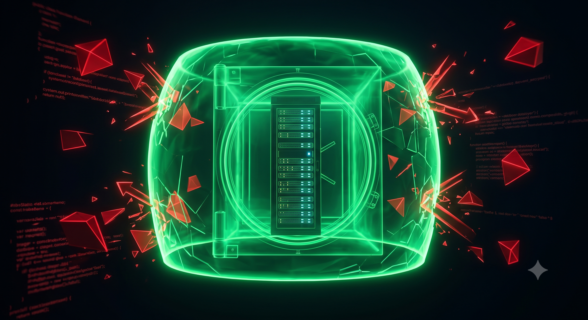
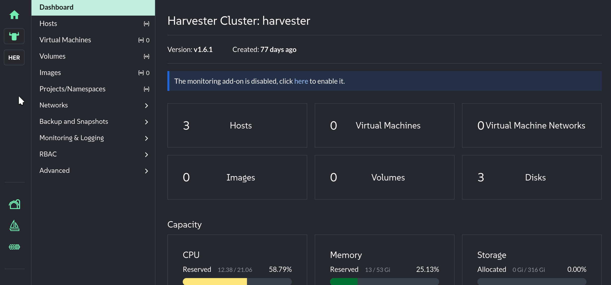

🕵️ Chapter 5 — The Invisible Intruder
=====================================

<style type="text/css">
  * {
    font-family: suse;
    src: url('https://fonts.google.com/specimen/SUSE');
  }
  .suse { color: #30ba78; }
  .virt { color: #30ba78; }
  .bank { color: #d4af37; }
  .danger { color: #ff4d4d; font-weight: bold; }
  .hovereffect {
    border-radius: 25px 25px 25px 25px;
    background: linear-gradient(#30ba78 0 0) var(--hundredpercent, 0) / var(--hundredpercent, 0) no-repeat;
    transition: 0.5s, background-position 0s;
    padding: 5px;
  }
  .hovereffect:hover {
    --hundredpercent: 100%;
    color: white;
    border-radius: 10px 25px 10px 25px;
  }
  .story {
    border-left: 5px solid #d4af37;
    border-radius: 0 15px 15px 0;
    background: linear-gradient(135deg, rgba(48,186,120,.10), rgba(212,175,55,.10));
    padding: 15px 20px;
    margin: 15px 0;
  }
  .story em { color: #d4af37; }
  .missionbox {
    border: 2px dashed #30ba78;
    border-radius: 15px;
    padding: 12px 18px;
    margin: 15px 0;
  }
  .highlightcopy { color: white; font-weight: bold; padding: 0 10px; }
  img.logos { border-radius: 10px; }
  img.animatedgif {
    --borderthickness: 5pt;
    --colors: #0000 25%,#30ba78 0;
    padding: 10px;
    background:
      conic-gradient(from 90deg  at top    var(--borderthickness) left  var(--borderthickness),var(--colors)) 0    0,
      conic-gradient(from 180deg at top    var(--borderthickness) right var(--borderthickness),var(--colors)) 100% 0,
      conic-gradient(from 0deg   at bottom var(--borderthickness) left  var(--borderthickness),var(--colors)) 0    100%,
      conic-gradient(from -90deg at bottom var(--borderthickness) right var(--borderthickness),var(--colors)) 100% 100%;
    background-size: 50px 50px;
    background-repeat: no-repeat;
    transition: 1s;
  }
  img.animatedgif:hover {
    background-size: 51% 51%;
  }
  /* compact credential boxes (scoped: only code blocks inside <div class="cred">) */
  .cred > div { margin: 0; }
  .cred .my-3 {
    display: flex;
    flex-direction: row-reverse;   /* put the copy bar on the right */
    align-items: stretch;
    width: fit-content;
    min-width: 14em;
    margin: 4px 0;
    overflow: hidden;
  }
  .cred .my-3 > div:first-child {  /* the bar holding the copy button */
    height: auto;
    padding: 2px 8px;
    border-bottom: none;
    border-left: 1px solid rgba(255,255,255,.25);
    border-radius: 0;
    display: flex;
    align-items: center;
    background-color: #30ba78;
  }
  .cred .my-3 > div:first-child,
  .cred .my-3 > div:first-child * {
    color: #fff !important;
  }
  .cred .my-3 > div:first-child:hover,
  .cred .my-3 > div:first-child:hover * {
    font-weight: bold;
  }
  .cred .my-3 > pre {
    flex: 1 1 auto;
    margin: 0 !important;
    padding: 2px !important;
    border-radius: 0 !important;
    display: flex;
    align-items: center;
  }
</style>



<div id="501" class="story">

It is now two in the morning. The datacenter is quiet, save for the rhythmic humming of the cooling fans. You are drinking stale coffee and reviewing the daily telemetry logs when your screen flashes <span class="danger">red</span>. A critical, high-priority alert from the Security Operations Center overrides your dashboard.

An automated vulnerability scan has detected a severe architectural flaw: the bank's public-facing marketing **web server** is sitting on the exact same flat network layer as the highly classified <b class="highlightcopy">insider-threat-db</b> virtual machine.

If a threat actor were to compromise the public website, they would have a direct, unimpeded lateral path straight into the bank's most sensitive internal security database. In a traditional infrastructure, fixing this would require waking up the senior network engineering team, physically re-cabling switch ports in the dark, and risking catastrophic routing loops.

You don't need physical cables. You have the power of **software-defined networking** at your fingertips. You must construct an impenetrable digital vault and lock the database inside it — before an intrusion can occur.

</div>

## <b class="hovereffect">Two layers of software-defined networking</b>

<b class="virt">SUSE Virtualization</b> gives you the full spectrum, from classic VLAN segmentation to enterprise SDN — capabilities the bank used to pay a separate closed-source SDN license for:

| Layer | Technology | Use tonight |
|-------|-----------|-------------|
| L2 / VLAN bridging | **Multus** | The vault VLAN isolating the database |
| SDN / isolated overlay zones | **Kube-OVN** | Private subnets with no external path — even overlapping CIDRs |

<div class="missionbox">

## 🎯 Your Quest Objectives

1. Connect a closed-loop physical network for production
2. Build an equally isolated SDN for development
3. Learn how to move VMs into the new networks

</div>

🔐 Login Credentials
====================

The **SUSE Virtualization** UI and **Rancher Prime** UI use the same credentials.

Username:

<div class="cred">

```txt
admin
```

</div>

Password:

<div class="cred">

```txt
[[ Instruqt-Var key="RANCHER_PASSWORD" hostname="kvm-host" ]]
```

</div>


🧱 Task 1: Connect a closed loop physical network
=================================================

Our team has set up the SUSE Virtualization nodes with an extra dedicated NIC that is connected in a physically closed loop. Let's use it for our most precious traffic and create an isolated production network.

In the [button label="SUSE Virtualization UI" variant="success"](tab-0), navigate to **Networks** in the left menu, then select **Cluster Network Configuration**:

1. Click **Create a Cluster Network**
2. Set the **Name** to <b class="highlightcopy">closed-loop</b>
3. Click **Create**

The new cluster network appears in the list. Now assign it a physical interface — click **Create Network Configuration** on the same row as the <b class="highlightcopy">closed-loop</b> cluster network, then fill in the following details:

1. Set the **Name** to <b class="highlightcopy">closed-loop</b>
2. Under **Uplink**, set **NICs** to <b class="highlightcopy">ens5</b>
3. Click **Create**

Now define the VM-facing network on top of it. Select **Virtual Machine Networks** and click **Create** to define a new secure perimeter:

- **Namespace**: <b class="highlightcopy">prod</b>
- **Name**: <b class="highlightcopy">secure-loop-prod</b>
- Basics:
  - **Type**: <b class="highlightcopy">UntaggedNetwork</b>
  - **Cluster Network**: <b class="highlightcopy">closed-loop</b>

Click **Create**.

<div style='align: middle; margin: 15px;'>
  
</div>

Back in the **Virtual Machine Networks** list, <b class="highlightcopy">secure-loop-prod</b> appears with **Active** status.


🔒 Task 2: Create a closed loop SDN
===================================

Now create the same type of isolation for the development environment. Adding new NICs and cabling is expensive, and dev does not need that performance — so this time you will use a **software-defined network**.

Go to **Networks > Virtual Machine Networks** and click **Create**, then fill in the following details:

- **Namespace**: <b class="highlightcopy">dev</b>
- **Name**: <b class="highlightcopy">secure-loop-dev</b>
- Basics:
  - **Type**: <b class="highlightcopy">OverlayNetwork</b>

Click **Create**.

Now create the SDN subnet. Go to **Virtual Private Cloud**, and on the tab of the <b class="highlightcopy">ovn-cluster</b> Virtual Private Cloud click **Create Subnet**, then fill in the following details:

- **Name**: <b class="highlightcopy">secure-vpc-dev</b>
- Basic:
  - **CIDR**: <b class="highlightcopy">192.168.32.0/24</b>
  - **Provider**: <b class="highlightcopy">dev/secure-loop-dev</b>
  - **Gateway IP**: <b class="highlightcopy">192.168.32.1</b>
  - **Dynamic Host Configuration Protocol (DHCP)**: <b class="highlightcopy">Enabled</b>
  - **Private Subnet**: <b class="highlightcopy">Enabled</b>

Click **Create**.

Now you can assign the network <b class="highlightcopy">dev/secure-loop-dev</b> to any VM, and it will only be able to communicate with the VMs on the same network.


🎯 Task 3: Configure VMs with the new networks
=====================================================


You have two new isolated networks — now it is time to show your peers how to attach them to a VM. You are not making the change yourself, just walking through how it is done:

Return to the **Virtual Machines** dashboard and locate the target virtual machine:

1. Click the **three dots** on its row and select **Edit Config**
2. Go to the **Networks** tab
3. Select the network <b class="highlightcopy">prod/secure-loop-prod</b> for production systems, or <b class="highlightcopy">dev/secure-loop-dev</b> for development systems
4. Click **Save**
5. Click the **three dots** again and select **Restart**

The VM boots connected to the new network.


> [!IMPORTANT]
> For most cases if a VM is currently running, you must **stop it first** to activate the hardware modification.


🏋️ Bonus Drills — for the command-line curious (optional)
==========================================================

New to Kubernetes? **Skip ahead freely** — we have the isolated networks already created. These optional drills add an extra isolated network with pure Kubernetes tooling.

**Drill 1 — an extra isolated network is needed for QA: Kubernetes network policies.** We need to be able to replicate this setup in QA to make sure there are no surprises when moving into production, apply a strict policy that drops unauthorized traffic at the pod level, underneath the VLAN isolation. In the [button label="Cluster Terminal" variant="success"](tab-1), apply a default deny-all ingress policy to the secure namespace:

```bash,run
cat << EOF | kubectl --kubeconfig .rodeo/harvester-kubeconfig apply -f -
kind: NetworkPolicy
apiVersion: networking.k8s.io/v1
metadata:
  name: default-deny-all
  namespace: prod
spec:
  podSelector: {}
  policyTypes:
    - Ingress
EOF
```

Confirm the policy is enforced:

```bash,run
kubectl --kubeconfig .rodeo/harvester-kubeconfig get networkpolicy -n prod
```

**Drill 2 — build air-gapped containment zones.** VLANs segment the physical network — but <b class="virt">SUSE Virtualization</b> also ships a full SDN layer (**Kube-OVN**) for overlay networks with private, non-NAT'ed subnets. Build a fully air-gapped zone for the bank's future forensics workloads:

```bash,run
cat << EOF | kubectl --kubeconfig .rodeo/harvester-kubeconfig apply -f -
apiVersion: kubeovn.io/v1
kind: Subnet
metadata:
  name: vault-zone
spec:
  cidrBlock: "172.16.0.0/24"
  gateway: "172.16.0.1"
  excludeIps:
    - "172.16.0.1"
  protocol: IPv4
  natOutgoing: false
  private: true
EOF
```

Now prove the most counterintuitive capability of the SDN layer: **overlapping address space**. Create a second, completely independent zone for the forensics team — using the *exact same CIDR*:

```bash,run
cat << EOF | kubectl --kubeconfig .rodeo/harvester-kubeconfig apply -f -
apiVersion: kubeovn.io/v1
kind: Subnet
metadata:
  name: forensics-zone
spec:
  cidrBlock: "172.16.0.0/24"
  gateway: "172.16.0.1"
  excludeIps:
    - "172.16.0.1"
  protocol: IPv4
  natOutgoing: false
  private: true
EOF
```

> [!NOTE]
> Kube-OVN handles overlapping CIDRs via VPC isolation. If the command returns a validation error about duplicate CIDRs, use `172.16.1.0/24` for `forensics-zone` instead — the isolation demonstration still holds, just with different addresses.

Verify both zones exist with `natOutgoing: false` — no path out, no path in:

```bash,run
kubectl --kubeconfig .rodeo/harvester-kubeconfig get subnets.kubeovn.io -o custom-columns=NAME:.metadata.name,CIDR:.spec.cidrBlock,PRIVATE:.spec.private,NAT:.spec.natOutgoing
```

Two vaults, same IP space, zero shared packets. A VM attached to either zone can talk to its neighbors in the same subnet and to **nothing else** — micro-segmentation without a proprietary SDN license, and without ever running out of address space.

💼 Why does this matter?
==============================================

- **Segmentation at 2 AM, in software.** What used to be a re-cabling project with change-control meetings became three minutes of configuration — while the threat window was still closed.
- **Defense-in-depth by default.** VLAN isolation at layer 2, network policies at the pod layer, and private SDN subnets — three independent walls from one platform.
- **Compliance evidence built in.** Every network, policy, and subnet is a versionable YAML object — the security auditors get proof, not promises.

Click **Check** to continue. ⏪

📚 More information
===================

- [Cluster Networking](https://documentation.suse.com/cloudnative/virtualization/latest/en/networking/cluster-network.html)
