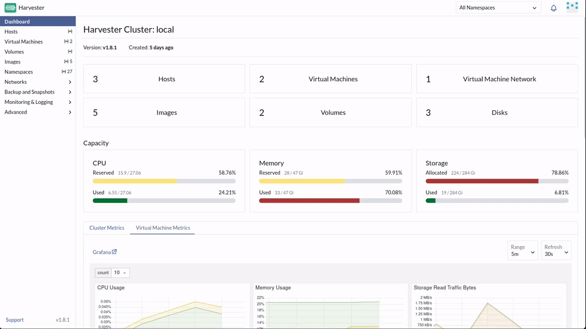
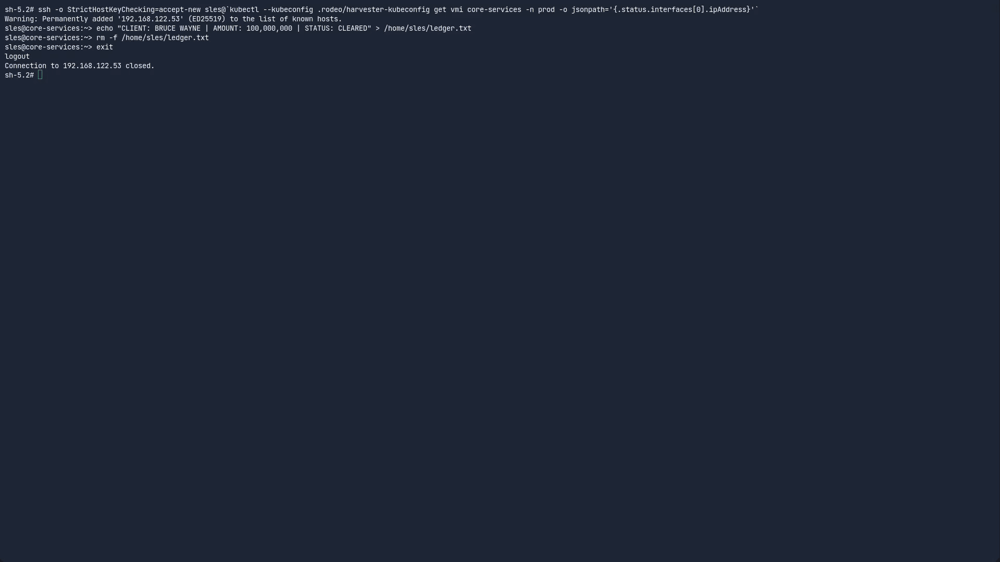
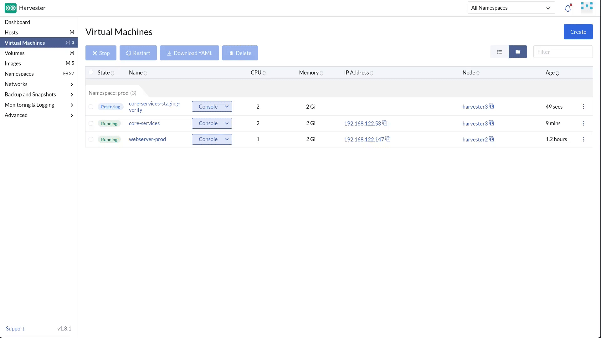
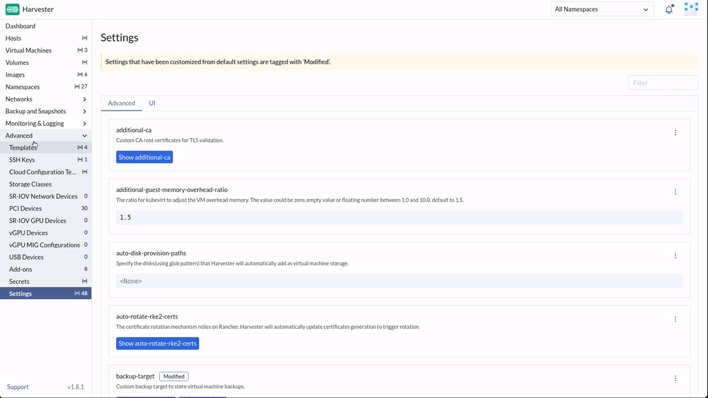
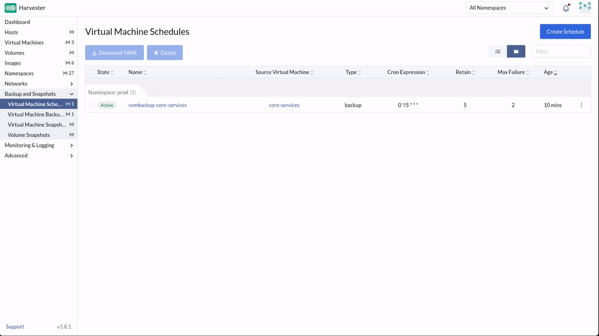
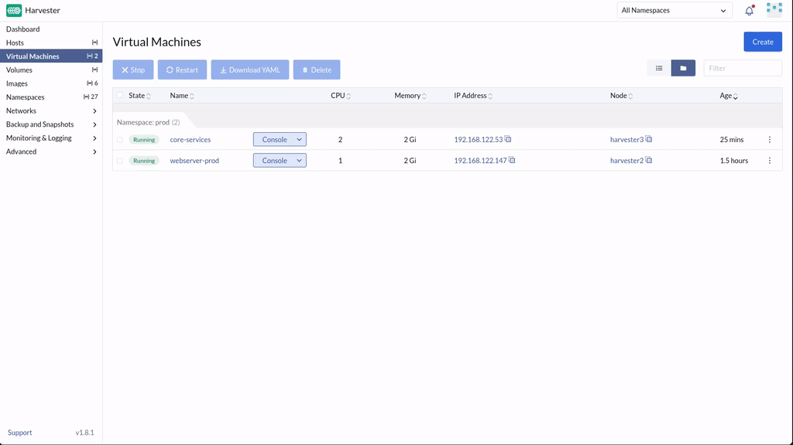

⏪ Chapter 6: The Unthinkable Error
===================================

<style type="text/css">
  * {
    font-family: suse;
    src: url('https://fonts.google.com/specimen/SUSE');
  }
  .suse { color: #30ba78; }
  .virt { color: #30ba78; }
  .bank { color: #d4af37; }
  .danger { color: #ff4d4d; font-weight: bold; }
  .hovereffect {
    border-radius: 25px 25px 25px 25px;
    background: linear-gradient(#30ba78 0 0) var(--hundredpercent, 0) / var(--hundredpercent, 0) no-repeat;
    transition: 0.5s, background-position 0s;
    padding: 5px;
  }
  .hovereffect:hover {
    --hundredpercent: 100%;
    color: white;
    border-radius: 10px 25px 10px 25px;
  }
  .story {
    border-left: 5px solid #d4af37;
    border-radius: 0 15px 15px 0;
    background: linear-gradient(135deg, rgba(48,186,120,.10), rgba(212,175,55,.10));
    padding: 15px 20px;
    margin: 15px 0;
  }
  .story em { color: #d4af37; }
  .missionbox {
    border: 2px dashed #30ba78;
    border-radius: 15px;
    padding: 12px 18px;
    margin: 15px 0;
  }
  .highlightcopy { color: white; font-weight: bold; padding: 0 10px; }
  img.logos { border-radius: 10px; }
  /* compact credential boxes (scoped: only code blocks inside <div class="cred">) */
  .cred > div { margin: 0; }
  .cred .my-3 {
    display: flex;
    flex-direction: row-reverse;   /* put the copy bar on the right */
    align-items: stretch;
    width: fit-content;
    min-width: 14em;
    margin: 4px 0;
    overflow: hidden;
  }
  .cred .my-3 > div:first-child {  /* the bar holding the copy button */
    height: auto;
    padding: 2px 8px;
    border-bottom: none;
    border-left: 1px solid rgba(255,255,255,.25);
    border-radius: 0;
    display: flex;
    align-items: center;
    background-color: #30ba78;
  }
  .cred .my-3 > div:first-child,
  .cred .my-3 > div:first-child * {
    color: #fff !important;
  }
  .cred .my-3 > div:first-child:hover,
  .cred .my-3 > div:first-child:hover * {
    font-weight: bold;
  }
  .cred .my-3 > pre {
    flex: 1 1 auto;
    margin: 0 !important;
    padding: 2px !important;
    border-radius: 0 !important;
    display: flex;
    align-items: center;
  }

  img.animatedgif {
    --borderthickness: 5pt;
    --colors: #0000 25%,#30ba78 0;
    padding: 10px;
    background:
      conic-gradient(from 90deg  at top    var(--borderthickness) left  var(--borderthickness),var(--colors)) 0    0,
      conic-gradient(from 180deg at top    var(--borderthickness) right var(--borderthickness),var(--colors)) 100% 0,
      conic-gradient(from 0deg   at bottom var(--borderthickness) left  var(--borderthickness),var(--colors)) 0    100%,
      conic-gradient(from -90deg at bottom var(--borderthickness) right var(--borderthickness),var(--colors)) 100% 100%;
    background-size: 50px 50px;
    background-repeat: no-repeat;
    transition: 1s;
  }

  img.animatedgif:hover {
    background-size: 51% 51%;
  }

  .embedded_img {
    width: 100%;
    height: auto;
    max-height: 1.5vh;
    max-width: 1.5vh;
    margin: 0;
    padding: 0;
    display: inline-block;
  }

</style>


<div id="601" class="story">

The next morning, the exhausted silence of the night shift is abruptly broken by a muffled sob coming from the junior database administrator's desk.

You and Sarah walk over immediately. The junior admin is staring at his screen in abject horror, his hands shaking over his keyboard. While attempting to clear out stale temporary files on the primary <b class="highlightcopy">transaction-ledger</b> server, his cursor slipped. He accidentally executed a recursive delete command on the wrong directory.

A <span class="danger">one hundred million dollar</span> corporate transaction settlement record, finalized only moments before, has been wiped entirely from the disk.

*"I destroyed it,"* the admin whispers, trembling. *"The backup tape run does not happen until midnight. The data is just gone."*

Sarah closes her eyes, rubbing her temples, bracing for the devastating impact this will have on the bank's stock price and reputation. But you place a steady hand on the admin's shoulder.

*"The data isn't gone,"* you say calmly. *"Our new storage architecture relies on distributed block-level snapshots. I took a baseline state capture right before the morning shift started."*

You step up to his terminal. It is time to turn back the clock. But you must be careful: you want to **verify the restored data in a safe sandbox before overwriting production**.

</div>

<div class="missionbox">

## 🎯 Your Quest Objectives

1. Simulate the creation and destruction of the record
2. Clone a staging environment from the snapshot
3. Verify the data in the staging sandbox
4. Restore the production system
5. Connect the bank's off-cluster backup vault
6. Put backups on a schedule

</div>

🔐 Login Credentials
====================

The **SUSE Virtualization** UI and **Rancher Prime** UI use the same credentials.

Username:

<div class="cred">

```txt
admin
```

</div>

Password:

<div class="cred">

```txt
[[ Instruqt-Var key="RANCHER_PASSWORD" hostname="kvm-host" ]]
```

</div>


💥 Task 1: Simulate the creation and destruction of the record
==============================================================

<div style='align: middle; margin: 15px;'>
  
</div>

You will replay this morning's events yourself, so you understand exactly what the snapshot protects.

In the [button label="Cluster Terminal" variant="success"](tab-1), log into the virtual machine:

```bash,run
while [[ "${IPA}" ==  "" ]]; do IPA=`kubectl --kubeconfig .rodeo/harvester-kubeconfig get vmi core-services -n prod -o jsonpath='{.status.interfaces[0].ipAddress}'`; sleep 1; echo -n '.'; done ; ssh -o StrictHostKeyChecking=accept-new sles@${IPA}

```

Generate the highly sensitive transaction record onto the disk by typing exactly this:

```bash,run
echo "CLIENT: BRUCE WAYNE | AMOUNT: 100,000,000 | STATUS: CLEARED" > /home/sles/ledger.txt
```

**Now capture the baseline.** Switch to the [button label="SUSE Virtualization UI" variant="success"](tab-0):

1. Navigate to **Virtual Machines**, then locate the following VM and click the **...** button next to it:

<div class="cred">

```txt
core-services
```

</div>
2. Click on **Take Virtual Machine Snapshot**
3. Name it:

<div class="cred">

```txt
pre-disaster-backup
```

</div>

4. Click on **Create**

5. Navigate to **Backup and Snapshots**, then click on **Virtual Machine Snapshots** and wait for one we just created to have the state **Ready**: the rollback point is set


Return to the [button label="Cluster Terminal" variant="success"](tab-1) and simulate the junior admin's terrible mistake:

```bash,run
rm -f /home/sles/ledger.txt
```

One hundred million dollars, gone from the disk. Leave the VM console:

```bash,run
exit
```


🧪 Task 2: Clone a staging environment from the snapshot
========================================================

<div style='align: middle; margin: 15px;'>
  
</div>

Instead of immediately restoring production, you will build a **clone** to verify the data first, non-destructive recovery is always advised.

In the [button label="SUSE Virtualization UI" variant="success"](tab-0).

1. Navigate to **Backup and Snapshots**, then click on **Virtual Machine Snapshots**

2. Click on **pre-disaster-backup** snapshot:

3. Click the  next to it and select **Restore New**

4. Name the new virtual machine:


<div class="cred">

```txt
core-services-staging-verify
```

</div>


5. Click **Create**


> [!Note]
> Due to the hardware used in this lab this process will take longer than in normal conditions please continue to the next task.


🏦 Task 3: Connect the off-cluster backup vault
======================================================

<div style='align: middle; margin: 15px;'>
  
</div>

Snapshots saved us this morning, but snapshots live on the **same cluster** as the workload. They protect against fat fingers, but not against physical damage or cyber attacks. For real disaster recovery we operate an off-cluster **backup vault**: an NFS share on a separate storage system. Time to plug it in.

In the [button label="SUSE Virtualization UI" variant="success"](tab-0):

1. Go to **Advanced > Settings** and locate:

<div class="cred">

```txt
backup-target
```

</div>
2. Click the  on its row and select **Edit Setting**, add the following:

- **Type**: <b class="highlightcopy">NFS</b>
- **Endpoint**:

<div class="cred">

```txt
192.168.122.1:/srv/backups/
```

</div>

3. Click **Save**

The cluster can now ship complete VM backups off the cluster, the modern equivalent of the midnight tape run, minus the midnight. An **S3** bucket works just as well as an endpoint; in a production deployment this would point to a physically separated facility.


⏰ Task 4: Put backups on a schedule
====================================

<div style='align: middle; margin: 15px;'>
  
</div>

<div id="602" class="story">
Ad-hoc snapshots can the day once; policy keeps the bank safe every day after.
</div>

Put <b class="highlightcopy">core-services</b> itself under an automatic backup schedule so nobody ever has to remember to do this by hand again.


In the [button label="SUSE Virtualization UI" variant="success"](tab-0):

1. Go to **Backup & Snapshot > Virtual Machine Schedules** and click **Create schedule**
2. Set the following details:

  - **Namespace**: <b class="highlightcopy">prod</b>
  - **Virtual Machine Name**: <b class="highlightcopy">core-services</b>
  - **Basics**:
    - **Retain:** <b class="highlightcopy">5</b>
    - **Max Failure:** <b class="highlightcopy">2</b>
    - **Cron Schedule:** (at minute 00, every 5 hours)

<div class="cred">

```txt
0 */5 * * *
```

</div>


4. Click **Create**

From now on the platform backs the VM up to the NFS vault every five hours, keeps the five most recent copies, and pauses the schedule if two consecutive runs fail. Set once, protected forever.


🔍 Task 5: Verify the data in the staging sandbox
=================================================

<div style='align: middle; margin: 15px;'>
  
</div>

Now that <b class="highlightcopy">core-services-staging-verify</b> is up and running, let's verify the file is there.

This time we will use the graphical console, since the VM has no network.

In the [button label="SUSE Virtualization UI" variant="success"](tab-0):

1. Go to **Virtual Machines**
2. Click **Console** drop-down and select **Open in WebVNC**, a new window will appear with the terminal, feel free to resize it.
3. Login using the following credentials:
   - **username**: 'sles'
   - **password**: '1234'

4. Once inside run the following command:


<div class="cred">

```txt
cat /home/sles/ledger.txt
```

</div>

5. It should return:

**CLIENT: BRUCE WAYNE | AMOUNT: 100,000,000 | STATUS: CLEARED**


The text prints flawlessly. **The data is safe.**


Now let's delete the clone we no longer need.

1. Close the window with the console.
2. Click the  on **core-services-staging-verify** row and select **Delete**, and again **Delete**.


♻️ Task 6: Restore the production system
=========================================

<div style='align: middle; margin: 15px;'>
  
</div>

Now that you have verified the snapshot's integrity, proceed to restore the production system:

1. Go to **Virtual Machines**
2. Click the  on **core-services** row and select **Stop**, and again **Apply**.
3. Once it has completely stopped, navigate to **Backup and Snapshots**, then click on **Virtual Machine Snapshots**

4. Click on **pre-disaster-backup** snapshot:

5. Click the  next to it and select **Replace Existing**

6. Click on **Create**

The VM will power itself back up because that is what the run strategy defines.

Optionally, SSH back and `cat` the file one last time, then logout of the VM. The record is back where it belongs.


🏋️ Bonus Drills: see the machinery behind the safety net (optional)
======================================================================

- **For the command-line curious:** each VM snapshot is built from volume-level snapshots, and every one of them is an API object, as is your new backup schedule:

```bash,run
kubectl --kubeconfig .rodeo/harvester-kubeconfig get VirtualMachineBackup -A; kubectl --kubeconfig .rodeo/harvester-kubeconfig get volumesnapshots -A; kubectl --kubeconfig .rodeo/harvester-kubeconfig get schedulevmbackups -A
```

> [!NOTE]
> Make sure you logout of the VM before running this commands.


💼 Why does this matter?
==============================================

- **Human error stops being catastrophic.** Recovery went from "wait for midnight tapes and pray" to a five-minute, self-service rollback.
- **Verify before you overwrite.** Restoring to a clone means you never gamble production on an unverified backup, a pattern your auditors and your junior admins will both sleep better with.
- **Protection is now policy, not heroics.** An off-cluster NFS backup vault and a five-hourly backup schedule mean the safety net runs itself from here on.

Click **Check** to continue. 🤠

📚 More information
===================

- [Virtual Machine Backup and Restore](https://documentation.suse.com/cloudnative/virtualization/latest/en/virtual-machines/backup-restore.html)
