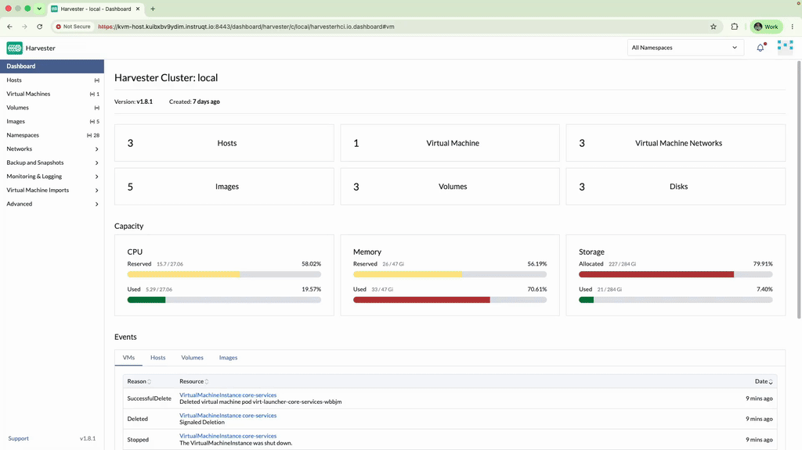
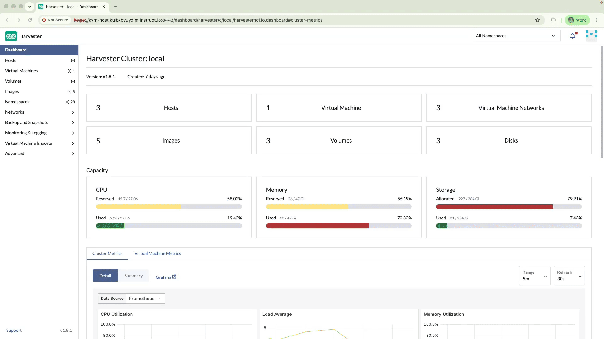
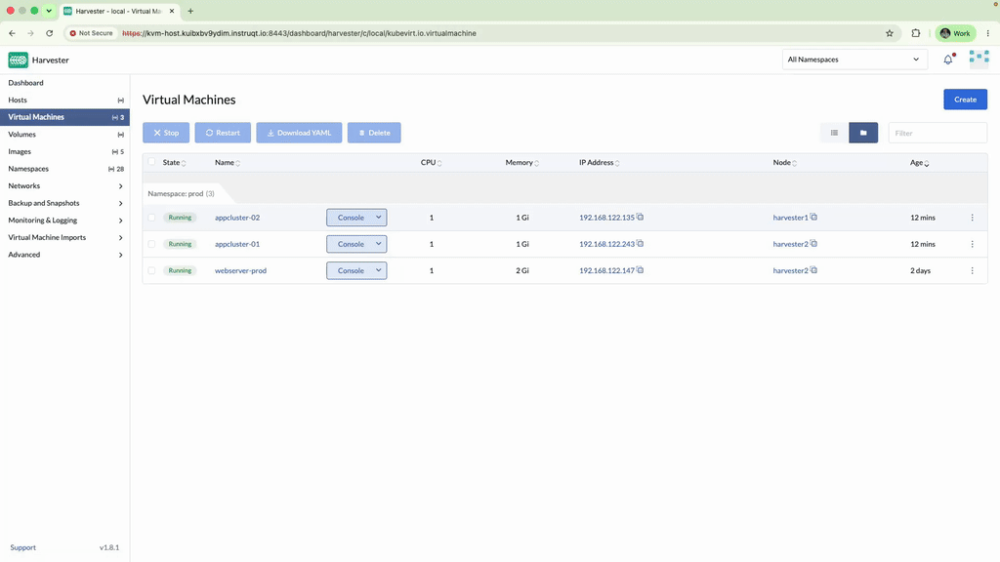

🤠 Chapter 7: The Stampede
===========================

<style type="text/css">
  * {
    font-family: suse;
    src: url('https://fonts.google.com/specimen/SUSE');
  }
  .suse { color: #30ba78; }
  .virt { color: #30ba78; }
  .bank { color: #d4af37; }
  .danger { color: #ff4d4d; font-weight: bold; }
  .hovereffect {
    border-radius: 25px 25px 25px 25px;
    background: linear-gradient(#30ba78 0 0) var(--hundredpercent, 0) / var(--hundredpercent, 0) no-repeat;
    transition: 0.5s, background-position 0s;
    padding: 5px;
  }
  .hovereffect:hover {
    --hundredpercent: 100%;
    color: white;
    border-radius: 10px 25px 10px 25px;
  }
  .story {
    border-left: 5px solid #d4af37;
    border-radius: 0 15px 15px 0;
    background: linear-gradient(135deg, rgba(48,186,120,.10), rgba(212,175,55,.10));
    padding: 15px 20px;
    margin: 15px 0;
  }
  .story em { color: #d4af37; }
  .missionbox {
    border: 2px dashed #30ba78;
    border-radius: 15px;
    padding: 12px 18px;
    margin: 15px 0;
  }
  .highlightcopy { color: white; font-weight: bold; padding: 0 10px; }
  img.logos { border-radius: 10px; }
  /* compact credential boxes (scoped: only code blocks inside <div class="cred">) */
  .cred > div { margin: 0; }
  .cred .my-3 {
    display: flex;
    flex-direction: row-reverse;   /* put the copy bar on the right */
    align-items: stretch;
    width: fit-content;
    min-width: 14em;
    margin: 4px 0;
    overflow: hidden;
  }
  .cred .my-3 > div:first-child {  /* the bar holding the copy button */
    height: auto;
    padding: 2px 8px;
    border-bottom: none;
    border-left: 1px solid rgba(255,255,255,.25);
    border-radius: 0;
    display: flex;
    align-items: center;
    background-color: #30ba78;
  }
  .cred .my-3 > div:first-child,
  .cred .my-3 > div:first-child * {
    color: #fff !important;
  }
  .cred .my-3 > div:first-child:hover,
  .cred .my-3 > div:first-child:hover * {
    font-weight: bold;
  }
  .cred .my-3 > pre {
    flex: 1 1 auto;
    margin: 0 !important;
    padding: 2px !important;
    border-radius: 0 !important;
    display: flex;
    align-items: center;
  }
  img.animatedgif {
    --borderthickness: 5pt;
    --colors: #0000 25%,#30ba78 0;
    padding: 10px;
    background:
      conic-gradient(from 90deg  at top    var(--borderthickness) left  var(--borderthickness),var(--colors)) 0    0,
      conic-gradient(from 180deg at top    var(--borderthickness) right var(--borderthickness),var(--colors)) 100% 0,
      conic-gradient(from 0deg   at bottom var(--borderthickness) left  var(--borderthickness),var(--colors)) 0    100%,
      conic-gradient(from -90deg at bottom var(--borderthickness) right var(--borderthickness),var(--colors)) 100% 100%;
    background-size: 50px 50px;
    background-repeat: no-repeat;
    transition: 1s;
  }

  img.animatedgif:hover {
    background-size: 51% 51%;
  }

  .embedded_img {
    margin: 0;
    padding: 0;
    display: inline-block;
  }

</style>


<div id="701" class="story">

A sudden, aggressive shift in global interest rates sends the financial markets into a chaotic frenzy. <b class="bank">Vertex Trust Bank</b>'s risk analysis algorithms are screaming for more compute capacity to process the incoming flood of volatile market data.

*"One calculation engine is not enough anymore!"* the **Head of Quant** shouts across the room, waving a printed report. *"I need a fleet of <span class="danger">five identical engines immediately</span>, or we fly blind into this market crash!"*

Building five machines by hand, one screen at a time, invites exactly what you cannot afford right now: a mistyped memory size here, a forgotten network there. Configuration drift under pressure — and right now, human error costs millions of dollars **per second**.

You crack your knuckles. What the bank needs is a **golden blueprint**: define the perfect machine once, then stamp out identical copies on demand.

</div>

<b class="virt">SUSE Virtualization</b> has exactly that: **VM Templates**. A template captures CPU, memory, disks, networks, and cloud-init in a single versioned object. Combined with **multi-instance creation**, one blueprint becomes an entire fleet in a single click.

<div class="missionbox">

## 🎯 Your Quest Objectives

1. Forge the golden template
2. Scale the fleet under pressure
3. Stand the fleet down

</div>

🔐 Login Credentials
====================

The **SUSE Virtualization** UI and **Rancher Prime** UI use the same credentials.

Username:

<div class="cred">

```txt
admin
```

</div>

Password:

<div class="cred">

```txt
[[ Instruqt-Var key="RANCHER_PASSWORD" hostname="kvm-host" ]]
```

</div>


📜 Task 1: Forge the golden template
====================================

<div style='align: middle; margin: 15px;'>
  
</div>

You need a template that speeds up the deployment of virtual machines and standardizes them.
In [button label="SUSE Virtualization UI" variant="success"](tab-0) navigate to **Advanced > Templates** and click **Create**, then fill in the following details:

- **Namespace**: <b class="highlightcopy">prod</b>
- **Template Name**:

<div class="cred">

```txt
prod-basic
```

</div>

We need to minimize resource usage, and all the VMs should be reachable using the production SSH key, which is securely guarded.

- Basics:
  - **CPU**: <b class="highlightcopy">1</b>
  - **Memory**: <b class="highlightcopy">1</b>
  - **SSHKey**: <b class="highlightcopy">prod/default</b>

Our default base OS is SLES 16.

- Volumes:
  - **Image**: <b class="highlightcopy">official-images/SLES-16.0-Minimal-VM.x86_64-Cloud-GM.qcow2</b>
  - **Size**: <b class="highlightcopy">5</b>

We want production servers to offer their services on the production service network.

- Networks:
  - **Network**: <b class="highlightcopy">prod/service</b>

All production VMs should run only on production-ready hosts.

- Node Scheduling:
  1. Select **Run virtual machine on node(s) matching scheduling rules**
  2. Click **Add Node Selector**, then **Add Rule**:
     - **Key**:

<div class="cred">

```txt
stage
```

</div>

     - **Value**:

<div class="cred">

```txt
prod
```

</div>


We want the VMs to be properly labeled:

- Labels:
  - Click **Add Label**:
    - **Key**:

<div class="cred">

```txt
stage
```

</div>

    - **Value**:

<div class="cred">

```txt
prod
```

</div>


Finally, we want all production machines standardized on a set of packages and settings:

- Advanced Options:
  - **User Data Template**: <b class="highlightcopy">prod/prod</b>

To finalize, click **Create**.

Can you imagine filling in all these details every time? People would give up, and the environment would fill up with inconsistency, and inconsistency makes further automation even more difficult.


> [!NOTE]
> Templates are **versioned**. If you later edit the template, a new version is created while machines built from older versions keep their lineage: a full audit trail of what was deployed from which blueprint, which your regulators will appreciate.


📈 Task 2: Scale the fleet under pressure
=========================================

Because the template already exists, deploying multiple servers takes just a few clicks.

<div style='align: middle; margin: 15px;'>
  
</div>

In [button label="SUSE Virtualization UI" variant="success"](tab-0) go to **Virtual Machines** and click **Create**, then fill in the following details:

1. Select **Multiple Instance**
2. Set the **Namespace** to <b class="highlightcopy">prod</b>
3. Set the **Name Prefix** to:

<div class="cred">

```txt
appcluster
```

</div>


4. Set the **Count** to <b class="highlightcopy">2</b>
5. Tick **Use VM Template** and set the **Template** to <b class="highlightcopy">prod/prod-basic</b>
6. Click **Create**


<div id="702" class="story">

The risk analysis team begins feeding data into the expanded fleet, stabilizing the bank's market position just in time.

</div>


🧹 Task 3: Stand the fleet down
===============================

<div id="703" class="story">

The market surge subsides. The virtual machines sit idle, waiting for the next wave — but will it come today? Tomorrow? Next month? For these noble servers, waiting is more painful than doing all the number crunching.

</div>

You no longer need so many virtual machines, delete them all at once (don't worry if they are still starting).

<div style='align: middle; margin: 15px;'>
  
</div>


In [button label="SUSE Virtualization UI" variant="success"](tab-0) navigate to the **Virtual Machines** section:

1. Tick the **checkboxes** next to all the new virtual machines you created
2. Click **Delete**, tick **Delete All**, and click **Delete**


<div id="704" class="story">

The suffering of these noble virtual machines has stopped. You see the flames, my child? Now they rest in Valhalla.

</div>


🏋️ Bonus Drills: for the command-line curious (optional)
==========================================================

New to Kubernetes? **Skip ahead freely.** Otherwise, prove in the [button label="Cluster Terminal" variant="success"](tab-1) that the UI, the fleet, and the API all agree:

- **Inspect the template as an API object**: templates and their versions are resources too:

```bash,run
kubectl --kubeconfig .rodeo/harvester-kubeconfig get virtualmachinetemplates,virtualmachinetemplateversions -n prod
```

- **Retrieve the template definition in yaml format**:

```bash,run
kubectl --kubeconfig .rodeo/harvester-kubeconfig get virtualmachinetemplates -n prod prod-basic -o yaml > template_prod-basic.yaml
kubectl --kubeconfig .rodeo/harvester-kubeconfig get virtualmachinetemplateversions -n prod prod-basic -o yaml >> template_prod-basic.yaml
```

You can examine the file `template_prod-basic.yaml`: it contains a definition similar to the one you used to create the template in Task 2.


💼 Why does this matter?
==============================================

- **Elasticity on owned hardware.** Cloud-style scale-out (and scale-in) on the bank's own datacenter: no data residency questions, no egress bills.
- **Human error is engineered out.** Machines come from a versioned golden blueprint, not from memory and muscle: configuration drift cannot happen at 2 AM.
- **Full lifecycle economics.** Decommissioning is a checkbox and a click, so temporary capacity never becomes permanent cost, the exact opposite of the old hypervisor sprawl.

Click **Check** to continue. ⚔️

📚 More information
===================

- [SUSE Virtualization: Overview](https://documentation.suse.com/cloudnative/virtualization/latest/en/introduction/overview.html)
- [Creating Virtual Machines](https://documentation.suse.com/cloudnative/virtualization/latest/en/virtual-machines/create-vm.html)
