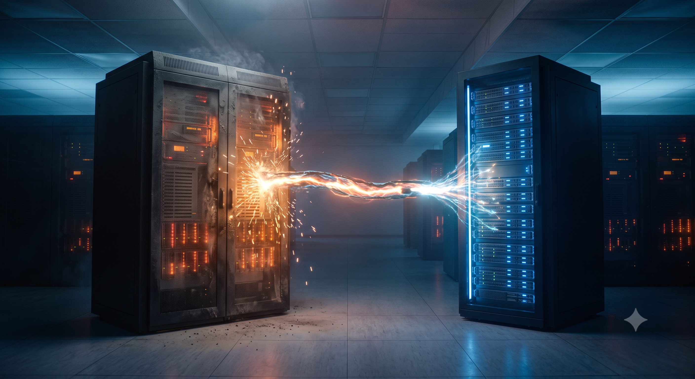

⚔️ Chapter 8 — The Final Showdown
=================================

<style type="text/css">
  * {
    font-family: suse;
    src: url('https://fonts.google.com/specimen/SUSE');
  }
  .suse { color: #30ba78; }
  .virt { color: #30ba78; }
  .bank { color: #d4af37; }
  .danger { color: #ff4d4d; font-weight: bold; }
  .hovereffect {
    border-radius: 25px 25px 25px 25px;
    background: linear-gradient(#30ba78 0 0) var(--hundredpercent, 0) / var(--hundredpercent, 0) no-repeat;
    transition: 0.5s, background-position 0s;
    padding: 5px;
  }
  .hovereffect:hover {
    --hundredpercent: 100%;
    color: white;
    border-radius: 10px 25px 10px 25px;
  }
  .storybox {
    border-left: 5px solid #d4af37;
    border-radius: 0 15px 15px 0;
    background: linear-gradient(135deg, rgba(48,186,120,.10), rgba(212,175,55,.10));
    padding: 15px 20px;
    margin: 15px 0;
  }
  .storybox em { color: #d4af37; }
  .missionbox {
    border: 2px dashed #30ba78;
    border-radius: 15px;
    padding: 12px 18px;
    margin: 15px 0;
  }
  .highlightcopy { color: white; font-weight: bold; padding: 0 10px; }
  img.logos { border-radius: 10px; }
</style>

🔐 Login Credentials
====================

The **SUSE Virtualization** UI and **Rancher Prime** UI use the same credentials.

Username:
```txt
admin
```

Password:
```txt
[[ Instruqt-Var key="RANCHER_PASSWORD" hostname="kvm-host" ]]
```



<div class="storybox">

The week of relentless crises has finally stabilized, but one massive shadow still looms over the datacenter.

In the darkest, coldest corner of the room sits the **legacy ISAware cluster**. It is ancient, temperamental, and obscenely expensive to maintain. It holds the final, most critical piece of the bank's architecture: the <b class="highlightcopy">legacy-ledger-vm</b>.

Sarah's phone buzzes. She looks down, her jaw tightening. *"It is the legacy vendor,"* she says. *"They are demanding a signed contract for the renewal by midnight, and they have hiked the licensing fee by another <span class="danger">forty percent</span>. They know we are trapped. They think we cannot move that machine without breaking the database."*

You stand up, cracking your knuckles. *"Tell them we decline the renewal."*

Sarah looks at you, stunned. *"If we turn that cluster off, the bank dies."*

*"We aren't turning it off yet,"* you reply, a confident grin forming. *"We are going to extract the virtual machine while it is still running."*

</div>

<b class="virt">SUSE Virtualization</b> possesses a powerful migration utility capable of reaching across the network, interfacing directly with the legacy hypervisor, and pulling the virtual machine into the modern era — converting its disks and translating its hardware entirely **on the fly**.

<div class="missionbox">

## 🎯 Your Quest Objectives

1. Establish the migration bridge
2. Execute the workload extraction
3. Verify the migrated workload
4. Enable advanced telemetry

</div>

🌉 Task 1: Establish the migration bridge
=========================================

In the [button label="SUSE Virtualization UI" variant="success"](tab-0), navigate to the **Advanced** menu on the left, and click **Migration**.

Click on **Sources** to ensure the bridge to the old world is established. Verify that <b class="highlightcopy">isaware-legacy-01</b> is displaying a green **Ready** status.

> [!NOTE]
> A migration source holds the address and credentials of the legacy ISAware management endpoint. The import controller uses it to enumerate and extract VMs — no agent is installed on the old cluster.

📦 Task 2: Execute the workload extraction
==========================================

Navigate back to the main **Migrations** page and click **Create**. Configure the extraction parameters:

| Setting | Value |
|--------:|:------|
| **Source Type** | `ISAware` |
| **Source VM** | <b class="highlightcopy">legacy-ledger-vm</b> |
| **Target Network** | the default management **Network** (ensures connectivity upon boot) |

Click **Create** and watch the progress bar closely.

<div class="storybox">

Behind the scenes, the new cluster is reaching into the legacy storage array, copying the raw disk blocks, converting them into cloud-native volumes, and wrapping them in modern descriptors. The old hypervisor doesn't even know the ledger is leaving.

</div>

✅ Task 3: Verify the migrated workload
=======================================

Once the progress bar reaches one hundred percent, navigate back to **Virtual Machines**.

1. Locate the newly migrated <b class="highlightcopy">legacy-ledger-vm</b>
2. Click **Console** to view the web console

The familiar boot screen of the core ledger appears — running flawlessly on the new infrastructure. Same disks, same OS, same application. New world.

📊 Task 4: Enable advanced telemetry
====================================

To ensure the new platform can deeply monitor the legacy system, you must ensure the **QEMU guest agent** is running inside the migrated machine.

Close the web console. Switch to the [button label="Cluster Terminal" variant="success"](tab-1) and SSH into the newly migrated machine (find `MIGRATED_VM_IP` in the UI):

```bash
ssh opensuse@MIGRATED_VM_IP
```

Install and start the guest agent:

```bash,run
sudo systemctl enable --now qemu-guest-agent
```

Type `exit` to return to the Cluster Terminal. If you look back at the [button label="SUSE Virtualization UI" variant="success"](tab-0), the virtual machine will now report rich telemetry data — including memory usage and assigned IP addresses — directly to the dashboard.

🏋️ Bonus Drills — treat the refugee like a citizen (optional)
==============================================================

The migrated VM is now a first-class <b class="virt">SUSE Virtualization</b> workload. Prove it by applying what you learned in the previous chapters:

- **For the command-line curious — watch the extraction machinery at work.** The importer runs as a pod, and every migration is a trackable API object:

```bash,run
kubectl --kubeconfig .kube/harvester.yaml get pods -A | grep vm-import; kubectl --kubeconfig .kube/harvester.yaml get virtualmachineimports -A
```

- **Confirm it is a native Kubernetes object** like every other VM in the fleet:

```bash,run
kubectl --kubeconfig .kube/harvester.yaml get vm -A | grep legacy-ledger
```

- **Give it the protection the old cluster never had:** take a snapshot named <b class="highlightcopy">post-migration-baseline</b> from its **Snapshots** tab in the UI (Chapter 6 skills).

- **Prove it can dodge hardware failures now:** live-migrate <b class="highlightcopy">legacy-ledger-vm</b> to another node (Chapter 4 skills). On ISAware, that feature was a licensed add-on. Here, it is just Tuesday.

💼 Why does this matter for Vertex Trust Bank?
==============================================

- **The lock-in lever is gone.** When workloads can be extracted live, no vendor can price a renewal like a ransom again.
- **Migration without a rewrite.** The ledger moved with its disks and OS intact — no application changes, no big-bang cutover weekend.
- **Day-one operational parity.** Snapshots, live migration, and telemetry apply to the migrated VM immediately — it doesn't just survive on the new platform, it gains capabilities.

<div class="storybox">

Across the room, the legacy cluster fans spin down into a quiet, defeated hum. The vendor lock-in is broken forever. **You have won.**

</div>

Click **Check** for the final chapter. 🌅

📚 More information
===================

- [SUSE Virtualization — Overview](https://documentation.suse.com/cloudnative/virtualization/latest/en/introduction/overview.html)
- [Live Migration](https://documentation.suse.com/cloudnative/virtualization/latest/en/virtual-machines/live-migration.html)
- [Virtual Machine Backup and Restore](https://documentation.suse.com/cloudnative/virtualization/latest/en/virtual-machines/backup-restore.html)
