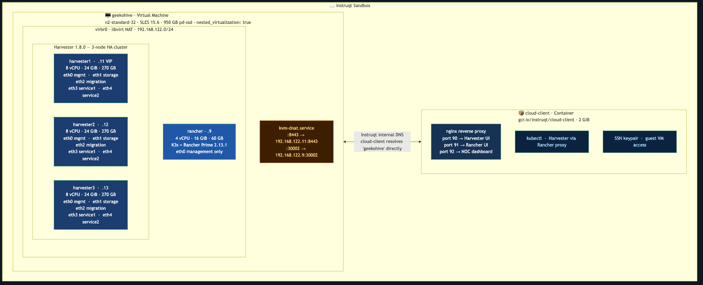
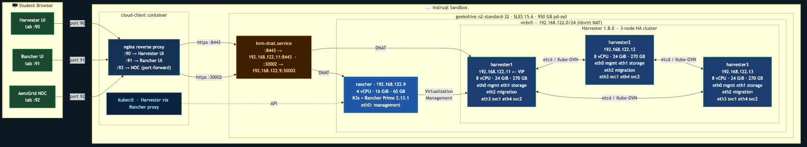
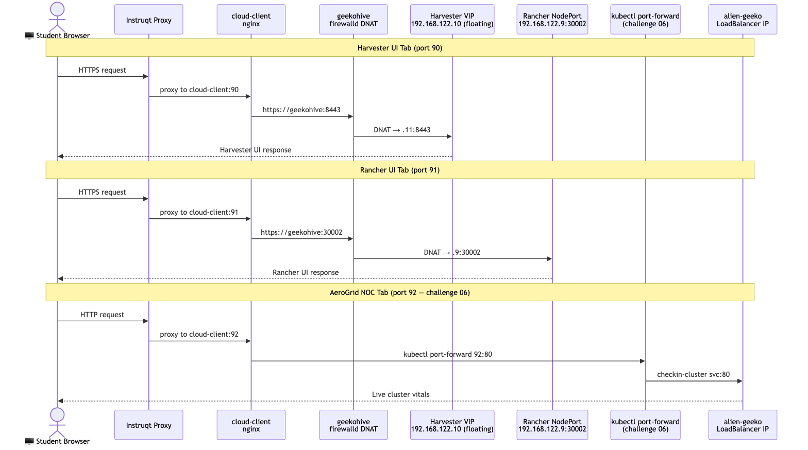
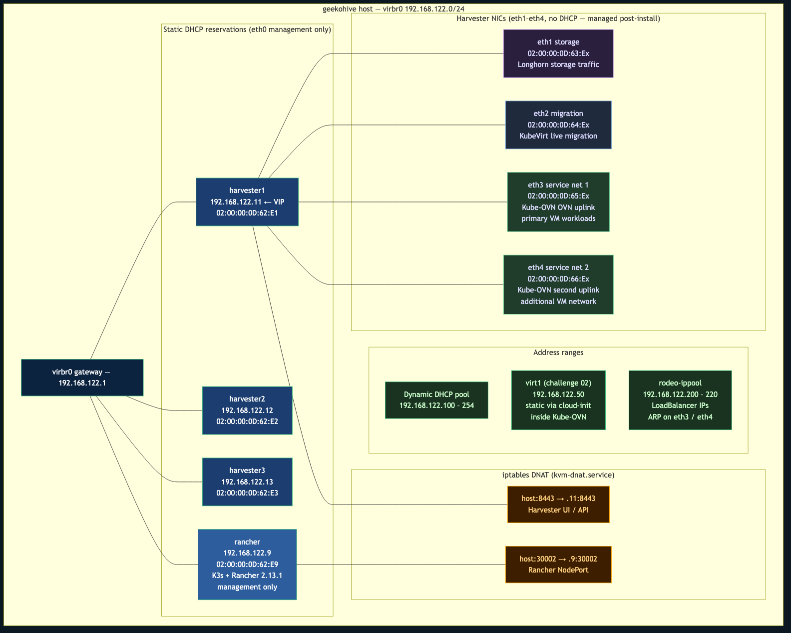
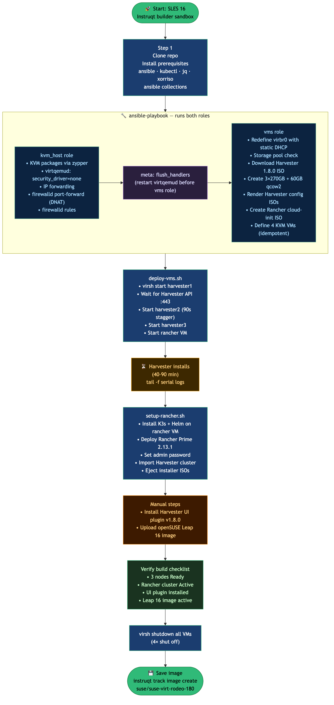
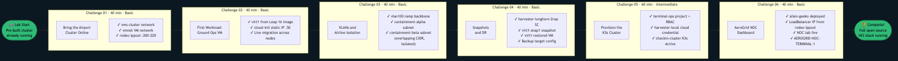

# SUSE Virtualization Rodeo

An Instruqt-based interactive lab where participants migrate a fictional airport IT
platform from VMware to **SUSE Virtualization** (Harvester HCI). The lab runs on a
pre-built custom image containing a fully operational 3-node Harvester 1.8.0 cluster
managed by Rancher Prime 2.13.1 — no waiting for installation during the session.

**Versions:** Harvester 1.8.0 · Rancher Prime 2.13.1 · K3s v1.31 · SLES 15.6  
**Duration:** ~3 hours (6 challenges)  
**Audience:** DevOps engineers, SREs, platform teams evaluating or adopting SUSE Virtualization

---

## The Story

**AeroGrid Operations** manages IT for a regional international airport. When the
Broadcom acquisition of VMware closed, the renewal quote came in at 3.2x the
previous cost — NSX, vSAN, and vCenter all billed separately. The decision was made:
migrate to SUSE Virtualization.

Participants play the infrastructure engineer getting the new platform operational.
Over six challenges they bring up the cluster, build the network topology, provision
workloads with live migration and snapshots, and deploy a live NOC dashboard. Every
task maps directly to something that would happen in a real VMware-to-SUSE migration.

---

## Architecture

### Infrastructure overview

**Sandbox layout** — what runs inside the Instruqt play:



**Traffic and data flow** — how each component connects:



### How UI tabs reach the student



All UI traffic goes through the `cloud-client` container, which runs nginx as a
reverse proxy. Instruqt exposes container ports as browser tabs.

```
Student browser
  |
  +-- Tab: Harvester UI (port 90)  --> cloud-client:90 --> nginx --> geekohive:8443
  +-- Tab: Rancher UI   (port 91)  --> cloud-client:91 --> nginx --> geekohive:30002
  +-- Tab: AeroGrid NOC (port 92)  --> cloud-client:92 --> kubectl port-forward
```

`geekohive` forwards incoming traffic to the KVM guests via iptables DNAT rules
managed by `kvm-dnat.service`:

```
geekohive:8443  --DNAT--> 192.168.122.11:8443   (Harvester VIP)
geekohive:30002 --DNAT--> 192.168.122.9:30002   (Rancher K3s NodePort)
```

Port 92 is not pre-configured. The student runs `kubectl port-forward` in challenge
06, which brings the NOC dashboard live in that tab.

### Network topology



### KVM guest configuration

| VM | vCPU | RAM | Disk | IP | Purpose |
|---|---|---|---|---|---|
| harvester1 | 8 | 24 GiB | 270 GB qcow2 | 192.168.122.11 | Bootstrap node, kube-vip VIP |
| harvester2 | 8 | 24 GiB | 270 GB qcow2 | 192.168.122.12 | Join node |
| harvester3 | 8 | 24 GiB | 270 GB qcow2 | 192.168.122.13 | Join node |
| rancher | 4 | 16 GiB | 60 GB qcow2 | 192.168.122.9 | K3s + Rancher Prime 2.13.1 |

All VMs share a single libvirt NAT network (`virbr0`, `192.168.122.0/24`).

Each Harvester node has five NICs on virbr0, each dedicated to a traffic role:

| NIC | Role | MAC | Notes |
|-----|------|-----|-------|
| eth0 | Management | `02:00:00:0D:62:Ex` | Static IP from installer, cluster API — DHCP reserved |
| eth1 | Storage | `02:00:00:0D:63:Ex` | Longhorn storage traffic — managed post-install |
| eth2 | Migration | `02:00:00:0D:64:Ex` | KubeVirt live migration — managed post-install |
| eth3 | Service net 1 | `02:00:00:0D:65:Ex` | Kube-OVN OVN uplink, primary VM workloads |
| eth4 | Service net 2 | `02:00:00:0D:66:Ex` | Kube-OVN second uplink / additional VM network |

Static DHCP reservations ensure VMs always get the same IPs regardless of boot order.
The dynamic DHCP pool starts at `.100` to keep static assignments well clear.

```
virbr0 -- 192.168.122.0/24
  .1    gateway
  .9    rancher     (02:00:00:0D:62:E9 -- static reservation)
  .11   harvester1  (02:00:00:0D:62:E1 -- static reservation, kube-vip VIP)
  .12   harvester2  (02:00:00:0D:62:E2 -- static reservation)
  .13   harvester3  (02:00:00:0D:62:E3 -- static reservation)
  .50   virt1       (challenge 02 VM, static via cloud-init inside Kube-OVN)
  .100-.254         dynamic DHCP pool
  .200-.220         rodeo-ippool (Harvester LoadBalancer IPs, ARP on eth3/eth4)
```

### Host resource budget

```
geekohive: n2-standard-32 (32 vCPU, 128 GiB RAM, 950 GB pd-ssd)

  harvester1:  8 vCPU  24 GiB  vda = 270 GB qcow2 (preallocation=metadata)
  harvester2:  8 vCPU  24 GiB  vda = 270 GB qcow2
  harvester3:  8 vCPU  24 GiB  vda = 270 GB qcow2
  rancher:     4 vCPU  16 GiB  60 GB qcow2
  -------------------------------------------------------
  KVM total:  28 vCPU  88 GiB
  Host overhead:  4 vCPU, ~8 GiB
  RAM headroom:  ~32 GiB

Disk layout per Harvester node (270 GB vda):
  COS_PERSISTENT:    ~173 GB  (OS + container images)
  HARV_LH_DEFAULT:   ~97 GB   (Longhorn storage pool)
  Longhorn usable per node (after 30% reserve): ~68 GB
```

---

## Technical Decisions

### 3-node HA cluster, not single-node

Single-node Harvester is technically possible but teaches nothing about the HA
properties that make the platform valuable. The 3-node setup gives a real etcd
quorum, demonstrates live migration across nodes, and lets students see Longhorn
replica distribution across the cluster. 24 GiB per node is below the production
minimum of 32 GiB but proven to work for dev and lab workloads.

### Nested KVM on GCP n2-standard-32

This is the Instruqt-native approach. A single GCP instance with nested
virtualization enabled runs all four KVM guests without needing physical hardware or
a dedicated lab environment. The `n2-standard-32` gives enough CPU, RAM, and disk
to run a real 3-node Harvester cluster without resource pressure. The 950 GB pd-ssd
gives ~40 GB of headroom after all images are provisioned.

### SLES 15.6 as the KVM host

SLES 15.6 aligns with the SUSE product stack and uses `libvirtd` (the monolithic
daemon) rather than the modular `virtqemud` stack that arrives with SLES 16. The
service name and socket paths differ between the two, which matters for Ansible
automation. SLES 16 is viable but the `kvm_host` role would need updating to target
`virtqemud` instead of `libvirtd`.

### Single virbr0 bridge for all five NICs on Harvester nodes

All five NICs (management, storage, migration, service1, service2) share virbr0.
In production each would be on a dedicated physical switch or VLAN, but in the
nested KVM lab a single bridge is the practical constraint. This means Harvester's
VM LoadBalancer IPs (`192.168.122.200-220`) are ARP-announced directly onto the
bridge via eth3/eth4 and are reachable from both `geekohive` and `cloud-client`
without extra routing rules. Adding more bridges would require forwarding rules and
more DNAT entries for no lab benefit.

### Harvester VIP equals harvester1's management IP

In production the kube-vip VIP is a separate address that floats between nodes on
failover. Here it is pinned to harvester1's IP (`.11`) to simplify the lab setup.
If harvester1 fails the VIP will not migrate in this design. For a lab that does not
test node failover, this is an acceptable trade-off.

### Static MAC addresses with DHCP reservations

Harvester encodes node IPs in etcd at cluster formation time. If a node gets a
different IP after a reboot the etcd cluster breaks. Static DHCP reservations
anchored to known MACs guarantee the same IPs across every power cycle. The MACs
are hardcoded in `ansible/roles/vms/defaults/main.yml` and in the VM XML template.
Changing them requires rebuilding the image.

### Rancher on K3s, not RKE2

K3s starts in 2-4 minutes on a 4-core VM. RKE2 is heavier and takes 8-10 minutes.
Rancher is a single-node management plane here and does not need the security
hardening RKE2 provides. K3s with Rancher Prime is a supported production
configuration for management clusters.

### File-based serial console

GCP VMs have no physical display. Writing serial output to a file
(`/var/log/libvirt/qemu/<vm>_serial.log`) means install progress survives
disconnections and multiple terminals can tail the same log simultaneously.
The trade-off is that `virsh console` no longer works interactively — use
`tail -f` instead.

### preallocation=metadata on Harvester qcow2 disks

The Harvester installer inspects the block device to determine partition sizes. With
pure thin-provisioned qcow2 (no preallocation), the reported device size matches
actual allocated bytes rather than the virtual size, and the installer can
miscalculate the `HARV_LH_DEFAULT` (Longhorn) partition. The `metadata` mode writes
the qcow2 cluster table upfront so the virtual size is reported correctly, while
actual disk consumption stays thin.

### CDROM eject after install

After Harvester installs and reboots, its EFI boot entry points to the hard disk.
If QEMU loses its in-memory EFI variables (host crash, power loss), it falls back
to the boot order in the VM XML, which had the installer CDROM at `boot order=1`.
Ejecting CDROMs after a confirmed install with `virsh change-media --eject --live
--config` removes them from both the running state and the persistent XML, so there
is no ISO to accidentally re-install from.

### Ansible roles instead of a shell script

The original build process was a single 654-line bash script that was not idempotent,
not re-runnable, and mixed host setup, disk creation, ISO generation, and VM
definition into one sequential flow. Two Ansible roles (`kvm_host` and `vms`) give
per-task idempotency, Jinja2 templating for VM XML and Harvester configs, proper
handler chains, and `--tags` support to run only what needs running.

---

## Repository Structure

```
.
├── ansible/
│   ├── playbook.yml              # runs kvm_host + vms roles
│   ├── inventory.example         # localhost for builder track
│   ├── requirements.yml          # community.libvirt, community.general, ansible.posix
│   └── roles/
│       ├── kvm_host/             # host packages, libvirt config, DNAT, firewall
│       └── vms/
│           ├── defaults/main.yml # all parameters: flavors, MACs, IPs, UUIDs, paths
│           ├── tasks/
│           │   ├── network_setup.yml    # redefine virbr0 with static DHCP entries
│           │   ├── storage_setup.yml    # ensure default storage pool exists
│           │   ├── images.yml           # ISO download, disks, config ISOs, cloud-init
│           │   └── vm_setup.yml         # idempotent VM define from template
│           └── templates/
│               ├── vm.xml.j2                # parameterized KVM domain XML
│               ├── network.xml.j2           # libvirt NAT network + static DHCP
│               ├── harvester-config.yaml.j2 # Harvester unattended install config
│               ├── cloud-init-meta-data.j2
│               ├── cloud-init-user-data.j2
│               └── cloud-init-network-config.j2
│
├── builder/
│   ├── 01-build/assignment.md    # step-by-step image build guide
│   ├── deploy-vms.sh             # start VMs, wait for Harvester install
│   ├── setup-rancher.sh          # K3s + Rancher Prime, import, eject ISOs
│   ├── harvester-config-node*.yaml # reference copies (Ansible renders the real ones)
│   ├── config.yml                # Instruqt builder sandbox config
│   └── track.yml                 # Instruqt builder track definition
│
├── track_scripts/
│   ├── setup-geekohive           # start VMs, wait for cluster, set agent variables
│   ├── setup-cloud-client        # nginx proxy, kubectl context, SSH keypair
│   └── cleanup-cloud-client      # sandbox teardown
│
├── 01-susevirt-intro/            # Challenge 01
├── 02-first-vm/                  # Challenge 02
├── 03-networking/                # Challenge 03
├── 04-storage-migration/         # Challenge 04
├── 05-rancher-k3s/               # Challenge 05
├── 06-alien-geeko/               # Challenge 06
│
├── assets/                       # GIF demos embedded in challenge assignments
├── ARCHITECTURE.md               # detailed architecture and ops reference
├── Converting-SLES-15.6-KVM-host.md  # guide to set up a SLES 15.6 KVM host
├── config.yml                    # Instruqt main track sandbox config
└── track.yml                     # Instruqt main track definition
```

---

## Prerequisites

### Building the image

- Access to the `SUSE-Technical-Marketing` Instruqt org (or an org with a SLES 15.6 base image)
- SLES 15.6 base image slug in Instruqt: verify `suse/sles-15sp6` exists in the catalog
- Instruqt CLI installed and authenticated
- `git` on your workstation

### Running the lab

- Pre-built image `suse/suse-virt-rodeo-180` published in your Instruqt org
- `config.yml` updated to point to the correct image slug
- Track pushed with `instruqt track push`

---

## Building the Image



The lab runs from a custom Instruqt image that contains the pre-installed Harvester
cluster. Building takes 2-3 hours, mostly unattended. Full step-by-step instructions
are in `builder/01-build/assignment.md`. The summary below covers each major step.

### Step 1 — Spin up the builder track

```bash
instruqt track push --dir builder/
instruqt track start suse-virt-rodeo-builder
```

Open the `geekohive` terminal.

### Step 2 — Clone the repo and verify prerequisites

```bash
git clone https://github.com/SUSE-Technical-Marketing/test-harv-rodeo.git /root/rodeo
cd /root/rodeo

# sshpass and jq are required by setup-rancher.sh
rpm -q sshpass jq || zypper install -y sshpass jq

ansible-galaxy collection install -r ansible/requirements.yml
```

### Step 3 — Run the Ansible playbook

Runs `kvm_host` then `vms` roles. Configures the host and prepares all VM assets.

```bash
ansible-playbook -i ansible/inventory.example ansible/playbook.yml
```

What this does:

- **kvm_host:** installs KVM packages, configures libvirtd, sets up iptables DNAT
  service (`kvm-dnat.service`), configures firewalld, enables IP forwarding
- **vms:** redefines virbr0 with static DHCP host entries, creates qcow2 disks
  (3x 270 GB Harvester, 1x 60 GB Rancher), downloads Harvester 1.8.0 ISO, renders
  per-node config ISOs from template, creates Rancher cloud-init ISO, defines all
  4 KVM VMs in libvirt

### Step 4 — Start the VMs

```bash
cd /root/rodeo/builder
chmod +x deploy-vms.sh
./deploy-vms.sh
```

The script starts harvester1, polls `https://192.168.122.11` until Harvester
responds (20-40 minutes), staggers harvester2 and harvester3 by 90 seconds to avoid
etcd join race conditions, then starts the rancher VM. All 4 VMs are running when
the script exits.

Monitor install progress in a second terminal:

```bash
tail -f /var/log/libvirt/qemu/harvester1_serial.log
tail -f /var/log/libvirt/qemu/harvester2_serial.log
tail -f /var/log/libvirt/qemu/harvester3_serial.log
```

### Step 5 — Confirm the cluster

```bash
ssh root@192.168.122.11 "kubectl get nodes -o wide"
```

All 3 nodes should show `Ready`. Total time from VM start: 40-90 minutes.

### Step 6 — Install K3s, Rancher, and import Harvester

```bash
chmod +x /root/rodeo/builder/setup-rancher.sh
/root/rodeo/builder/setup-rancher.sh
```

The script installs K3s and Helm on the rancher VM, deploys cert-manager and Rancher
Prime 2.13.1 via Helm, sets a random admin password (written to
`/root/rancher-password`), creates the Harvester cluster import record in Rancher,
applies the import manifest to the Harvester cluster, and ejects the installer ISOs
from all three Harvester VMs.

```bash
cat /root/rancher-password
curl -sk https://rancher.192.168.122.9.sslip.io/ping | grep -q "pong" && echo "Rancher OK"
```

### Step 7 — Install the Harvester UI plugin

In Rancher, navigate to **local cluster > Apps** and install the Harvester UI plugin
version 1.8.0. The plugin version must match the Harvester cluster version exactly.

### Step 8 — Pre-load the openSUSE Leap 16 image

```bash
curl -sk -X POST \
  -H "Authorization: Bearer $(cat /root/harvester-token)" \
  -H "Content-Type: application/json" \
  -d '{"metadata":{"name":"opensuse-leap-16","namespace":"default"},
       "spec":{"displayName":"openSUSE Leap 16",
               "url":"https://download.opensuse.org/distribution/leap/16.0/appliances/openSUSE-Leap-16.0-Minimal-VM.x86_64-Cloud.qcow2",
               "sourceType":"download"}}' \
  https://192.168.122.11/v1/harvesterhci.io.virtualmachineimages
```

Wait for the image to reach `status.state: active` before proceeding.

### Step 9 — Shut off all VMs

```bash
for vm in harvester1 harvester2 harvester3 rancher; do
  virsh shutdown $vm && echo "Shutdown sent to $vm"
done
sleep 120
virsh list --all
```

All four VMs must show `shut off` before saving.

### Step 10 — Save the image

1. In the Instruqt web console, select the `geekohive` VM
2. Click **Save as image**, name it `suse-virt-rodeo-180`, owner `suse`
3. Wait 20-30 minutes for the snapshot to complete
4. Update `config.yml` in the main track to reference the new image slug

### Build checklist

**Host layer:**
- [ ] Ansible playbook completed with zero failures
- [ ] `cat /sys/module/kvm_intel/parameters/nested` returns `Y`
- [ ] `virsh net-list --all` shows `default` (virbr0) active
- [ ] `systemctl status kvm-dnat` shows active (exited)
- [ ] `firewall-cmd --zone=public --list-ports` includes `8443/tcp 30001/tcp 30002/tcp`

**Harvester cluster:**
- [ ] `ssh root@192.168.122.11 "kubectl get nodes"` shows 3 nodes Ready
- [ ] `curl -sk https://192.168.122.11/ping` responds

**Rancher:**
- [ ] Rancher pods Ready in `cattle-system`
- [ ] Harvester cluster shows Active in Rancher Virtualization Management
- [ ] Harvester UI plugin v1.8.0 installed
- [ ] `/root/rancher-password` exists on geekohive

**Harvester content:**
- [ ] `opensuse-leap-16` image active in Harvester
- [ ] Longhorn V2 data engine disabled (incompatible with nested KVM)
- [ ] All 4 VMs show `shut off`: `virsh list --all`

---

## Deploying the Track on Instruqt

Once the image is built and `config.yml` updated:

```bash
instruqt track push
instruqt track start suse-virt-rodeo
```

The `setup-geekohive` script runs automatically at track start. It boots the 4 VMs,
waits for all 3 Harvester nodes to reach Ready, ejects CDROMs, waits for Rancher,
and exports agent variables. This takes 5-10 minutes from a pre-built image.

---

## The Challenges



### Challenge 01 — Bring the Airport Cluster Online

**Time limit:** 40 min | **Difficulty:** Basic

AeroGrid's SUSE Virtualization cluster has just powered on. Before any workload can
run, the team needs to verify the cluster is healthy and build the foundation
networking.

Students log in to Rancher and verify the 3-node cluster from the terminal. They
then build three resources that all subsequent challenges depend on:

- **`vms` cluster network** — binds `eth3` on all three nodes as the primary Kube-OVN uplink for VM workloads
- **`vmnet` VM network** — L2VlanNetwork on the `vms` cluster network, VLAN ID 1 (untagged)
- **`rodeo-ippool` IP pool** — range `192.168.122.200-220`, scoped to `default/vmnet`

The IP pool is the source for every LoadBalancer IP in the lab — the check-in
portal cluster (challenge 05) and the NOC dashboard (challenge 06) both draw from it.

**VMware equivalent:** cluster networks replace the Distributed Switch, VM networks
replace Port Groups, and the IP pool replaces NSX's load balancer VIP allocation.

**Check validates:** `vmnet` NetworkAttachmentDefinition and `rodeo-ippool` IPPool exist.

---

### Challenge 02 — First Workload: Ground Operations VM

**Time limit:** 40 min | **Difficulty:** Basic

AeroGrid's first migration target is `virt1` — the ground operations VM handling
baggage tracking, gate assignments, and ramp coordination. Under VMware this was a
vMotion-capable workload on ESXi.

Students create `virt1` from the pre-loaded openSUSE Leap 16 cloud image. Cloud-init
network data assigns a static IP (`192.168.122.50`) and injects the `cloud-client`
SSH key. Once running, they SSH into the VM and confirm the ground ops service is
reachable. They then trigger a **live migration** — moving the running VM to a
different Harvester node without downtime.

The scheduling section covers Harvester's three placement policies: any available
node (required for migration), specific node pinning, and label-based affinity rules
(GPU capability, NUMA topology, network zone).

**VMware equivalent:** VM creation from template with cloud-init instead of
customization specs; live migration instead of vMotion.

**Check validates:** `virt1` VM is Running, live migration event in the VM event log.

---

### Challenge 03 — Network Topology: VLANs and Airline Isolation

**Time limit:** 40 min | **Difficulty:** Basic

Three airlines share AeroGrid infrastructure. Passenger data and ground ops traffic
for each airline must be completely isolated — a compliance requirement.

Students create two network constructs:

**VLAN 100 ramp control backbone** — a Multus L2VlanNetwork on the `mgmt` cluster
network with VLAN ID 100. This is the airport's ramp coordination bus, tagged
separately from management traffic. Any upstream switch port carrying Harvester node
traffic must trunk VLAN 100 for real external use.

**Kube-OVN airline tenant zones** — two subnets (`containment-alpha` and
`containment-beta`) with `natOutgoing: false` and `private: true`. Both use
`172.16.0.0/24`. Kube-OVN's VPC isolation lets two tenants share the same CIDR with
zero traffic crossing between them — the overlapping address space capability that
NSX provides, without the NSX license.

**VMware equivalent:** VLAN 100 replaces a Distributed Switch port group with VLAN
tagging; the Kube-OVN subnets replace NSX micro-segmentation with distributed
firewall rules.

**Check validates:** `vlan100` NetworkAttachmentDefinition and both Kube-OVN Subnet
objects exist with `natOutgoing: false`.

---

### Challenge 04 — Flight Data: Snapshots and DR

**Time limit:** 40 min | **Difficulty:** Basic

ICAO regulations require flight operations records to be retained for 7 years.
Before any maintenance on `virt1`, the AeroGrid team needs a rollback point.

Students inspect the Longhorn storage topology across 3 nodes and create a
`harvester-longhorn-2rep` StorageClass for dev workloads (2 replicas vs. the
default 3). They take a snapshot of `virt1` named `virt1-snap1`, simulate data
corruption by writing an incident file to the VM via SSH, then restore the snapshot
into a new VM (`virt1-restored`). Both VMs exist side by side — original (corrupted)
and restored (clean) — for comparison.

The challenge ends with an inspection of the Longhorn backup target configuration
(S3/NFS), which covers the ICAO off-site retention requirement.

A callout introduces Harvester 1.8.0's new **in-place storage live migration**
feature — moving a running VM's disk between storage backends without stopping the VM.

**VMware equivalent:** Longhorn StorageClasses replace vSAN storage policies; VM
snapshots replace vSphere snapshots; Longhorn backup targets replace vSphere Data
Protection and off-site tape.

**Check validates:** `virt1-snap1` snapshot ReadyToUse, `virt1-restored` VM exists.

---

### Challenge 05 — Check-In Portal: Provision the K3s Cluster

**Time limit:** 60 min | **Difficulty:** Intermediate

AeroGrid needs a Kubernetes cluster for a self-service passenger check-in portal.
Rancher will provision it directly on SUSE Virtualization, treating the HCI platform
as a cloud provider.

Students first set up Rancher **RBAC**: create a `terminal-ops` project and annotate
a `checkin-workloads` namespace to scope it to that project. They then create a
`harvester-local` cloud credential (Rancher's authentication link to the Harvester
API). Finally they provision `checkin-cluster` — a K3s cluster with one node pool.
Rancher creates the VM on Harvester, installs K3s via cloud-init, and registers the
cluster. Students fetch the kubeconfig via the Rancher API.

The node pool is configured with the Harvester CSI Driver (Longhorn persistent
volumes for pods) and Harvester Cloud Provider (LoadBalancer services from
`rodeo-ippool`) add-ons enabled.

**VMware equivalent:** Rancher Projects replace vSphere resource pools with RBAC;
the Harvester node driver replaces vSphere with Tanzu; Harvester CSI replaces vSAN
PVC provisioning.

**Check validates:** `checkin-cluster` shows Active in Rancher cluster list.

---

### Challenge 06 — AeroGrid NOC Dashboard

**Time limit:** 40 min | **Difficulty:** Basic

`checkin-cluster` is running but dark. The NOC has no visibility into it. The team
deploys `alien-geeko` — a Node.js application that queries the Kubernetes API and
renders live cluster vitals.

Students deploy the full application stack in order: namespace, ServiceAccount,
ClusterRole and ClusterRoleBinding, ConfigMap (cluster display name), Deployment,
and LoadBalancer Service. The service gets an IP from `rodeo-ippool`. They then run
`kubectl port-forward svc/alien-geeko 92:80 --address=0.0.0.0 &` to bring the
AeroGrid NOC tab live in the Instruqt interface. Finally they patch the ConfigMap to
set the instance name to `AEROGRID-NOC-TERMINAL-1` and restart the deployment.

The closing section traces the full stack:

```
Bare metal (3 nodes)
  +-- SUSE Virtualization (KubeVirt + Longhorn + Kube-OVN)
        +-- checkin-cluster VM (K3s, provisioned by Rancher)
              +-- alien-geeko (NOC dashboard, LoadBalancer via rodeo-ippool)
                    +-- Port-forward --> NOC tab (port 92)
```

**Check validates:** `alien-geeko` Deployment Running, ConfigMap shows
`AEROGRID-NOC-TERMINAL-1`, NOC tab accessible.

---

## Credentials Reference

| Resource | Username | Password / Token |
|---|---|---|
| Rancher UI | `admin` | `/root/rancher-password` on geekohive |
| Harvester UI | `admin` | `HarvesterRodeo2024!` |
| Harvester nodes SSH | `root` | `HarvesterRodeo2024!` |
| Rancher VM SSH | `root` | `RancherRodeo2024!` |
| Rancher API token | — | `RANCHER_TOKEN` agent variable |
| Harvester API token | — | `/root/harvester-token` on geekohive |

The Rancher admin password is randomly generated during the image build. It is
exported as the `RANCHER_PASSWORD` agent variable so challenge assignments can
reference it as `[[ Instruqt-Var key="RANCHER_PASSWORD" hostname="cloud-client" ]]`.
The `HARVESTER_PASSWORD` agent variable is also set (`HarvesterRodeo2024!`) for
any challenge that needs direct Harvester API access.

---

## Troubleshooting

### setup-geekohive times out waiting for nodes

The 90-minute timeout is generous but Harvester install time on nested KVM can vary.
Check what the nodes are doing:

```bash
tail -f /var/log/libvirt/qemu/harvester1_serial.log
tail -f /var/log/libvirt/qemu/harvester2_serial.log
tail -f /var/log/libvirt/qemu/harvester3_serial.log
```

If a node is stuck in the installer, the config ISO may have been misconfigured.
Rebuild the image.

### Harvester UI not reachable on port 90

```bash
systemctl status kvm-dnat
virsh domstate harvester1
curl -sk https://192.168.122.11:8443 -o /dev/null -w "%{http_code}"
```

If `kvm-dnat` is not running: `systemctl start kvm-dnat`.

### Rancher shows harvester cluster as Unavailable after track start

The Harvester cluster takes 2-5 minutes after nodes are Ready to re-register with
Rancher. Refresh the Rancher UI after 3-5 minutes.

### virsh console not available on Harvester VMs

Serial console output is file-based by design:

```bash
tail -f /var/log/libvirt/qemu/harvester1_serial.log
```

### Live migration fails in challenge 02

Live migration requires `cpu_mode=host-passthrough` (already set in VM XML) and all
three Harvester nodes to be Ready with Longhorn replicas healthy. Check node and
Longhorn status:

```bash
kubectl get nodes
kubectl get nodes.longhorn.io -n longhorn-system
```

### Longhorn V2 data engine errors

The V2 engine requires SPDK and NVMe. Virtio-blk in nested KVM is not supported.
Keep the V2 engine disabled in Harvester settings. V1 works correctly.

### IP pool not allocating addresses

If a LoadBalancer service stays in `<pending>`, verify the `rodeo-ippool` exists and
is scoped to the correct VM network:

```bash
kubectl get ippools.network.harvesterhci.io -n default -o yaml
```

The selector must reference `default/vmnet`.

---

## Contributing

`development` is the main working branch. `main` is reserved for production-ready
image builds. Open pull requests against `development`.

Track developers: andres.valero@suse.com · raul.mahiques@suse.com
