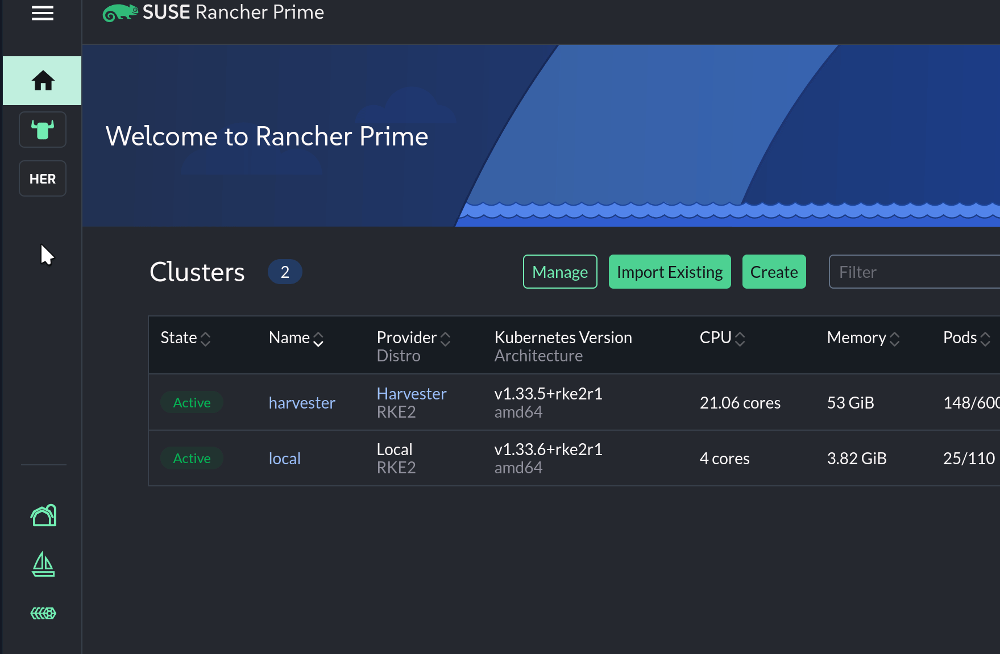
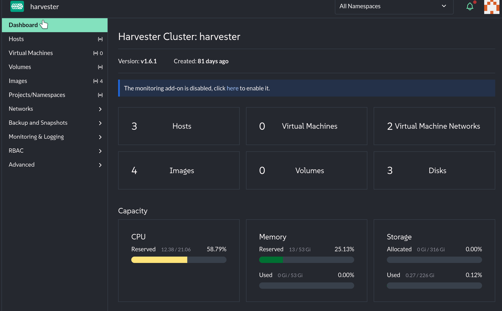
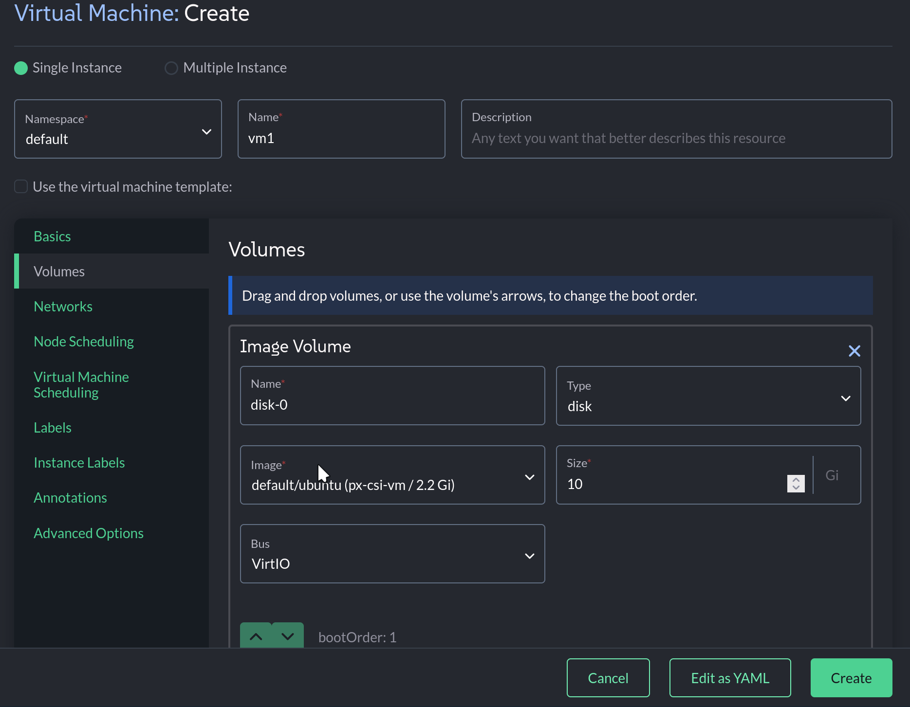

Editor's Notes
=====
This assignment should be written by SUSE.

Let's create our first virtual machine! In case you need to reconnect to Rancher Prime, follow the steps below. If you are already logged in, skip to `Creating our first Virtual Machine` below.

Connecting to SUSE Virtualization
=====

In this lab, we will be interacting with SUSE Virtualization using SUSE Rancher Prime. Rancher Prime provides a unified interface for managing Kubernetes clusters, including SUSE Virtualization.

### Logging in to the Rancher Prime UI

Let's open the [button label="Rancher" variant="success"](tab-0) tab.

Log in to Rancher Prime, if necessary, with the following credentials:

- Username:

```txt
admin
```

- Password:

```txt
[[ Instruqt-Var key="RANCHER_PASSWORD" hostname="cloud-client" ]]
```

### Accessing the SUSE Virtualization Cluster

From the Rancher Prime UI, select the `Virtualization Management` menu item from the left-hand menu. Then select the `harvester` cluster from the menu.



Creating our first Virtual Machine
=====

In this lab, we will be creating our first virtual machine. We have created a new VM template for you at the start of this lesson called `ubuntu`, which is a Ubuntu 24.04 cloud image.

### Task: Check on the status of our Data Volume

Take a look at the status of our Data Volumes by running the following command in the [button label="Terminal" variant="success"](tab-0) tab:

```bash,run
kubectl get dv
```

> [!NOTE]
> Why do all of our data volumes have strange names that start with image-? SUSE Virtualization adds an additional abstraction on top of Kubernetes Data Volumes called Virtual Machine Images. Know that when you create a Virtual Machine Image, it creates a Data Volume for you.

Let's run a new command to describe the correct datavolume:

```bash,run
IMAGE_NAME=$(kubectl get virtualmachineimage -l harvesterhci.io/imageDisplayName=ubuntu --no-headers | awk {'print $1'})
kubectl describe dv $IMAGE_NAME
```

We should see that the `Phase` of our DV is `Succeeded`. We can also see the events that the DV went through to get to the `Succeeded` phase.

> [!NOTE]
> If the `Phase` is `ImportInProgress`, wait another minute and run the above command again.

### Task: Create a Virtual Machine from a Template

Let's go back to the [button label="Rancher" variant="success"](tab-1) tab.

- Click on the `Virtual Machines` menu item from the left-hand menu
- Click the `Create` button.



- Set the name of our VM to `vm1`
- Set the `CPU` to `4`
- Set the `Memory` to `4`
- Set the `SSHKey` to `default/cloud-client` (This key will allow our cloud client to SSH to our VM)
- Select the `Volumes` menu item
- Select the `Image` dropdown and select the `default/ubuntu` image


We are now going to customize this VM using cloud-init. Cloud-init is a tool that allows you to customize a VM after it has been created. We will be using cloud-init set an ip address of this VM to `192.168.122.22`.

- Click on the `Networks` menu item
- Click the `Network` dropdown
- Select the `default/vmnet` network
- Click on the `Advanced Options` menu item
- Scroll down to the `Network Data:` section
- Paste the following in to the text field

```txt
version: 2
ethernets:
  enp1s0:
    addresses:
      - 192.168.122.22/24
    gateway4: 192.168.122.1
    nameservers:
      addresses:
        - 192.168.122.1
```



Switch back to the [button label="Terminal" variant="success"](tab-0) tab.

Let's wait for the VM to become available:

```bash,run
until ssh vm1 "uname -a" 2> /dev/null ; do sleep 5; done
```

Once our prompt comes back, we should see the output of `uname -a` which means our VM is up and running!

> [!NOTE]
> Cloud init is a powerful way of customizing Linux virtual machines. It can set networking configurations, install packages, and more. For more information, see the [cloud-init documentation](https://cloudinit.readthedocs.io/en/latest/).
> SUSE Virtualization integrates cloud-init in to the GUI, allowing you to configure virtual machines easily.


