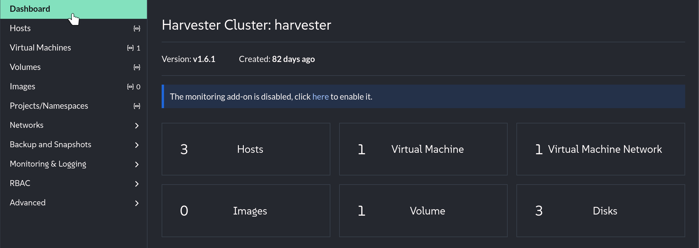
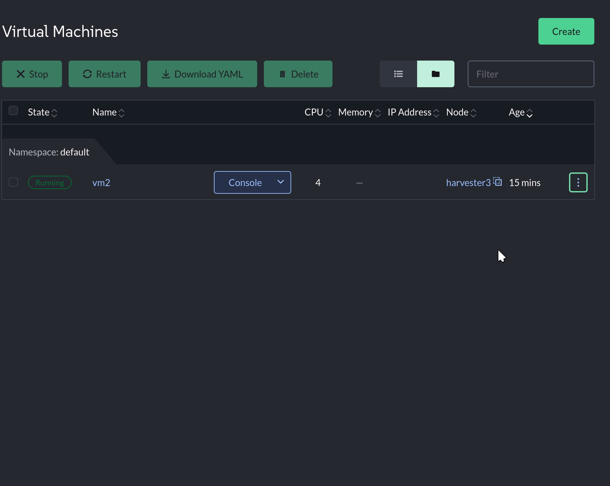
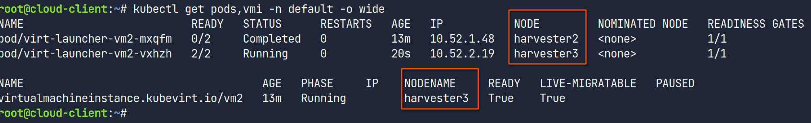
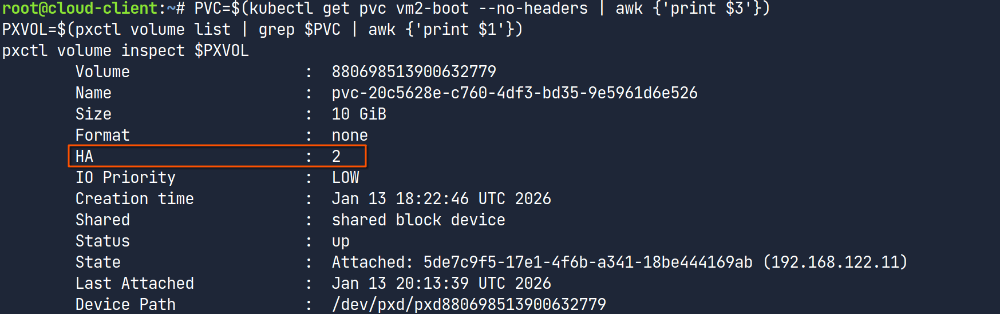
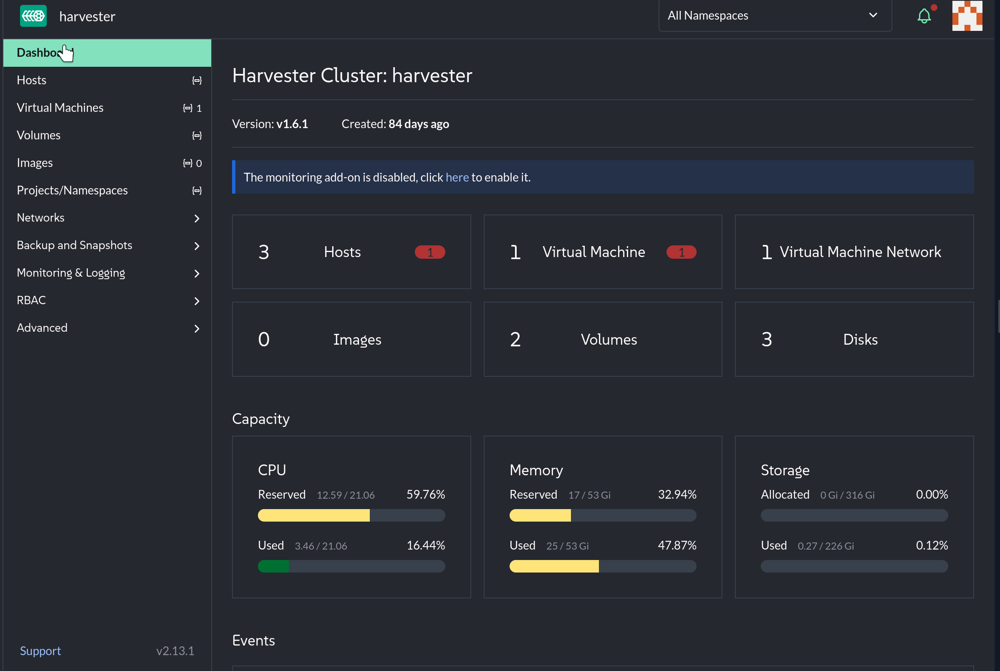
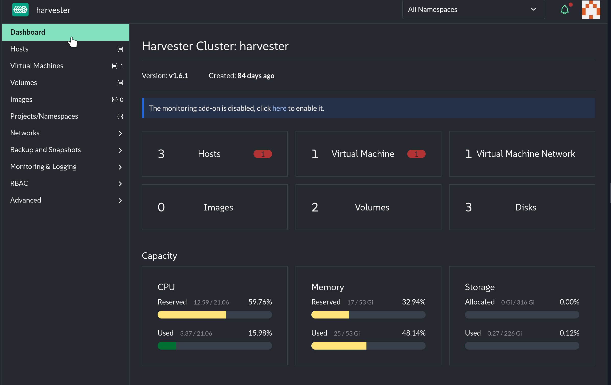
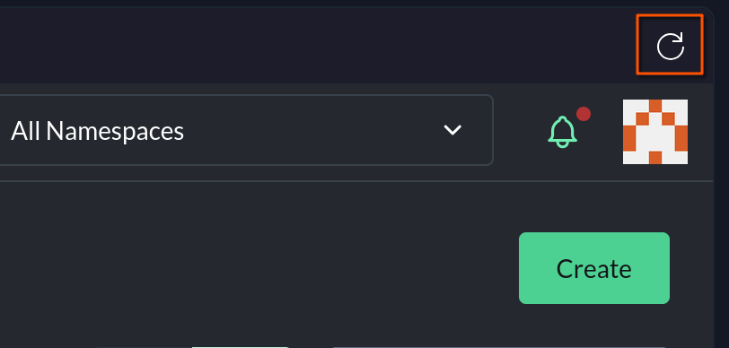

Editor's Notes
=====
This assignment should be written by Portworx. It is completed

In this lesson, we will be learning how to perform day 2 operations on virtual machines running on SUSE Virtualization. We will be using the SUSE Rancher Prime UI to manage the SUSE Virtualization cluster.

We have created a VM for you called `vm2`. We can access this VM though SSH using the `vm2` hostanem. Try it now:

```bash,run
ssh vm2 date
```

You should see the date and time displayed.

If you are already logged in, skip to `Scenario - Live Migration` below.

Connecting to SUSE Virtualization
=====

In this lab, we will be interacting with SUSE Virtualization using SUSE Rancher Prime. Rancher Prime provides a unified interface for managing Kubernetes clusters, including SUSE Virtualization.

### Logging in to the Rancher Prime UI

Let's open the [button label="Rancher" variant="success"](tab-1) tab.

Log in to Rancher Prime, if necessary, with the following credentials:

- Username:

```txt
admin
```

- Password:

```txt
[[ Instruqt-Var key="RANCHER_PASSWORD" hostname="cloud-client" ]]
```

### Accessing the SUSE Virtualization Cluster

From the Rancher Prime UI, select the `Virtualization Management` menu item from the left-hand menu. Then select the `harvester` cluster from the menu.


Scenario - Live Migration
=====

In this scenario, we will be learning how to perform a live migration of a virtual machine on SUSE Virtualization. We will be using the SUSE Rancher Prime UI to manage the SUSE Virtualization cluster. Live migration allows a virtual machine to move between SUSE Virtualization nodes without intrupting services. This is useful for maintenance operations such as applying security patches or upgrading the SUSE Virtualization nodes.

### Task: Find the current node our VM is running on

- Click on the [button label="Rancher" variant="success"](tab-1) tab
- Click on the `Virtual Machines` menu and find the `vm2` virtual machine
- Take note of the `Node` that the VM is running on



> [!NOTE]
> We can also find the running node for the vm by switching to the [button label="Terminal" variant="success"](tab-0) tab and running the following command:
> 'k get vmi'

### Task: Perform a Live Migration
Let's perform a live migration of our VM.

- Click on the kabob menu (three vertical dots) on the right side of the VM
- Select `Migrate`. Select a different node as the destination of our migration

After a few seconds, we can see that the node has successfully migrated!



Our VM has been successfully migrated to a different node!

Live Migrations work a little differently on SUSE Virtualization (and all Kubevirt variants) than hypervisors you may have worked with in the past. Let's switch to the [button label="Terminal" variant="success"](tab-0) tab and run the following command to see what happened "under the hood":

```bash,run
kubectl get pods,vmi -n default -o wide | grep vm2
```

You should see an output that looks like this:


Notice that there are 2 pods for `vm2`. When we run a virtual machine in Kubevirt, we are really running a virtual machine process (using QEMU/KVM) inside of a pod. When we perform a live migration, a new pod is created on the destination node, and the virtual machine process is moved to the new pod. The old pod is then deleted.

This is why RWX storage is important for live migrations. The virtual machine process can move between nodes while the VM is running, but the storage must be accessible by both the source and destination pods.

Scenario - High Availability
=====

Although perhaps not a Day 2 operation in the traditional sense, high availability is essential to modern workloads. High availability ensures that in the event of a node failure, the virtual machine will be rescheduled to a new node and resume operations. SUSE Virtualization and Portworx configured for high availability by default, so we don't have to do anything to configure it!

Portworx provides high availability to our VMs even if our storage is local to the node that failed! This is done through by having multiple `replicas` which are configured in the storage class. Let's take a moment to verify that our virtual machines volume has move than one replica:

- Click on the [button label="Terminal" variant="success"](tab-0) tab
- Run the following command:

```bash,run
PVC=$(kubectl get pvc vm2-boot --no-headers | awk {'print $3'})
PXVOL=$(pxctl volume list | grep $PVC | awk {'print $1'})
pxctl volume inspect $PXVOL
```

Example Output:


Notice how our volume has an HA property configured of 2. This means that there are two copies of our data stored in the Portworx cluster on different nodes.

If the event that a host is permanently lost, Portworx will rebuild the lost replica on a new node.

Just as before, we are going to collect the node that our virtual machine is running on, but this time we are going to load it in a variable

Click on the [button label="Terminal" variant="success"](tab-0) tab and run the following command:

### Task: Performing a Node Failure

```bash,run
NODENAME=$(kubectl get vmi vm2 -o jsonpath='{.status.nodeName}')
echo $NODENAME
```

Let's now shut down the node:
```bash,run
gcloud compute ssh ${HARVESTER_INSTANCE_NAME} --zone=$ZONE1 --command "virsh shutdown $NODENAME"
```

The above command can be a little confusing, but it is essentially stopping the SUSE Virtualization host that is named in the `$NODENAME` variable.

We can watch the status of the VM and our hosts by running the following command:
```bash,run
watch kubectl get vmi,nodes
```

This process can take a little time to complete (up to 10 minutes). Once the VM is running again, you can press `CTRL+C` to stop the watch command.

We can verify that our Portworx cluster is down by running the following command:
```bash,run
export PX_POD=$(kubectl get pods -n portworx -l name=portworx \
  --field-selector=status.phase==Running,spec.nodeName!=$NODENAME \
  -o jsonpath='{.items[?(@.status.containerStatuses[0].ready==true)].metadata.name}' | awk '{print $1}')

kubectl exec -it $PX_POD -n portworx -- /opt/pwx/bin/pxctl status
```
We can see that our storage node is listed as `Offline`

> [!NOTE] You may have noticed that our pxctl command was very different than before. This is because the `pxctl` command actually exists on one of the Portworx pods. We just shut down a node, so our alias *might* be pointing to the node that just went down! The above command find a Portworx pod that is NOT running on the node we just shut down.

### Task: Recover our node


Let's restart our SUSE Virtualization node. Run the following command:
```bash,run
gcloud compute ssh ${HARVESTER_INSTANCE_NAME} --zone=$ZONE1 --command "virsh start $NODENAME"
```

It may take a little while for our node to come pack online, but we can keep working on the lab while we wait. We will check at the end of our challenge to make sure everything is back to normal.

Lastly, ensure that our VM is running:
```bash,run
until ssh vm2 "uname -a" 2> /dev/null ; do sleep 5; done
```

Scenario - Snapshots
=====

Our last day 2 operation will be snapshots. Snapshots allow us to create a point in time copy of our virtual machine. This is useful for backup and recovery operations.

### Task: Configure the csi-driver-config

Before we can take a snapshot, we need to configure the `csi-driver-config` setting in Harvester. This setting is used map the CSI provisioner, with the snapshot class we want to use.

- Click on the `Advanced -> Settings` menu item
- Scroll down to find the `csi-driver-config` setting
- Click the kabob menu (three vertical dots) on the right side of the setting and select `Edit Setting`
- Click the `Add` button to create a new row
- Select `pxd.portworx.com` from the `Provisioner` dropdown
- Select `px-csi-snapclass` from the `Volume Snapshot Class Name` dropdown
- Click `Save`




### Task: Add some data to our VM

Run the following command from the [button label="Terminal" variant="success"](tab-0) tab to create a text file in the home directory of our user on `vm2`:

```bash,run
ssh vm2 "echo \"Hello from SUSE and Portworx\" > ~/data.txt"
```

We can verify the contents of the file by running:
```bash,run
ssh vm2 "cat ~/data.txt"
```

### Task: Create a snapshot of our VM

Switch back to our [button label="Rancher" variant="success"](tab-1) tab

- Navigate to the `Virtual Machines` menu
- Click on the kabob menu (three vertical dots) on the right side of the VM and select `Take Virtual Machine Snapshot`
- Enter the snapshot name of `snap`
- Click `Create`



>[!NOTE]
> If you do not see the `Take Virtual Machine Snapshot` option, you may need to refresh your Rancher UI by clicking the refresh icon in the upper right hand corner of the UI.
> 


### Task: Delete our file

We can now simulate data loss on our VM. Run the following command from the [button label="Terminal" variant="success"](tab-0) tab to delete the file we created:

```bash,run
ssh vm2 "rm ~/data.txt"
```

We can verify that the file is gone by running:
```bash,run
ssh vm2 "ls ~/data.txt"
```

You should see an output that looks like this:
```text
ls: cannot access '/home/ubuntu/data.txt': No such file or directory
```

### Task: Restore our snapshot

In order to restore the snapshot of the virtual machine, we first need to stop the virtual machine:

- Click on the `Virtual Machines` menu item
- Click on the kabob menu (three vertical dots) on the right side of the VM and select `Stop`

We can now restore our snapshot:

- Click on the `Backup and Snapshots` -> `Virtual Machine Snapshots` menu item
- Click on the kabob menu (three vertical dots) on the right side of the VM snapshot and select `Replace Existing`
- Click the `Create` button


Let's verify that our file is back by running:
```bash,run
until ssh vm2 "cat ~/data.txt" 2> /dev/null ; do sleep 5; done
```

>[!NOTE]
> It will take a few minutes for the virtual machine to boot after being restored from a snapshot.
> The above command will wait until the VM is back up and running before continuing.


Congratulations! You have completed the SUSE Virtualization Day 2 Operations scenario!


Cleanup
=====

Congratulations! You have completed the SUSE Virtualization Day 2 Operations scenario!

Please run the the following script to clean up your lab environment before moving on:
```bash,run
./cleanup.sh
```

